<a name="top"></a>
<div align="center">


<sub>
<a href="#transmission">📡 transmission</a> &nbsp;·&nbsp;
<a href="#galaxy">🌌 commit galaxy</a> &nbsp;·&nbsp;
<a href="#system">🪐 the scg system</a> &nbsp;·&nbsp;
<a href="#missions">🚀 missions</a> &nbsp;·&nbsp;
<a href="#signal">✨ send a signal</a> &nbsp;·&nbsp;
<a href="#secret">🕹️ ???</a>
</sub>

<br><br>

<a name="transmission"></a>
<picture>
  <source media="(prefers-color-scheme: dark)" srcset="cosmos/h-01-dark.svg">
  <source media="(prefers-color-scheme: light)" srcset="cosmos/h-01-light.svg">
  
</picture>


<br><br>

<a name="galaxy"></a>
<picture>
  <source media="(prefers-color-scheme: dark)" srcset="cosmos/h-02-dark.svg">
  <source media="(prefers-color-scheme: light)" srcset="cosmos/h-02-light.svg">
  
</picture>


<!-- HOLOGRAM:START -->
<details>
<summary><b>🛰️ HOLOGRAM</b> — grab it, spin it: my last 365 days as a 3D skyline (2,493 contributions)</summary>

```stl
solid scg-last-365-days
facet normal 0 0 1
outer loop
vertex 0 0 0
vertex 1084 0 0
vertex 1084 164 0
endloop
endfacet
facet normal 0 0 1
outer loop
vertex 0 0 0
vertex 1084 164 0
vertex 0 164 0
endloop
endfacet
facet normal 0 0 -1
outer loop
vertex 0 0 -16
vertex 0 164 -16
vertex 1084 164 -16
endloop
endfacet
facet normal 0 0 -1
outer loop
vertex 0 0 -16
vertex 1084 164 -16
vertex 1084 0 -16
endloop
endfacet
facet normal 0 -1 0
outer loop
vertex 0 0 -16
vertex 1084 0 -16
vertex 1084 0 0
endloop
endfacet
facet normal 0 -1 0
outer loop
vertex 0 0 -16
vertex 1084 0 0
vertex 0 0 0
endloop
endfacet
facet normal 0 1 0
outer loop
vertex 0 164 -16
vertex 0 164 0
vertex 1084 164 0
endloop
endfacet
facet normal 0 1 0
outer loop
vertex 0 164 -16
vertex 1084 164 0
vertex 1084 164 -16
endloop
endfacet
facet normal -1 0 0
outer loop
vertex 0 0 -16
vertex 0 0 0
vertex 0 164 0
endloop
endfacet
facet normal -1 0 0
outer loop
vertex 0 0 -16
vertex 0 164 0
vertex 0 164 -16
endloop
endfacet
facet normal 1 0 0
outer loop
vertex 1084 0 -16
vertex 1084 164 -16
vertex 1084 164 0
endloop
endfacet
facet normal 1 0 0
outer loop
vertex 1084 0 -16
vertex 1084 164 0
vertex 1084 0 0
endloop
endfacet
facet normal 0 0 1
outer loop
vertex 14 134 15
vertex 30 134 15
vertex 30 150 15
endloop
endfacet
facet normal 0 0 1
outer loop
vertex 14 134 15
vertex 30 150 15
vertex 14 150 15
endloop
endfacet
facet normal 0 -1 0
outer loop
vertex 14 134 0
vertex 30 134 0
vertex 30 134 15
endloop
endfacet
facet normal 0 -1 0
outer loop
vertex 14 134 0
vertex 30 134 15
vertex 14 134 15
endloop
endfacet
facet normal 0 1 0
outer loop
vertex 14 150 0
vertex 14 150 15
vertex 30 150 15
endloop
endfacet
facet normal 0 1 0
outer loop
vertex 14 150 0
vertex 30 150 15
vertex 30 150 0
endloop
endfacet
facet normal -1 0 0
outer loop
vertex 14 134 0
vertex 14 134 15
vertex 14 150 15
endloop
endfacet
facet normal -1 0 0
outer loop
vertex 14 134 0
vertex 14 150 15
vertex 14 150 0
endloop
endfacet
facet normal 1 0 0
outer loop
vertex 30 134 0
vertex 30 150 0
vertex 30 150 15
endloop
endfacet
facet normal 1 0 0
outer loop
vertex 30 134 0
vertex 30 150 15
vertex 30 134 15
endloop
endfacet
facet normal 0 0 1
outer loop
vertex 14 94 22
vertex 30 94 22
vertex 30 110 22
endloop
endfacet
facet normal 0 0 1
outer loop
vertex 14 94 22
vertex 30 110 22
vertex 14 110 22
endloop
endfacet
facet normal 0 -1 0
outer loop
vertex 14 94 0
vertex 30 94 0
vertex 30 94 22
endloop
endfacet
facet normal 0 -1 0
outer loop
vertex 14 94 0
vertex 30 94 22
vertex 14 94 22
endloop
endfacet
facet normal 0 1 0
outer loop
vertex 14 110 0
vertex 14 110 22
vertex 30 110 22
endloop
endfacet
facet normal 0 1 0
outer loop
vertex 14 110 0
vertex 30 110 22
vertex 30 110 0
endloop
endfacet
facet normal -1 0 0
outer loop
vertex 14 94 0
vertex 14 94 22
vertex 14 110 22
endloop
endfacet
facet normal -1 0 0
outer loop
vertex 14 94 0
vertex 14 110 22
vertex 14 110 0
endloop
endfacet
facet normal 1 0 0
outer loop
vertex 30 94 0
vertex 30 110 0
vertex 30 110 22
endloop
endfacet
facet normal 1 0 0
outer loop
vertex 30 94 0
vertex 30 110 22
vertex 30 94 22
endloop
endfacet
facet normal 0 0 1
outer loop
vertex 14 54 15
vertex 30 54 15
vertex 30 70 15
endloop
endfacet
facet normal 0 0 1
outer loop
vertex 14 54 15
vertex 30 70 15
vertex 14 70 15
endloop
endfacet
facet normal 0 -1 0
outer loop
vertex 14 54 0
vertex 30 54 0
vertex 30 54 15
endloop
endfacet
facet normal 0 -1 0
outer loop
vertex 14 54 0
vertex 30 54 15
vertex 14 54 15
endloop
endfacet
facet normal 0 1 0
outer loop
vertex 14 70 0
vertex 14 70 15
vertex 30 70 15
endloop
endfacet
facet normal 0 1 0
outer loop
vertex 14 70 0
vertex 30 70 15
vertex 30 70 0
endloop
endfacet
facet normal -1 0 0
outer loop
vertex 14 54 0
vertex 14 54 15
vertex 14 70 15
endloop
endfacet
facet normal -1 0 0
outer loop
vertex 14 54 0
vertex 14 70 15
vertex 14 70 0
endloop
endfacet
facet normal 1 0 0
outer loop
vertex 30 54 0
vertex 30 70 0
vertex 30 70 15
endloop
endfacet
facet normal 1 0 0
outer loop
vertex 30 54 0
vertex 30 70 15
vertex 30 54 15
endloop
endfacet
facet normal 0 0 1
outer loop
vertex 34 134 15
vertex 50 134 15
vertex 50 150 15
endloop
endfacet
facet normal 0 0 1
outer loop
vertex 34 134 15
vertex 50 150 15
vertex 34 150 15
endloop
endfacet
facet normal 0 -1 0
outer loop
vertex 34 134 0
vertex 50 134 0
vertex 50 134 15
endloop
endfacet
facet normal 0 -1 0
outer loop
vertex 34 134 0
vertex 50 134 15
vertex 34 134 15
endloop
endfacet
facet normal 0 1 0
outer loop
vertex 34 150 0
vertex 34 150 15
vertex 50 150 15
endloop
endfacet
facet normal 0 1 0
outer loop
vertex 34 150 0
vertex 50 150 15
vertex 50 150 0
endloop
endfacet
facet normal -1 0 0
outer loop
vertex 34 134 0
vertex 34 134 15
vertex 34 150 15
endloop
endfacet
facet normal -1 0 0
outer loop
vertex 34 134 0
vertex 34 150 15
vertex 34 150 0
endloop
endfacet
facet normal 1 0 0
outer loop
vertex 50 134 0
vertex 50 150 0
vertex 50 150 15
endloop
endfacet
facet normal 1 0 0
outer loop
vertex 50 134 0
vertex 50 150 15
vertex 50 134 15
endloop
endfacet
facet normal 0 0 1
outer loop
vertex 74 74 15
vertex 90 74 15
vertex 90 90 15
endloop
endfacet
facet normal 0 0 1
outer loop
vertex 74 74 15
vertex 90 90 15
vertex 74 90 15
endloop
endfacet
facet normal 0 -1 0
outer loop
vertex 74 74 0
vertex 90 74 0
vertex 90 74 15
endloop
endfacet
facet normal 0 -1 0
outer loop
vertex 74 74 0
vertex 90 74 15
vertex 74 74 15
endloop
endfacet
facet normal 0 1 0
outer loop
vertex 74 90 0
vertex 74 90 15
vertex 90 90 15
endloop
endfacet
facet normal 0 1 0
outer loop
vertex 74 90 0
vertex 90 90 15
vertex 90 90 0
endloop
endfacet
facet normal -1 0 0
outer loop
vertex 74 74 0
vertex 74 74 15
vertex 74 90 15
endloop
endfacet
facet normal -1 0 0
outer loop
vertex 74 74 0
vertex 74 90 15
vertex 74 90 0
endloop
endfacet
facet normal 1 0 0
outer loop
vertex 90 74 0
vertex 90 90 0
vertex 90 90 15
endloop
endfacet
facet normal 1 0 0
outer loop
vertex 90 74 0
vertex 90 90 15
vertex 90 74 15
endloop
endfacet
facet normal 0 0 1
outer loop
vertex 74 54 15
vertex 90 54 15
vertex 90 70 15
endloop
endfacet
facet normal 0 0 1
outer loop
vertex 74 54 15
vertex 90 70 15
vertex 74 70 15
endloop
endfacet
facet normal 0 -1 0
outer loop
vertex 74 54 0
vertex 90 54 0
vertex 90 54 15
endloop
endfacet
facet normal 0 -1 0
outer loop
vertex 74 54 0
vertex 90 54 15
vertex 74 54 15
endloop
endfacet
facet normal 0 1 0
outer loop
vertex 74 70 0
vertex 74 70 15
vertex 90 70 15
endloop
endfacet
facet normal 0 1 0
outer loop
vertex 74 70 0
vertex 90 70 15
vertex 90 70 0
endloop
endfacet
facet normal -1 0 0
outer loop
vertex 74 54 0
vertex 74 54 15
vertex 74 70 15
endloop
endfacet
facet normal -1 0 0
outer loop
vertex 74 54 0
vertex 74 70 15
vertex 74 70 0
endloop
endfacet
facet normal 1 0 0
outer loop
vertex 90 54 0
vertex 90 70 0
vertex 90 70 15
endloop
endfacet
facet normal 1 0 0
outer loop
vertex 90 54 0
vertex 90 70 15
vertex 90 54 15
endloop
endfacet
facet normal 0 0 1
outer loop
vertex 94 34 15
vertex 110 34 15
vertex 110 50 15
endloop
endfacet
facet normal 0 0 1
outer loop
vertex 94 34 15
vertex 110 50 15
vertex 94 50 15
endloop
endfacet
facet normal 0 -1 0
outer loop
vertex 94 34 0
vertex 110 34 0
vertex 110 34 15
endloop
endfacet
facet normal 0 -1 0
outer loop
vertex 94 34 0
vertex 110 34 15
vertex 94 34 15
endloop
endfacet
facet normal 0 1 0
outer loop
vertex 94 50 0
vertex 94 50 15
vertex 110 50 15
endloop
endfacet
facet normal 0 1 0
outer loop
vertex 94 50 0
vertex 110 50 15
vertex 110 50 0
endloop
endfacet
facet normal -1 0 0
outer loop
vertex 94 34 0
vertex 94 34 15
vertex 94 50 15
endloop
endfacet
facet normal -1 0 0
outer loop
vertex 94 34 0
vertex 94 50 15
vertex 94 50 0
endloop
endfacet
facet normal 1 0 0
outer loop
vertex 110 34 0
vertex 110 50 0
vertex 110 50 15
endloop
endfacet
facet normal 1 0 0
outer loop
vertex 110 34 0
vertex 110 50 15
vertex 110 34 15
endloop
endfacet
facet normal 0 0 1
outer loop
vertex 114 34 15
vertex 130 34 15
vertex 130 50 15
endloop
endfacet
facet normal 0 0 1
outer loop
vertex 114 34 15
vertex 130 50 15
vertex 114 50 15
endloop
endfacet
facet normal 0 -1 0
outer loop
vertex 114 34 0
vertex 130 34 0
vertex 130 34 15
endloop
endfacet
facet normal 0 -1 0
outer loop
vertex 114 34 0
vertex 130 34 15
vertex 114 34 15
endloop
endfacet
facet normal 0 1 0
outer loop
vertex 114 50 0
vertex 114 50 15
vertex 130 50 15
endloop
endfacet
facet normal 0 1 0
outer loop
vertex 114 50 0
vertex 130 50 15
vertex 130 50 0
endloop
endfacet
facet normal -1 0 0
outer loop
vertex 114 34 0
vertex 114 34 15
vertex 114 50 15
endloop
endfacet
facet normal -1 0 0
outer loop
vertex 114 34 0
vertex 114 50 15
vertex 114 50 0
endloop
endfacet
facet normal 1 0 0
outer loop
vertex 130 34 0
vertex 130 50 0
vertex 130 50 15
endloop
endfacet
facet normal 1 0 0
outer loop
vertex 130 34 0
vertex 130 50 15
vertex 130 34 15
endloop
endfacet
facet normal 0 0 1
outer loop
vertex 134 74 15
vertex 150 74 15
vertex 150 90 15
endloop
endfacet
facet normal 0 0 1
outer loop
vertex 134 74 15
vertex 150 90 15
vertex 134 90 15
endloop
endfacet
facet normal 0 -1 0
outer loop
vertex 134 74 0
vertex 150 74 0
vertex 150 74 15
endloop
endfacet
facet normal 0 -1 0
outer loop
vertex 134 74 0
vertex 150 74 15
vertex 134 74 15
endloop
endfacet
facet normal 0 1 0
outer loop
vertex 134 90 0
vertex 134 90 15
vertex 150 90 15
endloop
endfacet
facet normal 0 1 0
outer loop
vertex 134 90 0
vertex 150 90 15
vertex 150 90 0
endloop
endfacet
facet normal -1 0 0
outer loop
vertex 134 74 0
vertex 134 74 15
vertex 134 90 15
endloop
endfacet
facet normal -1 0 0
outer loop
vertex 134 74 0
vertex 134 90 15
vertex 134 90 0
endloop
endfacet
facet normal 1 0 0
outer loop
vertex 150 74 0
vertex 150 90 0
vertex 150 90 15
endloop
endfacet
facet normal 1 0 0
outer loop
vertex 150 74 0
vertex 150 90 15
vertex 150 74 15
endloop
endfacet
facet normal 0 0 1
outer loop
vertex 134 54 15
vertex 150 54 15
vertex 150 70 15
endloop
endfacet
facet normal 0 0 1
outer loop
vertex 134 54 15
vertex 150 70 15
vertex 134 70 15
endloop
endfacet
facet normal 0 -1 0
outer loop
vertex 134 54 0
vertex 150 54 0
vertex 150 54 15
endloop
endfacet
facet normal 0 -1 0
outer loop
vertex 134 54 0
vertex 150 54 15
vertex 134 54 15
endloop
endfacet
facet normal 0 1 0
outer loop
vertex 134 70 0
vertex 134 70 15
vertex 150 70 15
endloop
endfacet
facet normal 0 1 0
outer loop
vertex 134 70 0
vertex 150 70 15
vertex 150 70 0
endloop
endfacet
facet normal -1 0 0
outer loop
vertex 134 54 0
vertex 134 54 15
vertex 134 70 15
endloop
endfacet
facet normal -1 0 0
outer loop
vertex 134 54 0
vertex 134 70 15
vertex 134 70 0
endloop
endfacet
facet normal 1 0 0
outer loop
vertex 150 54 0
vertex 150 70 0
vertex 150 70 15
endloop
endfacet
facet normal 1 0 0
outer loop
vertex 150 54 0
vertex 150 70 15
vertex 150 54 15
endloop
endfacet
facet normal 0 0 1
outer loop
vertex 134 34 15
vertex 150 34 15
vertex 150 50 15
endloop
endfacet
facet normal 0 0 1
outer loop
vertex 134 34 15
vertex 150 50 15
vertex 134 50 15
endloop
endfacet
facet normal 0 -1 0
outer loop
vertex 134 34 0
vertex 150 34 0
vertex 150 34 15
endloop
endfacet
facet normal 0 -1 0
outer loop
vertex 134 34 0
vertex 150 34 15
vertex 134 34 15
endloop
endfacet
facet normal 0 1 0
outer loop
vertex 134 50 0
vertex 134 50 15
vertex 150 50 15
endloop
endfacet
facet normal 0 1 0
outer loop
vertex 134 50 0
vertex 150 50 15
vertex 150 50 0
endloop
endfacet
facet normal -1 0 0
outer loop
vertex 134 34 0
vertex 134 34 15
vertex 134 50 15
endloop
endfacet
facet normal -1 0 0
outer loop
vertex 134 34 0
vertex 134 50 15
vertex 134 50 0
endloop
endfacet
facet normal 1 0 0
outer loop
vertex 150 34 0
vertex 150 50 0
vertex 150 50 15
endloop
endfacet
facet normal 1 0 0
outer loop
vertex 150 34 0
vertex 150 50 15
vertex 150 34 15
endloop
endfacet
facet normal 0 0 1
outer loop
vertex 154 94 19
vertex 170 94 19
vertex 170 110 19
endloop
endfacet
facet normal 0 0 1
outer loop
vertex 154 94 19
vertex 170 110 19
vertex 154 110 19
endloop
endfacet
facet normal 0 -1 0
outer loop
vertex 154 94 0
vertex 170 94 0
vertex 170 94 19
endloop
endfacet
facet normal 0 -1 0
outer loop
vertex 154 94 0
vertex 170 94 19
vertex 154 94 19
endloop
endfacet
facet normal 0 1 0
outer loop
vertex 154 110 0
vertex 154 110 19
vertex 170 110 19
endloop
endfacet
facet normal 0 1 0
outer loop
vertex 154 110 0
vertex 170 110 19
vertex 170 110 0
endloop
endfacet
facet normal -1 0 0
outer loop
vertex 154 94 0
vertex 154 94 19
vertex 154 110 19
endloop
endfacet
facet normal -1 0 0
outer loop
vertex 154 94 0
vertex 154 110 19
vertex 154 110 0
endloop
endfacet
facet normal 1 0 0
outer loop
vertex 170 94 0
vertex 170 110 0
vertex 170 110 19
endloop
endfacet
facet normal 1 0 0
outer loop
vertex 170 94 0
vertex 170 110 19
vertex 170 94 19
endloop
endfacet
facet normal 0 0 1
outer loop
vertex 194 114 19
vertex 210 114 19
vertex 210 130 19
endloop
endfacet
facet normal 0 0 1
outer loop
vertex 194 114 19
vertex 210 130 19
vertex 194 130 19
endloop
endfacet
facet normal 0 -1 0
outer loop
vertex 194 114 0
vertex 210 114 0
vertex 210 114 19
endloop
endfacet
facet normal 0 -1 0
outer loop
vertex 194 114 0
vertex 210 114 19
vertex 194 114 19
endloop
endfacet
facet normal 0 1 0
outer loop
vertex 194 130 0
vertex 194 130 19
vertex 210 130 19
endloop
endfacet
facet normal 0 1 0
outer loop
vertex 194 130 0
vertex 210 130 19
vertex 210 130 0
endloop
endfacet
facet normal -1 0 0
outer loop
vertex 194 114 0
vertex 194 114 19
vertex 194 130 19
endloop
endfacet
facet normal -1 0 0
outer loop
vertex 194 114 0
vertex 194 130 19
vertex 194 130 0
endloop
endfacet
facet normal 1 0 0
outer loop
vertex 210 114 0
vertex 210 130 0
vertex 210 130 19
endloop
endfacet
facet normal 1 0 0
outer loop
vertex 210 114 0
vertex 210 130 19
vertex 210 114 19
endloop
endfacet
facet normal 0 0 1
outer loop
vertex 194 94 19
vertex 210 94 19
vertex 210 110 19
endloop
endfacet
facet normal 0 0 1
outer loop
vertex 194 94 19
vertex 210 110 19
vertex 194 110 19
endloop
endfacet
facet normal 0 -1 0
outer loop
vertex 194 94 0
vertex 210 94 0
vertex 210 94 19
endloop
endfacet
facet normal 0 -1 0
outer loop
vertex 194 94 0
vertex 210 94 19
vertex 194 94 19
endloop
endfacet
facet normal 0 1 0
outer loop
vertex 194 110 0
vertex 194 110 19
vertex 210 110 19
endloop
endfacet
facet normal 0 1 0
outer loop
vertex 194 110 0
vertex 210 110 19
vertex 210 110 0
endloop
endfacet
facet normal -1 0 0
outer loop
vertex 194 94 0
vertex 194 94 19
vertex 194 110 19
endloop
endfacet
facet normal -1 0 0
outer loop
vertex 194 94 0
vertex 194 110 19
vertex 194 110 0
endloop
endfacet
facet normal 1 0 0
outer loop
vertex 210 94 0
vertex 210 110 0
vertex 210 110 19
endloop
endfacet
facet normal 1 0 0
outer loop
vertex 210 94 0
vertex 210 110 19
vertex 210 94 19
endloop
endfacet
facet normal 0 0 1
outer loop
vertex 194 74 38
vertex 210 74 38
vertex 210 90 38
endloop
endfacet
facet normal 0 0 1
outer loop
vertex 194 74 38
vertex 210 90 38
vertex 194 90 38
endloop
endfacet
facet normal 0 -1 0
outer loop
vertex 194 74 0
vertex 210 74 0
vertex 210 74 38
endloop
endfacet
facet normal 0 -1 0
outer loop
vertex 194 74 0
vertex 210 74 38
vertex 194 74 38
endloop
endfacet
facet normal 0 1 0
outer loop
vertex 194 90 0
vertex 194 90 38
vertex 210 90 38
endloop
endfacet
facet normal 0 1 0
outer loop
vertex 194 90 0
vertex 210 90 38
vertex 210 90 0
endloop
endfacet
facet normal -1 0 0
outer loop
vertex 194 74 0
vertex 194 74 38
vertex 194 90 38
endloop
endfacet
facet normal -1 0 0
outer loop
vertex 194 74 0
vertex 194 90 38
vertex 194 90 0
endloop
endfacet
facet normal 1 0 0
outer loop
vertex 210 74 0
vertex 210 90 0
vertex 210 90 38
endloop
endfacet
facet normal 1 0 0
outer loop
vertex 210 74 0
vertex 210 90 38
vertex 210 74 38
endloop
endfacet
facet normal 0 0 1
outer loop
vertex 194 54 19
vertex 210 54 19
vertex 210 70 19
endloop
endfacet
facet normal 0 0 1
outer loop
vertex 194 54 19
vertex 210 70 19
vertex 194 70 19
endloop
endfacet
facet normal 0 -1 0
outer loop
vertex 194 54 0
vertex 210 54 0
vertex 210 54 19
endloop
endfacet
facet normal 0 -1 0
outer loop
vertex 194 54 0
vertex 210 54 19
vertex 194 54 19
endloop
endfacet
facet normal 0 1 0
outer loop
vertex 194 70 0
vertex 194 70 19
vertex 210 70 19
endloop
endfacet
facet normal 0 1 0
outer loop
vertex 194 70 0
vertex 210 70 19
vertex 210 70 0
endloop
endfacet
facet normal -1 0 0
outer loop
vertex 194 54 0
vertex 194 54 19
vertex 194 70 19
endloop
endfacet
facet normal -1 0 0
outer loop
vertex 194 54 0
vertex 194 70 19
vertex 194 70 0
endloop
endfacet
facet normal 1 0 0
outer loop
vertex 210 54 0
vertex 210 70 0
vertex 210 70 19
endloop
endfacet
facet normal 1 0 0
outer loop
vertex 210 54 0
vertex 210 70 19
vertex 210 54 19
endloop
endfacet
facet normal 0 0 1
outer loop
vertex 194 34 32
vertex 210 34 32
vertex 210 50 32
endloop
endfacet
facet normal 0 0 1
outer loop
vertex 194 34 32
vertex 210 50 32
vertex 194 50 32
endloop
endfacet
facet normal 0 -1 0
outer loop
vertex 194 34 0
vertex 210 34 0
vertex 210 34 32
endloop
endfacet
facet normal 0 -1 0
outer loop
vertex 194 34 0
vertex 210 34 32
vertex 194 34 32
endloop
endfacet
facet normal 0 1 0
outer loop
vertex 194 50 0
vertex 194 50 32
vertex 210 50 32
endloop
endfacet
facet normal 0 1 0
outer loop
vertex 194 50 0
vertex 210 50 32
vertex 210 50 0
endloop
endfacet
facet normal -1 0 0
outer loop
vertex 194 34 0
vertex 194 34 32
vertex 194 50 32
endloop
endfacet
facet normal -1 0 0
outer loop
vertex 194 34 0
vertex 194 50 32
vertex 194 50 0
endloop
endfacet
facet normal 1 0 0
outer loop
vertex 210 34 0
vertex 210 50 0
vertex 210 50 32
endloop
endfacet
facet normal 1 0 0
outer loop
vertex 210 34 0
vertex 210 50 32
vertex 210 34 32
endloop
endfacet
facet normal 0 0 1
outer loop
vertex 194 14 52
vertex 210 14 52
vertex 210 30 52
endloop
endfacet
facet normal 0 0 1
outer loop
vertex 194 14 52
vertex 210 30 52
vertex 194 30 52
endloop
endfacet
facet normal 0 -1 0
outer loop
vertex 194 14 0
vertex 210 14 0
vertex 210 14 52
endloop
endfacet
facet normal 0 -1 0
outer loop
vertex 194 14 0
vertex 210 14 52
vertex 194 14 52
endloop
endfacet
facet normal 0 1 0
outer loop
vertex 194 30 0
vertex 194 30 52
vertex 210 30 52
endloop
endfacet
facet normal 0 1 0
outer loop
vertex 194 30 0
vertex 210 30 52
vertex 210 30 0
endloop
endfacet
facet normal -1 0 0
outer loop
vertex 194 14 0
vertex 194 14 52
vertex 194 30 52
endloop
endfacet
facet normal -1 0 0
outer loop
vertex 194 14 0
vertex 194 30 52
vertex 194 30 0
endloop
endfacet
facet normal 1 0 0
outer loop
vertex 210 14 0
vertex 210 30 0
vertex 210 30 52
endloop
endfacet
facet normal 1 0 0
outer loop
vertex 210 14 0
vertex 210 30 52
vertex 210 14 52
endloop
endfacet
facet normal 0 0 1
outer loop
vertex 214 134 32
vertex 230 134 32
vertex 230 150 32
endloop
endfacet
facet normal 0 0 1
outer loop
vertex 214 134 32
vertex 230 150 32
vertex 214 150 32
endloop
endfacet
facet normal 0 -1 0
outer loop
vertex 214 134 0
vertex 230 134 0
vertex 230 134 32
endloop
endfacet
facet normal 0 -1 0
outer loop
vertex 214 134 0
vertex 230 134 32
vertex 214 134 32
endloop
endfacet
facet normal 0 1 0
outer loop
vertex 214 150 0
vertex 214 150 32
vertex 230 150 32
endloop
endfacet
facet normal 0 1 0
outer loop
vertex 214 150 0
vertex 230 150 32
vertex 230 150 0
endloop
endfacet
facet normal -1 0 0
outer loop
vertex 214 134 0
vertex 214 134 32
vertex 214 150 32
endloop
endfacet
facet normal -1 0 0
outer loop
vertex 214 134 0
vertex 214 150 32
vertex 214 150 0
endloop
endfacet
facet normal 1 0 0
outer loop
vertex 230 134 0
vertex 230 150 0
vertex 230 150 32
endloop
endfacet
facet normal 1 0 0
outer loop
vertex 230 134 0
vertex 230 150 32
vertex 230 134 32
endloop
endfacet
facet normal 0 0 1
outer loop
vertex 214 114 29
vertex 230 114 29
vertex 230 130 29
endloop
endfacet
facet normal 0 0 1
outer loop
vertex 214 114 29
vertex 230 130 29
vertex 214 130 29
endloop
endfacet
facet normal 0 -1 0
outer loop
vertex 214 114 0
vertex 230 114 0
vertex 230 114 29
endloop
endfacet
facet normal 0 -1 0
outer loop
vertex 214 114 0
vertex 230 114 29
vertex 214 114 29
endloop
endfacet
facet normal 0 1 0
outer loop
vertex 214 130 0
vertex 214 130 29
vertex 230 130 29
endloop
endfacet
facet normal 0 1 0
outer loop
vertex 214 130 0
vertex 230 130 29
vertex 230 130 0
endloop
endfacet
facet normal -1 0 0
outer loop
vertex 214 114 0
vertex 214 114 29
vertex 214 130 29
endloop
endfacet
facet normal -1 0 0
outer loop
vertex 214 114 0
vertex 214 130 29
vertex 214 130 0
endloop
endfacet
facet normal 1 0 0
outer loop
vertex 230 114 0
vertex 230 130 0
vertex 230 130 29
endloop
endfacet
facet normal 1 0 0
outer loop
vertex 230 114 0
vertex 230 130 29
vertex 230 114 29
endloop
endfacet
facet normal 0 0 1
outer loop
vertex 214 94 32
vertex 230 94 32
vertex 230 110 32
endloop
endfacet
facet normal 0 0 1
outer loop
vertex 214 94 32
vertex 230 110 32
vertex 214 110 32
endloop
endfacet
facet normal 0 -1 0
outer loop
vertex 214 94 0
vertex 230 94 0
vertex 230 94 32
endloop
endfacet
facet normal 0 -1 0
outer loop
vertex 214 94 0
vertex 230 94 32
vertex 214 94 32
endloop
endfacet
facet normal 0 1 0
outer loop
vertex 214 110 0
vertex 214 110 32
vertex 230 110 32
endloop
endfacet
facet normal 0 1 0
outer loop
vertex 214 110 0
vertex 230 110 32
vertex 230 110 0
endloop
endfacet
facet normal -1 0 0
outer loop
vertex 214 94 0
vertex 214 94 32
vertex 214 110 32
endloop
endfacet
facet normal -1 0 0
outer loop
vertex 214 94 0
vertex 214 110 32
vertex 214 110 0
endloop
endfacet
facet normal 1 0 0
outer loop
vertex 230 94 0
vertex 230 110 0
vertex 230 110 32
endloop
endfacet
facet normal 1 0 0
outer loop
vertex 230 94 0
vertex 230 110 32
vertex 230 94 32
endloop
endfacet
facet normal 0 0 1
outer loop
vertex 214 74 35
vertex 230 74 35
vertex 230 90 35
endloop
endfacet
facet normal 0 0 1
outer loop
vertex 214 74 35
vertex 230 90 35
vertex 214 90 35
endloop
endfacet
facet normal 0 -1 0
outer loop
vertex 214 74 0
vertex 230 74 0
vertex 230 74 35
endloop
endfacet
facet normal 0 -1 0
outer loop
vertex 214 74 0
vertex 230 74 35
vertex 214 74 35
endloop
endfacet
facet normal 0 1 0
outer loop
vertex 214 90 0
vertex 214 90 35
vertex 230 90 35
endloop
endfacet
facet normal 0 1 0
outer loop
vertex 214 90 0
vertex 230 90 35
vertex 230 90 0
endloop
endfacet
facet normal -1 0 0
outer loop
vertex 214 74 0
vertex 214 74 35
vertex 214 90 35
endloop
endfacet
facet normal -1 0 0
outer loop
vertex 214 74 0
vertex 214 90 35
vertex 214 90 0
endloop
endfacet
facet normal 1 0 0
outer loop
vertex 230 74 0
vertex 230 90 0
vertex 230 90 35
endloop
endfacet
facet normal 1 0 0
outer loop
vertex 230 74 0
vertex 230 90 35
vertex 230 74 35
endloop
endfacet
facet normal 0 0 1
outer loop
vertex 214 54 22
vertex 230 54 22
vertex 230 70 22
endloop
endfacet
facet normal 0 0 1
outer loop
vertex 214 54 22
vertex 230 70 22
vertex 214 70 22
endloop
endfacet
facet normal 0 -1 0
outer loop
vertex 214 54 0
vertex 230 54 0
vertex 230 54 22
endloop
endfacet
facet normal 0 -1 0
outer loop
vertex 214 54 0
vertex 230 54 22
vertex 214 54 22
endloop
endfacet
facet normal 0 1 0
outer loop
vertex 214 70 0
vertex 214 70 22
vertex 230 70 22
endloop
endfacet
facet normal 0 1 0
outer loop
vertex 214 70 0
vertex 230 70 22
vertex 230 70 0
endloop
endfacet
facet normal -1 0 0
outer loop
vertex 214 54 0
vertex 214 54 22
vertex 214 70 22
endloop
endfacet
facet normal -1 0 0
outer loop
vertex 214 54 0
vertex 214 70 22
vertex 214 70 0
endloop
endfacet
facet normal 1 0 0
outer loop
vertex 230 54 0
vertex 230 70 0
vertex 230 70 22
endloop
endfacet
facet normal 1 0 0
outer loop
vertex 230 54 0
vertex 230 70 22
vertex 230 54 22
endloop
endfacet
facet normal 0 0 1
outer loop
vertex 214 14 37
vertex 230 14 37
vertex 230 30 37
endloop
endfacet
facet normal 0 0 1
outer loop
vertex 214 14 37
vertex 230 30 37
vertex 214 30 37
endloop
endfacet
facet normal 0 -1 0
outer loop
vertex 214 14 0
vertex 230 14 0
vertex 230 14 37
endloop
endfacet
facet normal 0 -1 0
outer loop
vertex 214 14 0
vertex 230 14 37
vertex 214 14 37
endloop
endfacet
facet normal 0 1 0
outer loop
vertex 214 30 0
vertex 214 30 37
vertex 230 30 37
endloop
endfacet
facet normal 0 1 0
outer loop
vertex 214 30 0
vertex 230 30 37
vertex 230 30 0
endloop
endfacet
facet normal -1 0 0
outer loop
vertex 214 14 0
vertex 214 14 37
vertex 214 30 37
endloop
endfacet
facet normal -1 0 0
outer loop
vertex 214 14 0
vertex 214 30 37
vertex 214 30 0
endloop
endfacet
facet normal 1 0 0
outer loop
vertex 230 14 0
vertex 230 30 0
vertex 230 30 37
endloop
endfacet
facet normal 1 0 0
outer loop
vertex 230 14 0
vertex 230 30 37
vertex 230 14 37
endloop
endfacet
facet normal 0 0 1
outer loop
vertex 234 134 25
vertex 250 134 25
vertex 250 150 25
endloop
endfacet
facet normal 0 0 1
outer loop
vertex 234 134 25
vertex 250 150 25
vertex 234 150 25
endloop
endfacet
facet normal 0 -1 0
outer loop
vertex 234 134 0
vertex 250 134 0
vertex 250 134 25
endloop
endfacet
facet normal 0 -1 0
outer loop
vertex 234 134 0
vertex 250 134 25
vertex 234 134 25
endloop
endfacet
facet normal 0 1 0
outer loop
vertex 234 150 0
vertex 234 150 25
vertex 250 150 25
endloop
endfacet
facet normal 0 1 0
outer loop
vertex 234 150 0
vertex 250 150 25
vertex 250 150 0
endloop
endfacet
facet normal -1 0 0
outer loop
vertex 234 134 0
vertex 234 134 25
vertex 234 150 25
endloop
endfacet
facet normal -1 0 0
outer loop
vertex 234 134 0
vertex 234 150 25
vertex 234 150 0
endloop
endfacet
facet normal 1 0 0
outer loop
vertex 250 134 0
vertex 250 150 0
vertex 250 150 25
endloop
endfacet
facet normal 1 0 0
outer loop
vertex 250 134 0
vertex 250 150 25
vertex 250 134 25
endloop
endfacet
facet normal 0 0 1
outer loop
vertex 234 114 15
vertex 250 114 15
vertex 250 130 15
endloop
endfacet
facet normal 0 0 1
outer loop
vertex 234 114 15
vertex 250 130 15
vertex 234 130 15
endloop
endfacet
facet normal 0 -1 0
outer loop
vertex 234 114 0
vertex 250 114 0
vertex 250 114 15
endloop
endfacet
facet normal 0 -1 0
outer loop
vertex 234 114 0
vertex 250 114 15
vertex 234 114 15
endloop
endfacet
facet normal 0 1 0
outer loop
vertex 234 130 0
vertex 234 130 15
vertex 250 130 15
endloop
endfacet
facet normal 0 1 0
outer loop
vertex 234 130 0
vertex 250 130 15
vertex 250 130 0
endloop
endfacet
facet normal -1 0 0
outer loop
vertex 234 114 0
vertex 234 114 15
vertex 234 130 15
endloop
endfacet
facet normal -1 0 0
outer loop
vertex 234 114 0
vertex 234 130 15
vertex 234 130 0
endloop
endfacet
facet normal 1 0 0
outer loop
vertex 250 114 0
vertex 250 130 0
vertex 250 130 15
endloop
endfacet
facet normal 1 0 0
outer loop
vertex 250 114 0
vertex 250 130 15
vertex 250 114 15
endloop
endfacet
facet normal 0 0 1
outer loop
vertex 234 94 15
vertex 250 94 15
vertex 250 110 15
endloop
endfacet
facet normal 0 0 1
outer loop
vertex 234 94 15
vertex 250 110 15
vertex 234 110 15
endloop
endfacet
facet normal 0 -1 0
outer loop
vertex 234 94 0
vertex 250 94 0
vertex 250 94 15
endloop
endfacet
facet normal 0 -1 0
outer loop
vertex 234 94 0
vertex 250 94 15
vertex 234 94 15
endloop
endfacet
facet normal 0 1 0
outer loop
vertex 234 110 0
vertex 234 110 15
vertex 250 110 15
endloop
endfacet
facet normal 0 1 0
outer loop
vertex 234 110 0
vertex 250 110 15
vertex 250 110 0
endloop
endfacet
facet normal -1 0 0
outer loop
vertex 234 94 0
vertex 234 94 15
vertex 234 110 15
endloop
endfacet
facet normal -1 0 0
outer loop
vertex 234 94 0
vertex 234 110 15
vertex 234 110 0
endloop
endfacet
facet normal 1 0 0
outer loop
vertex 250 94 0
vertex 250 110 0
vertex 250 110 15
endloop
endfacet
facet normal 1 0 0
outer loop
vertex 250 94 0
vertex 250 110 15
vertex 250 94 15
endloop
endfacet
facet normal 0 0 1
outer loop
vertex 254 14 15
vertex 270 14 15
vertex 270 30 15
endloop
endfacet
facet normal 0 0 1
outer loop
vertex 254 14 15
vertex 270 30 15
vertex 254 30 15
endloop
endfacet
facet normal 0 -1 0
outer loop
vertex 254 14 0
vertex 270 14 0
vertex 270 14 15
endloop
endfacet
facet normal 0 -1 0
outer loop
vertex 254 14 0
vertex 270 14 15
vertex 254 14 15
endloop
endfacet
facet normal 0 1 0
outer loop
vertex 254 30 0
vertex 254 30 15
vertex 270 30 15
endloop
endfacet
facet normal 0 1 0
outer loop
vertex 254 30 0
vertex 270 30 15
vertex 270 30 0
endloop
endfacet
facet normal -1 0 0
outer loop
vertex 254 14 0
vertex 254 14 15
vertex 254 30 15
endloop
endfacet
facet normal -1 0 0
outer loop
vertex 254 14 0
vertex 254 30 15
vertex 254 30 0
endloop
endfacet
facet normal 1 0 0
outer loop
vertex 270 14 0
vertex 270 30 0
vertex 270 30 15
endloop
endfacet
facet normal 1 0 0
outer loop
vertex 270 14 0
vertex 270 30 15
vertex 270 14 15
endloop
endfacet
facet normal 0 0 1
outer loop
vertex 274 114 15
vertex 290 114 15
vertex 290 130 15
endloop
endfacet
facet normal 0 0 1
outer loop
vertex 274 114 15
vertex 290 130 15
vertex 274 130 15
endloop
endfacet
facet normal 0 -1 0
outer loop
vertex 274 114 0
vertex 290 114 0
vertex 290 114 15
endloop
endfacet
facet normal 0 -1 0
outer loop
vertex 274 114 0
vertex 290 114 15
vertex 274 114 15
endloop
endfacet
facet normal 0 1 0
outer loop
vertex 274 130 0
vertex 274 130 15
vertex 290 130 15
endloop
endfacet
facet normal 0 1 0
outer loop
vertex 274 130 0
vertex 290 130 15
vertex 290 130 0
endloop
endfacet
facet normal -1 0 0
outer loop
vertex 274 114 0
vertex 274 114 15
vertex 274 130 15
endloop
endfacet
facet normal -1 0 0
outer loop
vertex 274 114 0
vertex 274 130 15
vertex 274 130 0
endloop
endfacet
facet normal 1 0 0
outer loop
vertex 290 114 0
vertex 290 130 0
vertex 290 130 15
endloop
endfacet
facet normal 1 0 0
outer loop
vertex 290 114 0
vertex 290 130 15
vertex 290 114 15
endloop
endfacet
facet normal 0 0 1
outer loop
vertex 274 34 15
vertex 290 34 15
vertex 290 50 15
endloop
endfacet
facet normal 0 0 1
outer loop
vertex 274 34 15
vertex 290 50 15
vertex 274 50 15
endloop
endfacet
facet normal 0 -1 0
outer loop
vertex 274 34 0
vertex 290 34 0
vertex 290 34 15
endloop
endfacet
facet normal 0 -1 0
outer loop
vertex 274 34 0
vertex 290 34 15
vertex 274 34 15
endloop
endfacet
facet normal 0 1 0
outer loop
vertex 274 50 0
vertex 274 50 15
vertex 290 50 15
endloop
endfacet
facet normal 0 1 0
outer loop
vertex 274 50 0
vertex 290 50 15
vertex 290 50 0
endloop
endfacet
facet normal -1 0 0
outer loop
vertex 274 34 0
vertex 274 34 15
vertex 274 50 15
endloop
endfacet
facet normal -1 0 0
outer loop
vertex 274 34 0
vertex 274 50 15
vertex 274 50 0
endloop
endfacet
facet normal 1 0 0
outer loop
vertex 290 34 0
vertex 290 50 0
vertex 290 50 15
endloop
endfacet
facet normal 1 0 0
outer loop
vertex 290 34 0
vertex 290 50 15
vertex 290 34 15
endloop
endfacet
facet normal 0 0 1
outer loop
vertex 294 94 15
vertex 310 94 15
vertex 310 110 15
endloop
endfacet
facet normal 0 0 1
outer loop
vertex 294 94 15
vertex 310 110 15
vertex 294 110 15
endloop
endfacet
facet normal 0 -1 0
outer loop
vertex 294 94 0
vertex 310 94 0
vertex 310 94 15
endloop
endfacet
facet normal 0 -1 0
outer loop
vertex 294 94 0
vertex 310 94 15
vertex 294 94 15
endloop
endfacet
facet normal 0 1 0
outer loop
vertex 294 110 0
vertex 294 110 15
vertex 310 110 15
endloop
endfacet
facet normal 0 1 0
outer loop
vertex 294 110 0
vertex 310 110 15
vertex 310 110 0
endloop
endfacet
facet normal -1 0 0
outer loop
vertex 294 94 0
vertex 294 94 15
vertex 294 110 15
endloop
endfacet
facet normal -1 0 0
outer loop
vertex 294 94 0
vertex 294 110 15
vertex 294 110 0
endloop
endfacet
facet normal 1 0 0
outer loop
vertex 310 94 0
vertex 310 110 0
vertex 310 110 15
endloop
endfacet
facet normal 1 0 0
outer loop
vertex 310 94 0
vertex 310 110 15
vertex 310 94 15
endloop
endfacet
facet normal 0 0 1
outer loop
vertex 314 94 15
vertex 330 94 15
vertex 330 110 15
endloop
endfacet
facet normal 0 0 1
outer loop
vertex 314 94 15
vertex 330 110 15
vertex 314 110 15
endloop
endfacet
facet normal 0 -1 0
outer loop
vertex 314 94 0
vertex 330 94 0
vertex 330 94 15
endloop
endfacet
facet normal 0 -1 0
outer loop
vertex 314 94 0
vertex 330 94 15
vertex 314 94 15
endloop
endfacet
facet normal 0 1 0
outer loop
vertex 314 110 0
vertex 314 110 15
vertex 330 110 15
endloop
endfacet
facet normal 0 1 0
outer loop
vertex 314 110 0
vertex 330 110 15
vertex 330 110 0
endloop
endfacet
facet normal -1 0 0
outer loop
vertex 314 94 0
vertex 314 94 15
vertex 314 110 15
endloop
endfacet
facet normal -1 0 0
outer loop
vertex 314 94 0
vertex 314 110 15
vertex 314 110 0
endloop
endfacet
facet normal 1 0 0
outer loop
vertex 330 94 0
vertex 330 110 0
vertex 330 110 15
endloop
endfacet
facet normal 1 0 0
outer loop
vertex 330 94 0
vertex 330 110 15
vertex 330 94 15
endloop
endfacet
facet normal 0 0 1
outer loop
vertex 314 74 15
vertex 330 74 15
vertex 330 90 15
endloop
endfacet
facet normal 0 0 1
outer loop
vertex 314 74 15
vertex 330 90 15
vertex 314 90 15
endloop
endfacet
facet normal 0 -1 0
outer loop
vertex 314 74 0
vertex 330 74 0
vertex 330 74 15
endloop
endfacet
facet normal 0 -1 0
outer loop
vertex 314 74 0
vertex 330 74 15
vertex 314 74 15
endloop
endfacet
facet normal 0 1 0
outer loop
vertex 314 90 0
vertex 314 90 15
vertex 330 90 15
endloop
endfacet
facet normal 0 1 0
outer loop
vertex 314 90 0
vertex 330 90 15
vertex 330 90 0
endloop
endfacet
facet normal -1 0 0
outer loop
vertex 314 74 0
vertex 314 74 15
vertex 314 90 15
endloop
endfacet
facet normal -1 0 0
outer loop
vertex 314 74 0
vertex 314 90 15
vertex 314 90 0
endloop
endfacet
facet normal 1 0 0
outer loop
vertex 330 74 0
vertex 330 90 0
vertex 330 90 15
endloop
endfacet
facet normal 1 0 0
outer loop
vertex 330 74 0
vertex 330 90 15
vertex 330 74 15
endloop
endfacet
facet normal 0 0 1
outer loop
vertex 314 14 15
vertex 330 14 15
vertex 330 30 15
endloop
endfacet
facet normal 0 0 1
outer loop
vertex 314 14 15
vertex 330 30 15
vertex 314 30 15
endloop
endfacet
facet normal 0 -1 0
outer loop
vertex 314 14 0
vertex 330 14 0
vertex 330 14 15
endloop
endfacet
facet normal 0 -1 0
outer loop
vertex 314 14 0
vertex 330 14 15
vertex 314 14 15
endloop
endfacet
facet normal 0 1 0
outer loop
vertex 314 30 0
vertex 314 30 15
vertex 330 30 15
endloop
endfacet
facet normal 0 1 0
outer loop
vertex 314 30 0
vertex 330 30 15
vertex 330 30 0
endloop
endfacet
facet normal -1 0 0
outer loop
vertex 314 14 0
vertex 314 14 15
vertex 314 30 15
endloop
endfacet
facet normal -1 0 0
outer loop
vertex 314 14 0
vertex 314 30 15
vertex 314 30 0
endloop
endfacet
facet normal 1 0 0
outer loop
vertex 330 14 0
vertex 330 30 0
vertex 330 30 15
endloop
endfacet
facet normal 1 0 0
outer loop
vertex 330 14 0
vertex 330 30 15
vertex 330 14 15
endloop
endfacet
facet normal 0 0 1
outer loop
vertex 334 134 19
vertex 350 134 19
vertex 350 150 19
endloop
endfacet
facet normal 0 0 1
outer loop
vertex 334 134 19
vertex 350 150 19
vertex 334 150 19
endloop
endfacet
facet normal 0 -1 0
outer loop
vertex 334 134 0
vertex 350 134 0
vertex 350 134 19
endloop
endfacet
facet normal 0 -1 0
outer loop
vertex 334 134 0
vertex 350 134 19
vertex 334 134 19
endloop
endfacet
facet normal 0 1 0
outer loop
vertex 334 150 0
vertex 334 150 19
vertex 350 150 19
endloop
endfacet
facet normal 0 1 0
outer loop
vertex 334 150 0
vertex 350 150 19
vertex 350 150 0
endloop
endfacet
facet normal -1 0 0
outer loop
vertex 334 134 0
vertex 334 134 19
vertex 334 150 19
endloop
endfacet
facet normal -1 0 0
outer loop
vertex 334 134 0
vertex 334 150 19
vertex 334 150 0
endloop
endfacet
facet normal 1 0 0
outer loop
vertex 350 134 0
vertex 350 150 0
vertex 350 150 19
endloop
endfacet
facet normal 1 0 0
outer loop
vertex 350 134 0
vertex 350 150 19
vertex 350 134 19
endloop
endfacet
facet normal 0 0 1
outer loop
vertex 334 54 15
vertex 350 54 15
vertex 350 70 15
endloop
endfacet
facet normal 0 0 1
outer loop
vertex 334 54 15
vertex 350 70 15
vertex 334 70 15
endloop
endfacet
facet normal 0 -1 0
outer loop
vertex 334 54 0
vertex 350 54 0
vertex 350 54 15
endloop
endfacet
facet normal 0 -1 0
outer loop
vertex 334 54 0
vertex 350 54 15
vertex 334 54 15
endloop
endfacet
facet normal 0 1 0
outer loop
vertex 334 70 0
vertex 334 70 15
vertex 350 70 15
endloop
endfacet
facet normal 0 1 0
outer loop
vertex 334 70 0
vertex 350 70 15
vertex 350 70 0
endloop
endfacet
facet normal -1 0 0
outer loop
vertex 334 54 0
vertex 334 54 15
vertex 334 70 15
endloop
endfacet
facet normal -1 0 0
outer loop
vertex 334 54 0
vertex 334 70 15
vertex 334 70 0
endloop
endfacet
facet normal 1 0 0
outer loop
vertex 350 54 0
vertex 350 70 0
vertex 350 70 15
endloop
endfacet
facet normal 1 0 0
outer loop
vertex 350 54 0
vertex 350 70 15
vertex 350 54 15
endloop
endfacet
facet normal 0 0 1
outer loop
vertex 354 94 15
vertex 370 94 15
vertex 370 110 15
endloop
endfacet
facet normal 0 0 1
outer loop
vertex 354 94 15
vertex 370 110 15
vertex 354 110 15
endloop
endfacet
facet normal 0 -1 0
outer loop
vertex 354 94 0
vertex 370 94 0
vertex 370 94 15
endloop
endfacet
facet normal 0 -1 0
outer loop
vertex 354 94 0
vertex 370 94 15
vertex 354 94 15
endloop
endfacet
facet normal 0 1 0
outer loop
vertex 354 110 0
vertex 354 110 15
vertex 370 110 15
endloop
endfacet
facet normal 0 1 0
outer loop
vertex 354 110 0
vertex 370 110 15
vertex 370 110 0
endloop
endfacet
facet normal -1 0 0
outer loop
vertex 354 94 0
vertex 354 94 15
vertex 354 110 15
endloop
endfacet
facet normal -1 0 0
outer loop
vertex 354 94 0
vertex 354 110 15
vertex 354 110 0
endloop
endfacet
facet normal 1 0 0
outer loop
vertex 370 94 0
vertex 370 110 0
vertex 370 110 15
endloop
endfacet
facet normal 1 0 0
outer loop
vertex 370 94 0
vertex 370 110 15
vertex 370 94 15
endloop
endfacet
facet normal 0 0 1
outer loop
vertex 354 54 15
vertex 370 54 15
vertex 370 70 15
endloop
endfacet
facet normal 0 0 1
outer loop
vertex 354 54 15
vertex 370 70 15
vertex 354 70 15
endloop
endfacet
facet normal 0 -1 0
outer loop
vertex 354 54 0
vertex 370 54 0
vertex 370 54 15
endloop
endfacet
facet normal 0 -1 0
outer loop
vertex 354 54 0
vertex 370 54 15
vertex 354 54 15
endloop
endfacet
facet normal 0 1 0
outer loop
vertex 354 70 0
vertex 354 70 15
vertex 370 70 15
endloop
endfacet
facet normal 0 1 0
outer loop
vertex 354 70 0
vertex 370 70 15
vertex 370 70 0
endloop
endfacet
facet normal -1 0 0
outer loop
vertex 354 54 0
vertex 354 54 15
vertex 354 70 15
endloop
endfacet
facet normal -1 0 0
outer loop
vertex 354 54 0
vertex 354 70 15
vertex 354 70 0
endloop
endfacet
facet normal 1 0 0
outer loop
vertex 370 54 0
vertex 370 70 0
vertex 370 70 15
endloop
endfacet
facet normal 1 0 0
outer loop
vertex 370 54 0
vertex 370 70 15
vertex 370 54 15
endloop
endfacet
facet normal 0 0 1
outer loop
vertex 374 94 15
vertex 390 94 15
vertex 390 110 15
endloop
endfacet
facet normal 0 0 1
outer loop
vertex 374 94 15
vertex 390 110 15
vertex 374 110 15
endloop
endfacet
facet normal 0 -1 0
outer loop
vertex 374 94 0
vertex 390 94 0
vertex 390 94 15
endloop
endfacet
facet normal 0 -1 0
outer loop
vertex 374 94 0
vertex 390 94 15
vertex 374 94 15
endloop
endfacet
facet normal 0 1 0
outer loop
vertex 374 110 0
vertex 374 110 15
vertex 390 110 15
endloop
endfacet
facet normal 0 1 0
outer loop
vertex 374 110 0
vertex 390 110 15
vertex 390 110 0
endloop
endfacet
facet normal -1 0 0
outer loop
vertex 374 94 0
vertex 374 94 15
vertex 374 110 15
endloop
endfacet
facet normal -1 0 0
outer loop
vertex 374 94 0
vertex 374 110 15
vertex 374 110 0
endloop
endfacet
facet normal 1 0 0
outer loop
vertex 390 94 0
vertex 390 110 0
vertex 390 110 15
endloop
endfacet
facet normal 1 0 0
outer loop
vertex 390 94 0
vertex 390 110 15
vertex 390 94 15
endloop
endfacet
facet normal 0 0 1
outer loop
vertex 414 114 15
vertex 430 114 15
vertex 430 130 15
endloop
endfacet
facet normal 0 0 1
outer loop
vertex 414 114 15
vertex 430 130 15
vertex 414 130 15
endloop
endfacet
facet normal 0 -1 0
outer loop
vertex 414 114 0
vertex 430 114 0
vertex 430 114 15
endloop
endfacet
facet normal 0 -1 0
outer loop
vertex 414 114 0
vertex 430 114 15
vertex 414 114 15
endloop
endfacet
facet normal 0 1 0
outer loop
vertex 414 130 0
vertex 414 130 15
vertex 430 130 15
endloop
endfacet
facet normal 0 1 0
outer loop
vertex 414 130 0
vertex 430 130 15
vertex 430 130 0
endloop
endfacet
facet normal -1 0 0
outer loop
vertex 414 114 0
vertex 414 114 15
vertex 414 130 15
endloop
endfacet
facet normal -1 0 0
outer loop
vertex 414 114 0
vertex 414 130 15
vertex 414 130 0
endloop
endfacet
facet normal 1 0 0
outer loop
vertex 430 114 0
vertex 430 130 0
vertex 430 130 15
endloop
endfacet
facet normal 1 0 0
outer loop
vertex 430 114 0
vertex 430 130 15
vertex 430 114 15
endloop
endfacet
facet normal 0 0 1
outer loop
vertex 434 14 19
vertex 450 14 19
vertex 450 30 19
endloop
endfacet
facet normal 0 0 1
outer loop
vertex 434 14 19
vertex 450 30 19
vertex 434 30 19
endloop
endfacet
facet normal 0 -1 0
outer loop
vertex 434 14 0
vertex 450 14 0
vertex 450 14 19
endloop
endfacet
facet normal 0 -1 0
outer loop
vertex 434 14 0
vertex 450 14 19
vertex 434 14 19
endloop
endfacet
facet normal 0 1 0
outer loop
vertex 434 30 0
vertex 434 30 19
vertex 450 30 19
endloop
endfacet
facet normal 0 1 0
outer loop
vertex 434 30 0
vertex 450 30 19
vertex 450 30 0
endloop
endfacet
facet normal -1 0 0
outer loop
vertex 434 14 0
vertex 434 14 19
vertex 434 30 19
endloop
endfacet
facet normal -1 0 0
outer loop
vertex 434 14 0
vertex 434 30 19
vertex 434 30 0
endloop
endfacet
facet normal 1 0 0
outer loop
vertex 450 14 0
vertex 450 30 0
vertex 450 30 19
endloop
endfacet
facet normal 1 0 0
outer loop
vertex 450 14 0
vertex 450 30 19
vertex 450 14 19
endloop
endfacet
facet normal 0 0 1
outer loop
vertex 454 94 56
vertex 470 94 56
vertex 470 110 56
endloop
endfacet
facet normal 0 0 1
outer loop
vertex 454 94 56
vertex 470 110 56
vertex 454 110 56
endloop
endfacet
facet normal 0 -1 0
outer loop
vertex 454 94 0
vertex 470 94 0
vertex 470 94 56
endloop
endfacet
facet normal 0 -1 0
outer loop
vertex 454 94 0
vertex 470 94 56
vertex 454 94 56
endloop
endfacet
facet normal 0 1 0
outer loop
vertex 454 110 0
vertex 454 110 56
vertex 470 110 56
endloop
endfacet
facet normal 0 1 0
outer loop
vertex 454 110 0
vertex 470 110 56
vertex 470 110 0
endloop
endfacet
facet normal -1 0 0
outer loop
vertex 454 94 0
vertex 454 94 56
vertex 454 110 56
endloop
endfacet
facet normal -1 0 0
outer loop
vertex 454 94 0
vertex 454 110 56
vertex 454 110 0
endloop
endfacet
facet normal 1 0 0
outer loop
vertex 470 94 0
vertex 470 110 0
vertex 470 110 56
endloop
endfacet
facet normal 1 0 0
outer loop
vertex 470 94 0
vertex 470 110 56
vertex 470 94 56
endloop
endfacet
facet normal 0 0 1
outer loop
vertex 454 74 22
vertex 470 74 22
vertex 470 90 22
endloop
endfacet
facet normal 0 0 1
outer loop
vertex 454 74 22
vertex 470 90 22
vertex 454 90 22
endloop
endfacet
facet normal 0 -1 0
outer loop
vertex 454 74 0
vertex 470 74 0
vertex 470 74 22
endloop
endfacet
facet normal 0 -1 0
outer loop
vertex 454 74 0
vertex 470 74 22
vertex 454 74 22
endloop
endfacet
facet normal 0 1 0
outer loop
vertex 454 90 0
vertex 454 90 22
vertex 470 90 22
endloop
endfacet
facet normal 0 1 0
outer loop
vertex 454 90 0
vertex 470 90 22
vertex 470 90 0
endloop
endfacet
facet normal -1 0 0
outer loop
vertex 454 74 0
vertex 454 74 22
vertex 454 90 22
endloop
endfacet
facet normal -1 0 0
outer loop
vertex 454 74 0
vertex 454 90 22
vertex 454 90 0
endloop
endfacet
facet normal 1 0 0
outer loop
vertex 470 74 0
vertex 470 90 0
vertex 470 90 22
endloop
endfacet
facet normal 1 0 0
outer loop
vertex 470 74 0
vertex 470 90 22
vertex 470 74 22
endloop
endfacet
facet normal 0 0 1
outer loop
vertex 454 54 97
vertex 470 54 97
vertex 470 70 97
endloop
endfacet
facet normal 0 0 1
outer loop
vertex 454 54 97
vertex 470 70 97
vertex 454 70 97
endloop
endfacet
facet normal 0 -1 0
outer loop
vertex 454 54 0
vertex 470 54 0
vertex 470 54 97
endloop
endfacet
facet normal 0 -1 0
outer loop
vertex 454 54 0
vertex 470 54 97
vertex 454 54 97
endloop
endfacet
facet normal 0 1 0
outer loop
vertex 454 70 0
vertex 454 70 97
vertex 470 70 97
endloop
endfacet
facet normal 0 1 0
outer loop
vertex 454 70 0
vertex 470 70 97
vertex 470 70 0
endloop
endfacet
facet normal -1 0 0
outer loop
vertex 454 54 0
vertex 454 54 97
vertex 454 70 97
endloop
endfacet
facet normal -1 0 0
outer loop
vertex 454 54 0
vertex 454 70 97
vertex 454 70 0
endloop
endfacet
facet normal 1 0 0
outer loop
vertex 470 54 0
vertex 470 70 0
vertex 470 70 97
endloop
endfacet
facet normal 1 0 0
outer loop
vertex 470 54 0
vertex 470 70 97
vertex 470 54 97
endloop
endfacet
facet normal 0 0 1
outer loop
vertex 454 34 25
vertex 470 34 25
vertex 470 50 25
endloop
endfacet
facet normal 0 0 1
outer loop
vertex 454 34 25
vertex 470 50 25
vertex 454 50 25
endloop
endfacet
facet normal 0 -1 0
outer loop
vertex 454 34 0
vertex 470 34 0
vertex 470 34 25
endloop
endfacet
facet normal 0 -1 0
outer loop
vertex 454 34 0
vertex 470 34 25
vertex 454 34 25
endloop
endfacet
facet normal 0 1 0
outer loop
vertex 454 50 0
vertex 454 50 25
vertex 470 50 25
endloop
endfacet
facet normal 0 1 0
outer loop
vertex 454 50 0
vertex 470 50 25
vertex 470 50 0
endloop
endfacet
facet normal -1 0 0
outer loop
vertex 454 34 0
vertex 454 34 25
vertex 454 50 25
endloop
endfacet
facet normal -1 0 0
outer loop
vertex 454 34 0
vertex 454 50 25
vertex 454 50 0
endloop
endfacet
facet normal 1 0 0
outer loop
vertex 470 34 0
vertex 470 50 0
vertex 470 50 25
endloop
endfacet
facet normal 1 0 0
outer loop
vertex 470 34 0
vertex 470 50 25
vertex 470 34 25
endloop
endfacet
facet normal 0 0 1
outer loop
vertex 454 14 72
vertex 470 14 72
vertex 470 30 72
endloop
endfacet
facet normal 0 0 1
outer loop
vertex 454 14 72
vertex 470 30 72
vertex 454 30 72
endloop
endfacet
facet normal 0 -1 0
outer loop
vertex 454 14 0
vertex 470 14 0
vertex 470 14 72
endloop
endfacet
facet normal 0 -1 0
outer loop
vertex 454 14 0
vertex 470 14 72
vertex 454 14 72
endloop
endfacet
facet normal 0 1 0
outer loop
vertex 454 30 0
vertex 454 30 72
vertex 470 30 72
endloop
endfacet
facet normal 0 1 0
outer loop
vertex 454 30 0
vertex 470 30 72
vertex 470 30 0
endloop
endfacet
facet normal -1 0 0
outer loop
vertex 454 14 0
vertex 454 14 72
vertex 454 30 72
endloop
endfacet
facet normal -1 0 0
outer loop
vertex 454 14 0
vertex 454 30 72
vertex 454 30 0
endloop
endfacet
facet normal 1 0 0
outer loop
vertex 470 14 0
vertex 470 30 0
vertex 470 30 72
endloop
endfacet
facet normal 1 0 0
outer loop
vertex 470 14 0
vertex 470 30 72
vertex 470 14 72
endloop
endfacet
facet normal 0 0 1
outer loop
vertex 474 134 27
vertex 490 134 27
vertex 490 150 27
endloop
endfacet
facet normal 0 0 1
outer loop
vertex 474 134 27
vertex 490 150 27
vertex 474 150 27
endloop
endfacet
facet normal 0 -1 0
outer loop
vertex 474 134 0
vertex 490 134 0
vertex 490 134 27
endloop
endfacet
facet normal 0 -1 0
outer loop
vertex 474 134 0
vertex 490 134 27
vertex 474 134 27
endloop
endfacet
facet normal 0 1 0
outer loop
vertex 474 150 0
vertex 474 150 27
vertex 490 150 27
endloop
endfacet
facet normal 0 1 0
outer loop
vertex 474 150 0
vertex 490 150 27
vertex 490 150 0
endloop
endfacet
facet normal -1 0 0
outer loop
vertex 474 134 0
vertex 474 134 27
vertex 474 150 27
endloop
endfacet
facet normal -1 0 0
outer loop
vertex 474 134 0
vertex 474 150 27
vertex 474 150 0
endloop
endfacet
facet normal 1 0 0
outer loop
vertex 490 134 0
vertex 490 150 0
vertex 490 150 27
endloop
endfacet
facet normal 1 0 0
outer loop
vertex 490 134 0
vertex 490 150 27
vertex 490 134 27
endloop
endfacet
facet normal 0 0 1
outer loop
vertex 474 114 19
vertex 490 114 19
vertex 490 130 19
endloop
endfacet
facet normal 0 0 1
outer loop
vertex 474 114 19
vertex 490 130 19
vertex 474 130 19
endloop
endfacet
facet normal 0 -1 0
outer loop
vertex 474 114 0
vertex 490 114 0
vertex 490 114 19
endloop
endfacet
facet normal 0 -1 0
outer loop
vertex 474 114 0
vertex 490 114 19
vertex 474 114 19
endloop
endfacet
facet normal 0 1 0
outer loop
vertex 474 130 0
vertex 474 130 19
vertex 490 130 19
endloop
endfacet
facet normal 0 1 0
outer loop
vertex 474 130 0
vertex 490 130 19
vertex 490 130 0
endloop
endfacet
facet normal -1 0 0
outer loop
vertex 474 114 0
vertex 474 114 19
vertex 474 130 19
endloop
endfacet
facet normal -1 0 0
outer loop
vertex 474 114 0
vertex 474 130 19
vertex 474 130 0
endloop
endfacet
facet normal 1 0 0
outer loop
vertex 490 114 0
vertex 490 130 0
vertex 490 130 19
endloop
endfacet
facet normal 1 0 0
outer loop
vertex 490 114 0
vertex 490 130 19
vertex 490 114 19
endloop
endfacet
facet normal 0 0 1
outer loop
vertex 474 94 27
vertex 490 94 27
vertex 490 110 27
endloop
endfacet
facet normal 0 0 1
outer loop
vertex 474 94 27
vertex 490 110 27
vertex 474 110 27
endloop
endfacet
facet normal 0 -1 0
outer loop
vertex 474 94 0
vertex 490 94 0
vertex 490 94 27
endloop
endfacet
facet normal 0 -1 0
outer loop
vertex 474 94 0
vertex 490 94 27
vertex 474 94 27
endloop
endfacet
facet normal 0 1 0
outer loop
vertex 474 110 0
vertex 474 110 27
vertex 490 110 27
endloop
endfacet
facet normal 0 1 0
outer loop
vertex 474 110 0
vertex 490 110 27
vertex 490 110 0
endloop
endfacet
facet normal -1 0 0
outer loop
vertex 474 94 0
vertex 474 94 27
vertex 474 110 27
endloop
endfacet
facet normal -1 0 0
outer loop
vertex 474 94 0
vertex 474 110 27
vertex 474 110 0
endloop
endfacet
facet normal 1 0 0
outer loop
vertex 490 94 0
vertex 490 110 0
vertex 490 110 27
endloop
endfacet
facet normal 1 0 0
outer loop
vertex 490 94 0
vertex 490 110 27
vertex 490 94 27
endloop
endfacet
facet normal 0 0 1
outer loop
vertex 474 74 29
vertex 490 74 29
vertex 490 90 29
endloop
endfacet
facet normal 0 0 1
outer loop
vertex 474 74 29
vertex 490 90 29
vertex 474 90 29
endloop
endfacet
facet normal 0 -1 0
outer loop
vertex 474 74 0
vertex 490 74 0
vertex 490 74 29
endloop
endfacet
facet normal 0 -1 0
outer loop
vertex 474 74 0
vertex 490 74 29
vertex 474 74 29
endloop
endfacet
facet normal 0 1 0
outer loop
vertex 474 90 0
vertex 474 90 29
vertex 490 90 29
endloop
endfacet
facet normal 0 1 0
outer loop
vertex 474 90 0
vertex 490 90 29
vertex 490 90 0
endloop
endfacet
facet normal -1 0 0
outer loop
vertex 474 74 0
vertex 474 74 29
vertex 474 90 29
endloop
endfacet
facet normal -1 0 0
outer loop
vertex 474 74 0
vertex 474 90 29
vertex 474 90 0
endloop
endfacet
facet normal 1 0 0
outer loop
vertex 490 74 0
vertex 490 90 0
vertex 490 90 29
endloop
endfacet
facet normal 1 0 0
outer loop
vertex 490 74 0
vertex 490 90 29
vertex 490 74 29
endloop
endfacet
facet normal 0 0 1
outer loop
vertex 474 54 15
vertex 490 54 15
vertex 490 70 15
endloop
endfacet
facet normal 0 0 1
outer loop
vertex 474 54 15
vertex 490 70 15
vertex 474 70 15
endloop
endfacet
facet normal 0 -1 0
outer loop
vertex 474 54 0
vertex 490 54 0
vertex 490 54 15
endloop
endfacet
facet normal 0 -1 0
outer loop
vertex 474 54 0
vertex 490 54 15
vertex 474 54 15
endloop
endfacet
facet normal 0 1 0
outer loop
vertex 474 70 0
vertex 474 70 15
vertex 490 70 15
endloop
endfacet
facet normal 0 1 0
outer loop
vertex 474 70 0
vertex 490 70 15
vertex 490 70 0
endloop
endfacet
facet normal -1 0 0
outer loop
vertex 474 54 0
vertex 474 54 15
vertex 474 70 15
endloop
endfacet
facet normal -1 0 0
outer loop
vertex 474 54 0
vertex 474 70 15
vertex 474 70 0
endloop
endfacet
facet normal 1 0 0
outer loop
vertex 490 54 0
vertex 490 70 0
vertex 490 70 15
endloop
endfacet
facet normal 1 0 0
outer loop
vertex 490 54 0
vertex 490 70 15
vertex 490 54 15
endloop
endfacet
facet normal 0 0 1
outer loop
vertex 474 34 31
vertex 490 34 31
vertex 490 50 31
endloop
endfacet
facet normal 0 0 1
outer loop
vertex 474 34 31
vertex 490 50 31
vertex 474 50 31
endloop
endfacet
facet normal 0 -1 0
outer loop
vertex 474 34 0
vertex 490 34 0
vertex 490 34 31
endloop
endfacet
facet normal 0 -1 0
outer loop
vertex 474 34 0
vertex 490 34 31
vertex 474 34 31
endloop
endfacet
facet normal 0 1 0
outer loop
vertex 474 50 0
vertex 474 50 31
vertex 490 50 31
endloop
endfacet
facet normal 0 1 0
outer loop
vertex 474 50 0
vertex 490 50 31
vertex 490 50 0
endloop
endfacet
facet normal -1 0 0
outer loop
vertex 474 34 0
vertex 474 34 31
vertex 474 50 31
endloop
endfacet
facet normal -1 0 0
outer loop
vertex 474 34 0
vertex 474 50 31
vertex 474 50 0
endloop
endfacet
facet normal 1 0 0
outer loop
vertex 490 34 0
vertex 490 50 0
vertex 490 50 31
endloop
endfacet
facet normal 1 0 0
outer loop
vertex 490 34 0
vertex 490 50 31
vertex 490 34 31
endloop
endfacet
facet normal 0 0 1
outer loop
vertex 494 114 22
vertex 510 114 22
vertex 510 130 22
endloop
endfacet
facet normal 0 0 1
outer loop
vertex 494 114 22
vertex 510 130 22
vertex 494 130 22
endloop
endfacet
facet normal 0 -1 0
outer loop
vertex 494 114 0
vertex 510 114 0
vertex 510 114 22
endloop
endfacet
facet normal 0 -1 0
outer loop
vertex 494 114 0
vertex 510 114 22
vertex 494 114 22
endloop
endfacet
facet normal 0 1 0
outer loop
vertex 494 130 0
vertex 494 130 22
vertex 510 130 22
endloop
endfacet
facet normal 0 1 0
outer loop
vertex 494 130 0
vertex 510 130 22
vertex 510 130 0
endloop
endfacet
facet normal -1 0 0
outer loop
vertex 494 114 0
vertex 494 114 22
vertex 494 130 22
endloop
endfacet
facet normal -1 0 0
outer loop
vertex 494 114 0
vertex 494 130 22
vertex 494 130 0
endloop
endfacet
facet normal 1 0 0
outer loop
vertex 510 114 0
vertex 510 130 0
vertex 510 130 22
endloop
endfacet
facet normal 1 0 0
outer loop
vertex 510 114 0
vertex 510 130 22
vertex 510 114 22
endloop
endfacet
facet normal 0 0 1
outer loop
vertex 494 94 27
vertex 510 94 27
vertex 510 110 27
endloop
endfacet
facet normal 0 0 1
outer loop
vertex 494 94 27
vertex 510 110 27
vertex 494 110 27
endloop
endfacet
facet normal 0 -1 0
outer loop
vertex 494 94 0
vertex 510 94 0
vertex 510 94 27
endloop
endfacet
facet normal 0 -1 0
outer loop
vertex 494 94 0
vertex 510 94 27
vertex 494 94 27
endloop
endfacet
facet normal 0 1 0
outer loop
vertex 494 110 0
vertex 494 110 27
vertex 510 110 27
endloop
endfacet
facet normal 0 1 0
outer loop
vertex 494 110 0
vertex 510 110 27
vertex 510 110 0
endloop
endfacet
facet normal -1 0 0
outer loop
vertex 494 94 0
vertex 494 94 27
vertex 494 110 27
endloop
endfacet
facet normal -1 0 0
outer loop
vertex 494 94 0
vertex 494 110 27
vertex 494 110 0
endloop
endfacet
facet normal 1 0 0
outer loop
vertex 510 94 0
vertex 510 110 0
vertex 510 110 27
endloop
endfacet
facet normal 1 0 0
outer loop
vertex 510 94 0
vertex 510 110 27
vertex 510 94 27
endloop
endfacet
facet normal 0 0 1
outer loop
vertex 494 74 27
vertex 510 74 27
vertex 510 90 27
endloop
endfacet
facet normal 0 0 1
outer loop
vertex 494 74 27
vertex 510 90 27
vertex 494 90 27
endloop
endfacet
facet normal 0 -1 0
outer loop
vertex 494 74 0
vertex 510 74 0
vertex 510 74 27
endloop
endfacet
facet normal 0 -1 0
outer loop
vertex 494 74 0
vertex 510 74 27
vertex 494 74 27
endloop
endfacet
facet normal 0 1 0
outer loop
vertex 494 90 0
vertex 494 90 27
vertex 510 90 27
endloop
endfacet
facet normal 0 1 0
outer loop
vertex 494 90 0
vertex 510 90 27
vertex 510 90 0
endloop
endfacet
facet normal -1 0 0
outer loop
vertex 494 74 0
vertex 494 74 27
vertex 494 90 27
endloop
endfacet
facet normal -1 0 0
outer loop
vertex 494 74 0
vertex 494 90 27
vertex 494 90 0
endloop
endfacet
facet normal 1 0 0
outer loop
vertex 510 74 0
vertex 510 90 0
vertex 510 90 27
endloop
endfacet
facet normal 1 0 0
outer loop
vertex 510 74 0
vertex 510 90 27
vertex 510 74 27
endloop
endfacet
facet normal 0 0 1
outer loop
vertex 494 54 15
vertex 510 54 15
vertex 510 70 15
endloop
endfacet
facet normal 0 0 1
outer loop
vertex 494 54 15
vertex 510 70 15
vertex 494 70 15
endloop
endfacet
facet normal 0 -1 0
outer loop
vertex 494 54 0
vertex 510 54 0
vertex 510 54 15
endloop
endfacet
facet normal 0 -1 0
outer loop
vertex 494 54 0
vertex 510 54 15
vertex 494 54 15
endloop
endfacet
facet normal 0 1 0
outer loop
vertex 494 70 0
vertex 494 70 15
vertex 510 70 15
endloop
endfacet
facet normal 0 1 0
outer loop
vertex 494 70 0
vertex 510 70 15
vertex 510 70 0
endloop
endfacet
facet normal -1 0 0
outer loop
vertex 494 54 0
vertex 494 54 15
vertex 494 70 15
endloop
endfacet
facet normal -1 0 0
outer loop
vertex 494 54 0
vertex 494 70 15
vertex 494 70 0
endloop
endfacet
facet normal 1 0 0
outer loop
vertex 510 54 0
vertex 510 70 0
vertex 510 70 15
endloop
endfacet
facet normal 1 0 0
outer loop
vertex 510 54 0
vertex 510 70 15
vertex 510 54 15
endloop
endfacet
facet normal 0 0 1
outer loop
vertex 494 34 19
vertex 510 34 19
vertex 510 50 19
endloop
endfacet
facet normal 0 0 1
outer loop
vertex 494 34 19
vertex 510 50 19
vertex 494 50 19
endloop
endfacet
facet normal 0 -1 0
outer loop
vertex 494 34 0
vertex 510 34 0
vertex 510 34 19
endloop
endfacet
facet normal 0 -1 0
outer loop
vertex 494 34 0
vertex 510 34 19
vertex 494 34 19
endloop
endfacet
facet normal 0 1 0
outer loop
vertex 494 50 0
vertex 494 50 19
vertex 510 50 19
endloop
endfacet
facet normal 0 1 0
outer loop
vertex 494 50 0
vertex 510 50 19
vertex 510 50 0
endloop
endfacet
facet normal -1 0 0
outer loop
vertex 494 34 0
vertex 494 34 19
vertex 494 50 19
endloop
endfacet
facet normal -1 0 0
outer loop
vertex 494 34 0
vertex 494 50 19
vertex 494 50 0
endloop
endfacet
facet normal 1 0 0
outer loop
vertex 510 34 0
vertex 510 50 0
vertex 510 50 19
endloop
endfacet
facet normal 1 0 0
outer loop
vertex 510 34 0
vertex 510 50 19
vertex 510 34 19
endloop
endfacet
facet normal 0 0 1
outer loop
vertex 514 114 50
vertex 530 114 50
vertex 530 130 50
endloop
endfacet
facet normal 0 0 1
outer loop
vertex 514 114 50
vertex 530 130 50
vertex 514 130 50
endloop
endfacet
facet normal 0 -1 0
outer loop
vertex 514 114 0
vertex 530 114 0
vertex 530 114 50
endloop
endfacet
facet normal 0 -1 0
outer loop
vertex 514 114 0
vertex 530 114 50
vertex 514 114 50
endloop
endfacet
facet normal 0 1 0
outer loop
vertex 514 130 0
vertex 514 130 50
vertex 530 130 50
endloop
endfacet
facet normal 0 1 0
outer loop
vertex 514 130 0
vertex 530 130 50
vertex 530 130 0
endloop
endfacet
facet normal -1 0 0
outer loop
vertex 514 114 0
vertex 514 114 50
vertex 514 130 50
endloop
endfacet
facet normal -1 0 0
outer loop
vertex 514 114 0
vertex 514 130 50
vertex 514 130 0
endloop
endfacet
facet normal 1 0 0
outer loop
vertex 530 114 0
vertex 530 130 0
vertex 530 130 50
endloop
endfacet
facet normal 1 0 0
outer loop
vertex 530 114 0
vertex 530 130 50
vertex 530 114 50
endloop
endfacet
facet normal 0 0 1
outer loop
vertex 514 94 19
vertex 530 94 19
vertex 530 110 19
endloop
endfacet
facet normal 0 0 1
outer loop
vertex 514 94 19
vertex 530 110 19
vertex 514 110 19
endloop
endfacet
facet normal 0 -1 0
outer loop
vertex 514 94 0
vertex 530 94 0
vertex 530 94 19
endloop
endfacet
facet normal 0 -1 0
outer loop
vertex 514 94 0
vertex 530 94 19
vertex 514 94 19
endloop
endfacet
facet normal 0 1 0
outer loop
vertex 514 110 0
vertex 514 110 19
vertex 530 110 19
endloop
endfacet
facet normal 0 1 0
outer loop
vertex 514 110 0
vertex 530 110 19
vertex 530 110 0
endloop
endfacet
facet normal -1 0 0
outer loop
vertex 514 94 0
vertex 514 94 19
vertex 514 110 19
endloop
endfacet
facet normal -1 0 0
outer loop
vertex 514 94 0
vertex 514 110 19
vertex 514 110 0
endloop
endfacet
facet normal 1 0 0
outer loop
vertex 530 94 0
vertex 530 110 0
vertex 530 110 19
endloop
endfacet
facet normal 1 0 0
outer loop
vertex 530 94 0
vertex 530 110 19
vertex 530 94 19
endloop
endfacet
facet normal 0 0 1
outer loop
vertex 514 74 59
vertex 530 74 59
vertex 530 90 59
endloop
endfacet
facet normal 0 0 1
outer loop
vertex 514 74 59
vertex 530 90 59
vertex 514 90 59
endloop
endfacet
facet normal 0 -1 0
outer loop
vertex 514 74 0
vertex 530 74 0
vertex 530 74 59
endloop
endfacet
facet normal 0 -1 0
outer loop
vertex 514 74 0
vertex 530 74 59
vertex 514 74 59
endloop
endfacet
facet normal 0 1 0
outer loop
vertex 514 90 0
vertex 514 90 59
vertex 530 90 59
endloop
endfacet
facet normal 0 1 0
outer loop
vertex 514 90 0
vertex 530 90 59
vertex 530 90 0
endloop
endfacet
facet normal -1 0 0
outer loop
vertex 514 74 0
vertex 514 74 59
vertex 514 90 59
endloop
endfacet
facet normal -1 0 0
outer loop
vertex 514 74 0
vertex 514 90 59
vertex 514 90 0
endloop
endfacet
facet normal 1 0 0
outer loop
vertex 530 74 0
vertex 530 90 0
vertex 530 90 59
endloop
endfacet
facet normal 1 0 0
outer loop
vertex 530 74 0
vertex 530 90 59
vertex 530 74 59
endloop
endfacet
facet normal 0 0 1
outer loop
vertex 514 54 44
vertex 530 54 44
vertex 530 70 44
endloop
endfacet
facet normal 0 0 1
outer loop
vertex 514 54 44
vertex 530 70 44
vertex 514 70 44
endloop
endfacet
facet normal 0 -1 0
outer loop
vertex 514 54 0
vertex 530 54 0
vertex 530 54 44
endloop
endfacet
facet normal 0 -1 0
outer loop
vertex 514 54 0
vertex 530 54 44
vertex 514 54 44
endloop
endfacet
facet normal 0 1 0
outer loop
vertex 514 70 0
vertex 514 70 44
vertex 530 70 44
endloop
endfacet
facet normal 0 1 0
outer loop
vertex 514 70 0
vertex 530 70 44
vertex 530 70 0
endloop
endfacet
facet normal -1 0 0
outer loop
vertex 514 54 0
vertex 514 54 44
vertex 514 70 44
endloop
endfacet
facet normal -1 0 0
outer loop
vertex 514 54 0
vertex 514 70 44
vertex 514 70 0
endloop
endfacet
facet normal 1 0 0
outer loop
vertex 530 54 0
vertex 530 70 0
vertex 530 70 44
endloop
endfacet
facet normal 1 0 0
outer loop
vertex 530 54 0
vertex 530 70 44
vertex 530 54 44
endloop
endfacet
facet normal 0 0 1
outer loop
vertex 534 114 19
vertex 550 114 19
vertex 550 130 19
endloop
endfacet
facet normal 0 0 1
outer loop
vertex 534 114 19
vertex 550 130 19
vertex 534 130 19
endloop
endfacet
facet normal 0 -1 0
outer loop
vertex 534 114 0
vertex 550 114 0
vertex 550 114 19
endloop
endfacet
facet normal 0 -1 0
outer loop
vertex 534 114 0
vertex 550 114 19
vertex 534 114 19
endloop
endfacet
facet normal 0 1 0
outer loop
vertex 534 130 0
vertex 534 130 19
vertex 550 130 19
endloop
endfacet
facet normal 0 1 0
outer loop
vertex 534 130 0
vertex 550 130 19
vertex 550 130 0
endloop
endfacet
facet normal -1 0 0
outer loop
vertex 534 114 0
vertex 534 114 19
vertex 534 130 19
endloop
endfacet
facet normal -1 0 0
outer loop
vertex 534 114 0
vertex 534 130 19
vertex 534 130 0
endloop
endfacet
facet normal 1 0 0
outer loop
vertex 550 114 0
vertex 550 130 0
vertex 550 130 19
endloop
endfacet
facet normal 1 0 0
outer loop
vertex 550 114 0
vertex 550 130 19
vertex 550 114 19
endloop
endfacet
facet normal 0 0 1
outer loop
vertex 534 94 27
vertex 550 94 27
vertex 550 110 27
endloop
endfacet
facet normal 0 0 1
outer loop
vertex 534 94 27
vertex 550 110 27
vertex 534 110 27
endloop
endfacet
facet normal 0 -1 0
outer loop
vertex 534 94 0
vertex 550 94 0
vertex 550 94 27
endloop
endfacet
facet normal 0 -1 0
outer loop
vertex 534 94 0
vertex 550 94 27
vertex 534 94 27
endloop
endfacet
facet normal 0 1 0
outer loop
vertex 534 110 0
vertex 534 110 27
vertex 550 110 27
endloop
endfacet
facet normal 0 1 0
outer loop
vertex 534 110 0
vertex 550 110 27
vertex 550 110 0
endloop
endfacet
facet normal -1 0 0
outer loop
vertex 534 94 0
vertex 534 94 27
vertex 534 110 27
endloop
endfacet
facet normal -1 0 0
outer loop
vertex 534 94 0
vertex 534 110 27
vertex 534 110 0
endloop
endfacet
facet normal 1 0 0
outer loop
vertex 550 94 0
vertex 550 110 0
vertex 550 110 27
endloop
endfacet
facet normal 1 0 0
outer loop
vertex 550 94 0
vertex 550 110 27
vertex 550 94 27
endloop
endfacet
facet normal 0 0 1
outer loop
vertex 534 74 19
vertex 550 74 19
vertex 550 90 19
endloop
endfacet
facet normal 0 0 1
outer loop
vertex 534 74 19
vertex 550 90 19
vertex 534 90 19
endloop
endfacet
facet normal 0 -1 0
outer loop
vertex 534 74 0
vertex 550 74 0
vertex 550 74 19
endloop
endfacet
facet normal 0 -1 0
outer loop
vertex 534 74 0
vertex 550 74 19
vertex 534 74 19
endloop
endfacet
facet normal 0 1 0
outer loop
vertex 534 90 0
vertex 534 90 19
vertex 550 90 19
endloop
endfacet
facet normal 0 1 0
outer loop
vertex 534 90 0
vertex 550 90 19
vertex 550 90 0
endloop
endfacet
facet normal -1 0 0
outer loop
vertex 534 74 0
vertex 534 74 19
vertex 534 90 19
endloop
endfacet
facet normal -1 0 0
outer loop
vertex 534 74 0
vertex 534 90 19
vertex 534 90 0
endloop
endfacet
facet normal 1 0 0
outer loop
vertex 550 74 0
vertex 550 90 0
vertex 550 90 19
endloop
endfacet
facet normal 1 0 0
outer loop
vertex 550 74 0
vertex 550 90 19
vertex 550 74 19
endloop
endfacet
facet normal 0 0 1
outer loop
vertex 534 34 15
vertex 550 34 15
vertex 550 50 15
endloop
endfacet
facet normal 0 0 1
outer loop
vertex 534 34 15
vertex 550 50 15
vertex 534 50 15
endloop
endfacet
facet normal 0 -1 0
outer loop
vertex 534 34 0
vertex 550 34 0
vertex 550 34 15
endloop
endfacet
facet normal 0 -1 0
outer loop
vertex 534 34 0
vertex 550 34 15
vertex 534 34 15
endloop
endfacet
facet normal 0 1 0
outer loop
vertex 534 50 0
vertex 534 50 15
vertex 550 50 15
endloop
endfacet
facet normal 0 1 0
outer loop
vertex 534 50 0
vertex 550 50 15
vertex 550 50 0
endloop
endfacet
facet normal -1 0 0
outer loop
vertex 534 34 0
vertex 534 34 15
vertex 534 50 15
endloop
endfacet
facet normal -1 0 0
outer loop
vertex 534 34 0
vertex 534 50 15
vertex 534 50 0
endloop
endfacet
facet normal 1 0 0
outer loop
vertex 550 34 0
vertex 550 50 0
vertex 550 50 15
endloop
endfacet
facet normal 1 0 0
outer loop
vertex 550 34 0
vertex 550 50 15
vertex 550 34 15
endloop
endfacet
facet normal 0 0 1
outer loop
vertex 554 114 57
vertex 570 114 57
vertex 570 130 57
endloop
endfacet
facet normal 0 0 1
outer loop
vertex 554 114 57
vertex 570 130 57
vertex 554 130 57
endloop
endfacet
facet normal 0 -1 0
outer loop
vertex 554 114 0
vertex 570 114 0
vertex 570 114 57
endloop
endfacet
facet normal 0 -1 0
outer loop
vertex 554 114 0
vertex 570 114 57
vertex 554 114 57
endloop
endfacet
facet normal 0 1 0
outer loop
vertex 554 130 0
vertex 554 130 57
vertex 570 130 57
endloop
endfacet
facet normal 0 1 0
outer loop
vertex 554 130 0
vertex 570 130 57
vertex 570 130 0
endloop
endfacet
facet normal -1 0 0
outer loop
vertex 554 114 0
vertex 554 114 57
vertex 554 130 57
endloop
endfacet
facet normal -1 0 0
outer loop
vertex 554 114 0
vertex 554 130 57
vertex 554 130 0
endloop
endfacet
facet normal 1 0 0
outer loop
vertex 570 114 0
vertex 570 130 0
vertex 570 130 57
endloop
endfacet
facet normal 1 0 0
outer loop
vertex 570 114 0
vertex 570 130 57
vertex 570 114 57
endloop
endfacet
facet normal 0 0 1
outer loop
vertex 554 94 48
vertex 570 94 48
vertex 570 110 48
endloop
endfacet
facet normal 0 0 1
outer loop
vertex 554 94 48
vertex 570 110 48
vertex 554 110 48
endloop
endfacet
facet normal 0 -1 0
outer loop
vertex 554 94 0
vertex 570 94 0
vertex 570 94 48
endloop
endfacet
facet normal 0 -1 0
outer loop
vertex 554 94 0
vertex 570 94 48
vertex 554 94 48
endloop
endfacet
facet normal 0 1 0
outer loop
vertex 554 110 0
vertex 554 110 48
vertex 570 110 48
endloop
endfacet
facet normal 0 1 0
outer loop
vertex 554 110 0
vertex 570 110 48
vertex 570 110 0
endloop
endfacet
facet normal -1 0 0
outer loop
vertex 554 94 0
vertex 554 94 48
vertex 554 110 48
endloop
endfacet
facet normal -1 0 0
outer loop
vertex 554 94 0
vertex 554 110 48
vertex 554 110 0
endloop
endfacet
facet normal 1 0 0
outer loop
vertex 570 94 0
vertex 570 110 0
vertex 570 110 48
endloop
endfacet
facet normal 1 0 0
outer loop
vertex 570 94 0
vertex 570 110 48
vertex 570 94 48
endloop
endfacet
facet normal 0 0 1
outer loop
vertex 554 74 49
vertex 570 74 49
vertex 570 90 49
endloop
endfacet
facet normal 0 0 1
outer loop
vertex 554 74 49
vertex 570 90 49
vertex 554 90 49
endloop
endfacet
facet normal 0 -1 0
outer loop
vertex 554 74 0
vertex 570 74 0
vertex 570 74 49
endloop
endfacet
facet normal 0 -1 0
outer loop
vertex 554 74 0
vertex 570 74 49
vertex 554 74 49
endloop
endfacet
facet normal 0 1 0
outer loop
vertex 554 90 0
vertex 554 90 49
vertex 570 90 49
endloop
endfacet
facet normal 0 1 0
outer loop
vertex 554 90 0
vertex 570 90 49
vertex 570 90 0
endloop
endfacet
facet normal -1 0 0
outer loop
vertex 554 74 0
vertex 554 74 49
vertex 554 90 49
endloop
endfacet
facet normal -1 0 0
outer loop
vertex 554 74 0
vertex 554 90 49
vertex 554 90 0
endloop
endfacet
facet normal 1 0 0
outer loop
vertex 570 74 0
vertex 570 90 0
vertex 570 90 49
endloop
endfacet
facet normal 1 0 0
outer loop
vertex 570 74 0
vertex 570 90 49
vertex 570 74 49
endloop
endfacet
facet normal 0 0 1
outer loop
vertex 554 54 29
vertex 570 54 29
vertex 570 70 29
endloop
endfacet
facet normal 0 0 1
outer loop
vertex 554 54 29
vertex 570 70 29
vertex 554 70 29
endloop
endfacet
facet normal 0 -1 0
outer loop
vertex 554 54 0
vertex 570 54 0
vertex 570 54 29
endloop
endfacet
facet normal 0 -1 0
outer loop
vertex 554 54 0
vertex 570 54 29
vertex 554 54 29
endloop
endfacet
facet normal 0 1 0
outer loop
vertex 554 70 0
vertex 554 70 29
vertex 570 70 29
endloop
endfacet
facet normal 0 1 0
outer loop
vertex 554 70 0
vertex 570 70 29
vertex 570 70 0
endloop
endfacet
facet normal -1 0 0
outer loop
vertex 554 54 0
vertex 554 54 29
vertex 554 70 29
endloop
endfacet
facet normal -1 0 0
outer loop
vertex 554 54 0
vertex 554 70 29
vertex 554 70 0
endloop
endfacet
facet normal 1 0 0
outer loop
vertex 570 54 0
vertex 570 70 0
vertex 570 70 29
endloop
endfacet
facet normal 1 0 0
outer loop
vertex 570 54 0
vertex 570 70 29
vertex 570 54 29
endloop
endfacet
facet normal 0 0 1
outer loop
vertex 554 14 15
vertex 570 14 15
vertex 570 30 15
endloop
endfacet
facet normal 0 0 1
outer loop
vertex 554 14 15
vertex 570 30 15
vertex 554 30 15
endloop
endfacet
facet normal 0 -1 0
outer loop
vertex 554 14 0
vertex 570 14 0
vertex 570 14 15
endloop
endfacet
facet normal 0 -1 0
outer loop
vertex 554 14 0
vertex 570 14 15
vertex 554 14 15
endloop
endfacet
facet normal 0 1 0
outer loop
vertex 554 30 0
vertex 554 30 15
vertex 570 30 15
endloop
endfacet
facet normal 0 1 0
outer loop
vertex 554 30 0
vertex 570 30 15
vertex 570 30 0
endloop
endfacet
facet normal -1 0 0
outer loop
vertex 554 14 0
vertex 554 14 15
vertex 554 30 15
endloop
endfacet
facet normal -1 0 0
outer loop
vertex 554 14 0
vertex 554 30 15
vertex 554 30 0
endloop
endfacet
facet normal 1 0 0
outer loop
vertex 570 14 0
vertex 570 30 0
vertex 570 30 15
endloop
endfacet
facet normal 1 0 0
outer loop
vertex 570 14 0
vertex 570 30 15
vertex 570 14 15
endloop
endfacet
facet normal 0 0 1
outer loop
vertex 574 114 22
vertex 590 114 22
vertex 590 130 22
endloop
endfacet
facet normal 0 0 1
outer loop
vertex 574 114 22
vertex 590 130 22
vertex 574 130 22
endloop
endfacet
facet normal 0 -1 0
outer loop
vertex 574 114 0
vertex 590 114 0
vertex 590 114 22
endloop
endfacet
facet normal 0 -1 0
outer loop
vertex 574 114 0
vertex 590 114 22
vertex 574 114 22
endloop
endfacet
facet normal 0 1 0
outer loop
vertex 574 130 0
vertex 574 130 22
vertex 590 130 22
endloop
endfacet
facet normal 0 1 0
outer loop
vertex 574 130 0
vertex 590 130 22
vertex 590 130 0
endloop
endfacet
facet normal -1 0 0
outer loop
vertex 574 114 0
vertex 574 114 22
vertex 574 130 22
endloop
endfacet
facet normal -1 0 0
outer loop
vertex 574 114 0
vertex 574 130 22
vertex 574 130 0
endloop
endfacet
facet normal 1 0 0
outer loop
vertex 590 114 0
vertex 590 130 0
vertex 590 130 22
endloop
endfacet
facet normal 1 0 0
outer loop
vertex 590 114 0
vertex 590 130 22
vertex 590 114 22
endloop
endfacet
facet normal 0 0 1
outer loop
vertex 574 94 22
vertex 590 94 22
vertex 590 110 22
endloop
endfacet
facet normal 0 0 1
outer loop
vertex 574 94 22
vertex 590 110 22
vertex 574 110 22
endloop
endfacet
facet normal 0 -1 0
outer loop
vertex 574 94 0
vertex 590 94 0
vertex 590 94 22
endloop
endfacet
facet normal 0 -1 0
outer loop
vertex 574 94 0
vertex 590 94 22
vertex 574 94 22
endloop
endfacet
facet normal 0 1 0
outer loop
vertex 574 110 0
vertex 574 110 22
vertex 590 110 22
endloop
endfacet
facet normal 0 1 0
outer loop
vertex 574 110 0
vertex 590 110 22
vertex 590 110 0
endloop
endfacet
facet normal -1 0 0
outer loop
vertex 574 94 0
vertex 574 94 22
vertex 574 110 22
endloop
endfacet
facet normal -1 0 0
outer loop
vertex 574 94 0
vertex 574 110 22
vertex 574 110 0
endloop
endfacet
facet normal 1 0 0
outer loop
vertex 590 94 0
vertex 590 110 0
vertex 590 110 22
endloop
endfacet
facet normal 1 0 0
outer loop
vertex 590 94 0
vertex 590 110 22
vertex 590 94 22
endloop
endfacet
facet normal 0 0 1
outer loop
vertex 574 34 15
vertex 590 34 15
vertex 590 50 15
endloop
endfacet
facet normal 0 0 1
outer loop
vertex 574 34 15
vertex 590 50 15
vertex 574 50 15
endloop
endfacet
facet normal 0 -1 0
outer loop
vertex 574 34 0
vertex 590 34 0
vertex 590 34 15
endloop
endfacet
facet normal 0 -1 0
outer loop
vertex 574 34 0
vertex 590 34 15
vertex 574 34 15
endloop
endfacet
facet normal 0 1 0
outer loop
vertex 574 50 0
vertex 574 50 15
vertex 590 50 15
endloop
endfacet
facet normal 0 1 0
outer loop
vertex 574 50 0
vertex 590 50 15
vertex 590 50 0
endloop
endfacet
facet normal -1 0 0
outer loop
vertex 574 34 0
vertex 574 34 15
vertex 574 50 15
endloop
endfacet
facet normal -1 0 0
outer loop
vertex 574 34 0
vertex 574 50 15
vertex 574 50 0
endloop
endfacet
facet normal 1 0 0
outer loop
vertex 590 34 0
vertex 590 50 0
vertex 590 50 15
endloop
endfacet
facet normal 1 0 0
outer loop
vertex 590 34 0
vertex 590 50 15
vertex 590 34 15
endloop
endfacet
facet normal 0 0 1
outer loop
vertex 594 114 15
vertex 610 114 15
vertex 610 130 15
endloop
endfacet
facet normal 0 0 1
outer loop
vertex 594 114 15
vertex 610 130 15
vertex 594 130 15
endloop
endfacet
facet normal 0 -1 0
outer loop
vertex 594 114 0
vertex 610 114 0
vertex 610 114 15
endloop
endfacet
facet normal 0 -1 0
outer loop
vertex 594 114 0
vertex 610 114 15
vertex 594 114 15
endloop
endfacet
facet normal 0 1 0
outer loop
vertex 594 130 0
vertex 594 130 15
vertex 610 130 15
endloop
endfacet
facet normal 0 1 0
outer loop
vertex 594 130 0
vertex 610 130 15
vertex 610 130 0
endloop
endfacet
facet normal -1 0 0
outer loop
vertex 594 114 0
vertex 594 114 15
vertex 594 130 15
endloop
endfacet
facet normal -1 0 0
outer loop
vertex 594 114 0
vertex 594 130 15
vertex 594 130 0
endloop
endfacet
facet normal 1 0 0
outer loop
vertex 610 114 0
vertex 610 130 0
vertex 610 130 15
endloop
endfacet
facet normal 1 0 0
outer loop
vertex 610 114 0
vertex 610 130 15
vertex 610 114 15
endloop
endfacet
facet normal 0 0 1
outer loop
vertex 594 54 19
vertex 610 54 19
vertex 610 70 19
endloop
endfacet
facet normal 0 0 1
outer loop
vertex 594 54 19
vertex 610 70 19
vertex 594 70 19
endloop
endfacet
facet normal 0 -1 0
outer loop
vertex 594 54 0
vertex 610 54 0
vertex 610 54 19
endloop
endfacet
facet normal 0 -1 0
outer loop
vertex 594 54 0
vertex 610 54 19
vertex 594 54 19
endloop
endfacet
facet normal 0 1 0
outer loop
vertex 594 70 0
vertex 594 70 19
vertex 610 70 19
endloop
endfacet
facet normal 0 1 0
outer loop
vertex 594 70 0
vertex 610 70 19
vertex 610 70 0
endloop
endfacet
facet normal -1 0 0
outer loop
vertex 594 54 0
vertex 594 54 19
vertex 594 70 19
endloop
endfacet
facet normal -1 0 0
outer loop
vertex 594 54 0
vertex 594 70 19
vertex 594 70 0
endloop
endfacet
facet normal 1 0 0
outer loop
vertex 610 54 0
vertex 610 70 0
vertex 610 70 19
endloop
endfacet
facet normal 1 0 0
outer loop
vertex 610 54 0
vertex 610 70 19
vertex 610 54 19
endloop
endfacet
facet normal 0 0 1
outer loop
vertex 614 74 15
vertex 630 74 15
vertex 630 90 15
endloop
endfacet
facet normal 0 0 1
outer loop
vertex 614 74 15
vertex 630 90 15
vertex 614 90 15
endloop
endfacet
facet normal 0 -1 0
outer loop
vertex 614 74 0
vertex 630 74 0
vertex 630 74 15
endloop
endfacet
facet normal 0 -1 0
outer loop
vertex 614 74 0
vertex 630 74 15
vertex 614 74 15
endloop
endfacet
facet normal 0 1 0
outer loop
vertex 614 90 0
vertex 614 90 15
vertex 630 90 15
endloop
endfacet
facet normal 0 1 0
outer loop
vertex 614 90 0
vertex 630 90 15
vertex 630 90 0
endloop
endfacet
facet normal -1 0 0
outer loop
vertex 614 74 0
vertex 614 74 15
vertex 614 90 15
endloop
endfacet
facet normal -1 0 0
outer loop
vertex 614 74 0
vertex 614 90 15
vertex 614 90 0
endloop
endfacet
facet normal 1 0 0
outer loop
vertex 630 74 0
vertex 630 90 0
vertex 630 90 15
endloop
endfacet
facet normal 1 0 0
outer loop
vertex 630 74 0
vertex 630 90 15
vertex 630 74 15
endloop
endfacet
facet normal 0 0 1
outer loop
vertex 634 114 15
vertex 650 114 15
vertex 650 130 15
endloop
endfacet
facet normal 0 0 1
outer loop
vertex 634 114 15
vertex 650 130 15
vertex 634 130 15
endloop
endfacet
facet normal 0 -1 0
outer loop
vertex 634 114 0
vertex 650 114 0
vertex 650 114 15
endloop
endfacet
facet normal 0 -1 0
outer loop
vertex 634 114 0
vertex 650 114 15
vertex 634 114 15
endloop
endfacet
facet normal 0 1 0
outer loop
vertex 634 130 0
vertex 634 130 15
vertex 650 130 15
endloop
endfacet
facet normal 0 1 0
outer loop
vertex 634 130 0
vertex 650 130 15
vertex 650 130 0
endloop
endfacet
facet normal -1 0 0
outer loop
vertex 634 114 0
vertex 634 114 15
vertex 634 130 15
endloop
endfacet
facet normal -1 0 0
outer loop
vertex 634 114 0
vertex 634 130 15
vertex 634 130 0
endloop
endfacet
facet normal 1 0 0
outer loop
vertex 650 114 0
vertex 650 130 0
vertex 650 130 15
endloop
endfacet
facet normal 1 0 0
outer loop
vertex 650 114 0
vertex 650 130 15
vertex 650 114 15
endloop
endfacet
facet normal 0 0 1
outer loop
vertex 634 54 48
vertex 650 54 48
vertex 650 70 48
endloop
endfacet
facet normal 0 0 1
outer loop
vertex 634 54 48
vertex 650 70 48
vertex 634 70 48
endloop
endfacet
facet normal 0 -1 0
outer loop
vertex 634 54 0
vertex 650 54 0
vertex 650 54 48
endloop
endfacet
facet normal 0 -1 0
outer loop
vertex 634 54 0
vertex 650 54 48
vertex 634 54 48
endloop
endfacet
facet normal 0 1 0
outer loop
vertex 634 70 0
vertex 634 70 48
vertex 650 70 48
endloop
endfacet
facet normal 0 1 0
outer loop
vertex 634 70 0
vertex 650 70 48
vertex 650 70 0
endloop
endfacet
facet normal -1 0 0
outer loop
vertex 634 54 0
vertex 634 54 48
vertex 634 70 48
endloop
endfacet
facet normal -1 0 0
outer loop
vertex 634 54 0
vertex 634 70 48
vertex 634 70 0
endloop
endfacet
facet normal 1 0 0
outer loop
vertex 650 54 0
vertex 650 70 0
vertex 650 70 48
endloop
endfacet
facet normal 1 0 0
outer loop
vertex 650 54 0
vertex 650 70 48
vertex 650 54 48
endloop
endfacet
facet normal 0 0 1
outer loop
vertex 654 114 35
vertex 670 114 35
vertex 670 130 35
endloop
endfacet
facet normal 0 0 1
outer loop
vertex 654 114 35
vertex 670 130 35
vertex 654 130 35
endloop
endfacet
facet normal 0 -1 0
outer loop
vertex 654 114 0
vertex 670 114 0
vertex 670 114 35
endloop
endfacet
facet normal 0 -1 0
outer loop
vertex 654 114 0
vertex 670 114 35
vertex 654 114 35
endloop
endfacet
facet normal 0 1 0
outer loop
vertex 654 130 0
vertex 654 130 35
vertex 670 130 35
endloop
endfacet
facet normal 0 1 0
outer loop
vertex 654 130 0
vertex 670 130 35
vertex 670 130 0
endloop
endfacet
facet normal -1 0 0
outer loop
vertex 654 114 0
vertex 654 114 35
vertex 654 130 35
endloop
endfacet
facet normal -1 0 0
outer loop
vertex 654 114 0
vertex 654 130 35
vertex 654 130 0
endloop
endfacet
facet normal 1 0 0
outer loop
vertex 670 114 0
vertex 670 130 0
vertex 670 130 35
endloop
endfacet
facet normal 1 0 0
outer loop
vertex 670 114 0
vertex 670 130 35
vertex 670 114 35
endloop
endfacet
facet normal 0 0 1
outer loop
vertex 654 94 15
vertex 670 94 15
vertex 670 110 15
endloop
endfacet
facet normal 0 0 1
outer loop
vertex 654 94 15
vertex 670 110 15
vertex 654 110 15
endloop
endfacet
facet normal 0 -1 0
outer loop
vertex 654 94 0
vertex 670 94 0
vertex 670 94 15
endloop
endfacet
facet normal 0 -1 0
outer loop
vertex 654 94 0
vertex 670 94 15
vertex 654 94 15
endloop
endfacet
facet normal 0 1 0
outer loop
vertex 654 110 0
vertex 654 110 15
vertex 670 110 15
endloop
endfacet
facet normal 0 1 0
outer loop
vertex 654 110 0
vertex 670 110 15
vertex 670 110 0
endloop
endfacet
facet normal -1 0 0
outer loop
vertex 654 94 0
vertex 654 94 15
vertex 654 110 15
endloop
endfacet
facet normal -1 0 0
outer loop
vertex 654 94 0
vertex 654 110 15
vertex 654 110 0
endloop
endfacet
facet normal 1 0 0
outer loop
vertex 670 94 0
vertex 670 110 0
vertex 670 110 15
endloop
endfacet
facet normal 1 0 0
outer loop
vertex 670 94 0
vertex 670 110 15
vertex 670 94 15
endloop
endfacet
facet normal 0 0 1
outer loop
vertex 654 54 63
vertex 670 54 63
vertex 670 70 63
endloop
endfacet
facet normal 0 0 1
outer loop
vertex 654 54 63
vertex 670 70 63
vertex 654 70 63
endloop
endfacet
facet normal 0 -1 0
outer loop
vertex 654 54 0
vertex 670 54 0
vertex 670 54 63
endloop
endfacet
facet normal 0 -1 0
outer loop
vertex 654 54 0
vertex 670 54 63
vertex 654 54 63
endloop
endfacet
facet normal 0 1 0
outer loop
vertex 654 70 0
vertex 654 70 63
vertex 670 70 63
endloop
endfacet
facet normal 0 1 0
outer loop
vertex 654 70 0
vertex 670 70 63
vertex 670 70 0
endloop
endfacet
facet normal -1 0 0
outer loop
vertex 654 54 0
vertex 654 54 63
vertex 654 70 63
endloop
endfacet
facet normal -1 0 0
outer loop
vertex 654 54 0
vertex 654 70 63
vertex 654 70 0
endloop
endfacet
facet normal 1 0 0
outer loop
vertex 670 54 0
vertex 670 70 0
vertex 670 70 63
endloop
endfacet
facet normal 1 0 0
outer loop
vertex 670 54 0
vertex 670 70 63
vertex 670 54 63
endloop
endfacet
facet normal 0 0 1
outer loop
vertex 654 34 52
vertex 670 34 52
vertex 670 50 52
endloop
endfacet
facet normal 0 0 1
outer loop
vertex 654 34 52
vertex 670 50 52
vertex 654 50 52
endloop
endfacet
facet normal 0 -1 0
outer loop
vertex 654 34 0
vertex 670 34 0
vertex 670 34 52
endloop
endfacet
facet normal 0 -1 0
outer loop
vertex 654 34 0
vertex 670 34 52
vertex 654 34 52
endloop
endfacet
facet normal 0 1 0
outer loop
vertex 654 50 0
vertex 654 50 52
vertex 670 50 52
endloop
endfacet
facet normal 0 1 0
outer loop
vertex 654 50 0
vertex 670 50 52
vertex 670 50 0
endloop
endfacet
facet normal -1 0 0
outer loop
vertex 654 34 0
vertex 654 34 52
vertex 654 50 52
endloop
endfacet
facet normal -1 0 0
outer loop
vertex 654 34 0
vertex 654 50 52
vertex 654 50 0
endloop
endfacet
facet normal 1 0 0
outer loop
vertex 670 34 0
vertex 670 50 0
vertex 670 50 52
endloop
endfacet
facet normal 1 0 0
outer loop
vertex 670 34 0
vertex 670 50 52
vertex 670 34 52
endloop
endfacet
facet normal 0 0 1
outer loop
vertex 674 114 19
vertex 690 114 19
vertex 690 130 19
endloop
endfacet
facet normal 0 0 1
outer loop
vertex 674 114 19
vertex 690 130 19
vertex 674 130 19
endloop
endfacet
facet normal 0 -1 0
outer loop
vertex 674 114 0
vertex 690 114 0
vertex 690 114 19
endloop
endfacet
facet normal 0 -1 0
outer loop
vertex 674 114 0
vertex 690 114 19
vertex 674 114 19
endloop
endfacet
facet normal 0 1 0
outer loop
vertex 674 130 0
vertex 674 130 19
vertex 690 130 19
endloop
endfacet
facet normal 0 1 0
outer loop
vertex 674 130 0
vertex 690 130 19
vertex 690 130 0
endloop
endfacet
facet normal -1 0 0
outer loop
vertex 674 114 0
vertex 674 114 19
vertex 674 130 19
endloop
endfacet
facet normal -1 0 0
outer loop
vertex 674 114 0
vertex 674 130 19
vertex 674 130 0
endloop
endfacet
facet normal 1 0 0
outer loop
vertex 690 114 0
vertex 690 130 0
vertex 690 130 19
endloop
endfacet
facet normal 1 0 0
outer loop
vertex 690 114 0
vertex 690 130 19
vertex 690 114 19
endloop
endfacet
facet normal 0 0 1
outer loop
vertex 674 94 51
vertex 690 94 51
vertex 690 110 51
endloop
endfacet
facet normal 0 0 1
outer loop
vertex 674 94 51
vertex 690 110 51
vertex 674 110 51
endloop
endfacet
facet normal 0 -1 0
outer loop
vertex 674 94 0
vertex 690 94 0
vertex 690 94 51
endloop
endfacet
facet normal 0 -1 0
outer loop
vertex 674 94 0
vertex 690 94 51
vertex 674 94 51
endloop
endfacet
facet normal 0 1 0
outer loop
vertex 674 110 0
vertex 674 110 51
vertex 690 110 51
endloop
endfacet
facet normal 0 1 0
outer loop
vertex 674 110 0
vertex 690 110 51
vertex 690 110 0
endloop
endfacet
facet normal -1 0 0
outer loop
vertex 674 94 0
vertex 674 94 51
vertex 674 110 51
endloop
endfacet
facet normal -1 0 0
outer loop
vertex 674 94 0
vertex 674 110 51
vertex 674 110 0
endloop
endfacet
facet normal 1 0 0
outer loop
vertex 690 94 0
vertex 690 110 0
vertex 690 110 51
endloop
endfacet
facet normal 1 0 0
outer loop
vertex 690 94 0
vertex 690 110 51
vertex 690 94 51
endloop
endfacet
facet normal 0 0 1
outer loop
vertex 674 74 31
vertex 690 74 31
vertex 690 90 31
endloop
endfacet
facet normal 0 0 1
outer loop
vertex 674 74 31
vertex 690 90 31
vertex 674 90 31
endloop
endfacet
facet normal 0 -1 0
outer loop
vertex 674 74 0
vertex 690 74 0
vertex 690 74 31
endloop
endfacet
facet normal 0 -1 0
outer loop
vertex 674 74 0
vertex 690 74 31
vertex 674 74 31
endloop
endfacet
facet normal 0 1 0
outer loop
vertex 674 90 0
vertex 674 90 31
vertex 690 90 31
endloop
endfacet
facet normal 0 1 0
outer loop
vertex 674 90 0
vertex 690 90 31
vertex 690 90 0
endloop
endfacet
facet normal -1 0 0
outer loop
vertex 674 74 0
vertex 674 74 31
vertex 674 90 31
endloop
endfacet
facet normal -1 0 0
outer loop
vertex 674 74 0
vertex 674 90 31
vertex 674 90 0
endloop
endfacet
facet normal 1 0 0
outer loop
vertex 690 74 0
vertex 690 90 0
vertex 690 90 31
endloop
endfacet
facet normal 1 0 0
outer loop
vertex 690 74 0
vertex 690 90 31
vertex 690 74 31
endloop
endfacet
facet normal 0 0 1
outer loop
vertex 674 54 43
vertex 690 54 43
vertex 690 70 43
endloop
endfacet
facet normal 0 0 1
outer loop
vertex 674 54 43
vertex 690 70 43
vertex 674 70 43
endloop
endfacet
facet normal 0 -1 0
outer loop
vertex 674 54 0
vertex 690 54 0
vertex 690 54 43
endloop
endfacet
facet normal 0 -1 0
outer loop
vertex 674 54 0
vertex 690 54 43
vertex 674 54 43
endloop
endfacet
facet normal 0 1 0
outer loop
vertex 674 70 0
vertex 674 70 43
vertex 690 70 43
endloop
endfacet
facet normal 0 1 0
outer loop
vertex 674 70 0
vertex 690 70 43
vertex 690 70 0
endloop
endfacet
facet normal -1 0 0
outer loop
vertex 674 54 0
vertex 674 54 43
vertex 674 70 43
endloop
endfacet
facet normal -1 0 0
outer loop
vertex 674 54 0
vertex 674 70 43
vertex 674 70 0
endloop
endfacet
facet normal 1 0 0
outer loop
vertex 690 54 0
vertex 690 70 0
vertex 690 70 43
endloop
endfacet
facet normal 1 0 0
outer loop
vertex 690 54 0
vertex 690 70 43
vertex 690 54 43
endloop
endfacet
facet normal 0 0 1
outer loop
vertex 674 34 15
vertex 690 34 15
vertex 690 50 15
endloop
endfacet
facet normal 0 0 1
outer loop
vertex 674 34 15
vertex 690 50 15
vertex 674 50 15
endloop
endfacet
facet normal 0 -1 0
outer loop
vertex 674 34 0
vertex 690 34 0
vertex 690 34 15
endloop
endfacet
facet normal 0 -1 0
outer loop
vertex 674 34 0
vertex 690 34 15
vertex 674 34 15
endloop
endfacet
facet normal 0 1 0
outer loop
vertex 674 50 0
vertex 674 50 15
vertex 690 50 15
endloop
endfacet
facet normal 0 1 0
outer loop
vertex 674 50 0
vertex 690 50 15
vertex 690 50 0
endloop
endfacet
facet normal -1 0 0
outer loop
vertex 674 34 0
vertex 674 34 15
vertex 674 50 15
endloop
endfacet
facet normal -1 0 0
outer loop
vertex 674 34 0
vertex 674 50 15
vertex 674 50 0
endloop
endfacet
facet normal 1 0 0
outer loop
vertex 690 34 0
vertex 690 50 0
vertex 690 50 15
endloop
endfacet
facet normal 1 0 0
outer loop
vertex 690 34 0
vertex 690 50 15
vertex 690 34 15
endloop
endfacet
facet normal 0 0 1
outer loop
vertex 694 74 27
vertex 710 74 27
vertex 710 90 27
endloop
endfacet
facet normal 0 0 1
outer loop
vertex 694 74 27
vertex 710 90 27
vertex 694 90 27
endloop
endfacet
facet normal 0 -1 0
outer loop
vertex 694 74 0
vertex 710 74 0
vertex 710 74 27
endloop
endfacet
facet normal 0 -1 0
outer loop
vertex 694 74 0
vertex 710 74 27
vertex 694 74 27
endloop
endfacet
facet normal 0 1 0
outer loop
vertex 694 90 0
vertex 694 90 27
vertex 710 90 27
endloop
endfacet
facet normal 0 1 0
outer loop
vertex 694 90 0
vertex 710 90 27
vertex 710 90 0
endloop
endfacet
facet normal -1 0 0
outer loop
vertex 694 74 0
vertex 694 74 27
vertex 694 90 27
endloop
endfacet
facet normal -1 0 0
outer loop
vertex 694 74 0
vertex 694 90 27
vertex 694 90 0
endloop
endfacet
facet normal 1 0 0
outer loop
vertex 710 74 0
vertex 710 90 0
vertex 710 90 27
endloop
endfacet
facet normal 1 0 0
outer loop
vertex 710 74 0
vertex 710 90 27
vertex 710 74 27
endloop
endfacet
facet normal 0 0 1
outer loop
vertex 694 54 27
vertex 710 54 27
vertex 710 70 27
endloop
endfacet
facet normal 0 0 1
outer loop
vertex 694 54 27
vertex 710 70 27
vertex 694 70 27
endloop
endfacet
facet normal 0 -1 0
outer loop
vertex 694 54 0
vertex 710 54 0
vertex 710 54 27
endloop
endfacet
facet normal 0 -1 0
outer loop
vertex 694 54 0
vertex 710 54 27
vertex 694 54 27
endloop
endfacet
facet normal 0 1 0
outer loop
vertex 694 70 0
vertex 694 70 27
vertex 710 70 27
endloop
endfacet
facet normal 0 1 0
outer loop
vertex 694 70 0
vertex 710 70 27
vertex 710 70 0
endloop
endfacet
facet normal -1 0 0
outer loop
vertex 694 54 0
vertex 694 54 27
vertex 694 70 27
endloop
endfacet
facet normal -1 0 0
outer loop
vertex 694 54 0
vertex 694 70 27
vertex 694 70 0
endloop
endfacet
facet normal 1 0 0
outer loop
vertex 710 54 0
vertex 710 70 0
vertex 710 70 27
endloop
endfacet
facet normal 1 0 0
outer loop
vertex 710 54 0
vertex 710 70 27
vertex 710 54 27
endloop
endfacet
facet normal 0 0 1
outer loop
vertex 694 34 25
vertex 710 34 25
vertex 710 50 25
endloop
endfacet
facet normal 0 0 1
outer loop
vertex 694 34 25
vertex 710 50 25
vertex 694 50 25
endloop
endfacet
facet normal 0 -1 0
outer loop
vertex 694 34 0
vertex 710 34 0
vertex 710 34 25
endloop
endfacet
facet normal 0 -1 0
outer loop
vertex 694 34 0
vertex 710 34 25
vertex 694 34 25
endloop
endfacet
facet normal 0 1 0
outer loop
vertex 694 50 0
vertex 694 50 25
vertex 710 50 25
endloop
endfacet
facet normal 0 1 0
outer loop
vertex 694 50 0
vertex 710 50 25
vertex 710 50 0
endloop
endfacet
facet normal -1 0 0
outer loop
vertex 694 34 0
vertex 694 34 25
vertex 694 50 25
endloop
endfacet
facet normal -1 0 0
outer loop
vertex 694 34 0
vertex 694 50 25
vertex 694 50 0
endloop
endfacet
facet normal 1 0 0
outer loop
vertex 710 34 0
vertex 710 50 0
vertex 710 50 25
endloop
endfacet
facet normal 1 0 0
outer loop
vertex 710 34 0
vertex 710 50 25
vertex 710 34 25
endloop
endfacet
facet normal 0 0 1
outer loop
vertex 714 134 15
vertex 730 134 15
vertex 730 150 15
endloop
endfacet
facet normal 0 0 1
outer loop
vertex 714 134 15
vertex 730 150 15
vertex 714 150 15
endloop
endfacet
facet normal 0 -1 0
outer loop
vertex 714 134 0
vertex 730 134 0
vertex 730 134 15
endloop
endfacet
facet normal 0 -1 0
outer loop
vertex 714 134 0
vertex 730 134 15
vertex 714 134 15
endloop
endfacet
facet normal 0 1 0
outer loop
vertex 714 150 0
vertex 714 150 15
vertex 730 150 15
endloop
endfacet
facet normal 0 1 0
outer loop
vertex 714 150 0
vertex 730 150 15
vertex 730 150 0
endloop
endfacet
facet normal -1 0 0
outer loop
vertex 714 134 0
vertex 714 134 15
vertex 714 150 15
endloop
endfacet
facet normal -1 0 0
outer loop
vertex 714 134 0
vertex 714 150 15
vertex 714 150 0
endloop
endfacet
facet normal 1 0 0
outer loop
vertex 730 134 0
vertex 730 150 0
vertex 730 150 15
endloop
endfacet
facet normal 1 0 0
outer loop
vertex 730 134 0
vertex 730 150 15
vertex 730 134 15
endloop
endfacet
facet normal 0 0 1
outer loop
vertex 714 114 32
vertex 730 114 32
vertex 730 130 32
endloop
endfacet
facet normal 0 0 1
outer loop
vertex 714 114 32
vertex 730 130 32
vertex 714 130 32
endloop
endfacet
facet normal 0 -1 0
outer loop
vertex 714 114 0
vertex 730 114 0
vertex 730 114 32
endloop
endfacet
facet normal 0 -1 0
outer loop
vertex 714 114 0
vertex 730 114 32
vertex 714 114 32
endloop
endfacet
facet normal 0 1 0
outer loop
vertex 714 130 0
vertex 714 130 32
vertex 730 130 32
endloop
endfacet
facet normal 0 1 0
outer loop
vertex 714 130 0
vertex 730 130 32
vertex 730 130 0
endloop
endfacet
facet normal -1 0 0
outer loop
vertex 714 114 0
vertex 714 114 32
vertex 714 130 32
endloop
endfacet
facet normal -1 0 0
outer loop
vertex 714 114 0
vertex 714 130 32
vertex 714 130 0
endloop
endfacet
facet normal 1 0 0
outer loop
vertex 730 114 0
vertex 730 130 0
vertex 730 130 32
endloop
endfacet
facet normal 1 0 0
outer loop
vertex 730 114 0
vertex 730 130 32
vertex 730 114 32
endloop
endfacet
facet normal 0 0 1
outer loop
vertex 714 94 68
vertex 730 94 68
vertex 730 110 68
endloop
endfacet
facet normal 0 0 1
outer loop
vertex 714 94 68
vertex 730 110 68
vertex 714 110 68
endloop
endfacet
facet normal 0 -1 0
outer loop
vertex 714 94 0
vertex 730 94 0
vertex 730 94 68
endloop
endfacet
facet normal 0 -1 0
outer loop
vertex 714 94 0
vertex 730 94 68
vertex 714 94 68
endloop
endfacet
facet normal 0 1 0
outer loop
vertex 714 110 0
vertex 714 110 68
vertex 730 110 68
endloop
endfacet
facet normal 0 1 0
outer loop
vertex 714 110 0
vertex 730 110 68
vertex 730 110 0
endloop
endfacet
facet normal -1 0 0
outer loop
vertex 714 94 0
vertex 714 94 68
vertex 714 110 68
endloop
endfacet
facet normal -1 0 0
outer loop
vertex 714 94 0
vertex 714 110 68
vertex 714 110 0
endloop
endfacet
facet normal 1 0 0
outer loop
vertex 730 94 0
vertex 730 110 0
vertex 730 110 68
endloop
endfacet
facet normal 1 0 0
outer loop
vertex 730 94 0
vertex 730 110 68
vertex 730 94 68
endloop
endfacet
facet normal 0 0 1
outer loop
vertex 714 74 72
vertex 730 74 72
vertex 730 90 72
endloop
endfacet
facet normal 0 0 1
outer loop
vertex 714 74 72
vertex 730 90 72
vertex 714 90 72
endloop
endfacet
facet normal 0 -1 0
outer loop
vertex 714 74 0
vertex 730 74 0
vertex 730 74 72
endloop
endfacet
facet normal 0 -1 0
outer loop
vertex 714 74 0
vertex 730 74 72
vertex 714 74 72
endloop
endfacet
facet normal 0 1 0
outer loop
vertex 714 90 0
vertex 714 90 72
vertex 730 90 72
endloop
endfacet
facet normal 0 1 0
outer loop
vertex 714 90 0
vertex 730 90 72
vertex 730 90 0
endloop
endfacet
facet normal -1 0 0
outer loop
vertex 714 74 0
vertex 714 74 72
vertex 714 90 72
endloop
endfacet
facet normal -1 0 0
outer loop
vertex 714 74 0
vertex 714 90 72
vertex 714 90 0
endloop
endfacet
facet normal 1 0 0
outer loop
vertex 730 74 0
vertex 730 90 0
vertex 730 90 72
endloop
endfacet
facet normal 1 0 0
outer loop
vertex 730 74 0
vertex 730 90 72
vertex 730 74 72
endloop
endfacet
facet normal 0 0 1
outer loop
vertex 714 54 51
vertex 730 54 51
vertex 730 70 51
endloop
endfacet
facet normal 0 0 1
outer loop
vertex 714 54 51
vertex 730 70 51
vertex 714 70 51
endloop
endfacet
facet normal 0 -1 0
outer loop
vertex 714 54 0
vertex 730 54 0
vertex 730 54 51
endloop
endfacet
facet normal 0 -1 0
outer loop
vertex 714 54 0
vertex 730 54 51
vertex 714 54 51
endloop
endfacet
facet normal 0 1 0
outer loop
vertex 714 70 0
vertex 714 70 51
vertex 730 70 51
endloop
endfacet
facet normal 0 1 0
outer loop
vertex 714 70 0
vertex 730 70 51
vertex 730 70 0
endloop
endfacet
facet normal -1 0 0
outer loop
vertex 714 54 0
vertex 714 54 51
vertex 714 70 51
endloop
endfacet
facet normal -1 0 0
outer loop
vertex 714 54 0
vertex 714 70 51
vertex 714 70 0
endloop
endfacet
facet normal 1 0 0
outer loop
vertex 730 54 0
vertex 730 70 0
vertex 730 70 51
endloop
endfacet
facet normal 1 0 0
outer loop
vertex 730 54 0
vertex 730 70 51
vertex 730 54 51
endloop
endfacet
facet normal 0 0 1
outer loop
vertex 714 34 55
vertex 730 34 55
vertex 730 50 55
endloop
endfacet
facet normal 0 0 1
outer loop
vertex 714 34 55
vertex 730 50 55
vertex 714 50 55
endloop
endfacet
facet normal 0 -1 0
outer loop
vertex 714 34 0
vertex 730 34 0
vertex 730 34 55
endloop
endfacet
facet normal 0 -1 0
outer loop
vertex 714 34 0
vertex 730 34 55
vertex 714 34 55
endloop
endfacet
facet normal 0 1 0
outer loop
vertex 714 50 0
vertex 714 50 55
vertex 730 50 55
endloop
endfacet
facet normal 0 1 0
outer loop
vertex 714 50 0
vertex 730 50 55
vertex 730 50 0
endloop
endfacet
facet normal -1 0 0
outer loop
vertex 714 34 0
vertex 714 34 55
vertex 714 50 55
endloop
endfacet
facet normal -1 0 0
outer loop
vertex 714 34 0
vertex 714 50 55
vertex 714 50 0
endloop
endfacet
facet normal 1 0 0
outer loop
vertex 730 34 0
vertex 730 50 0
vertex 730 50 55
endloop
endfacet
facet normal 1 0 0
outer loop
vertex 730 34 0
vertex 730 50 55
vertex 730 34 55
endloop
endfacet
facet normal 0 0 1
outer loop
vertex 734 134 31
vertex 750 134 31
vertex 750 150 31
endloop
endfacet
facet normal 0 0 1
outer loop
vertex 734 134 31
vertex 750 150 31
vertex 734 150 31
endloop
endfacet
facet normal 0 -1 0
outer loop
vertex 734 134 0
vertex 750 134 0
vertex 750 134 31
endloop
endfacet
facet normal 0 -1 0
outer loop
vertex 734 134 0
vertex 750 134 31
vertex 734 134 31
endloop
endfacet
facet normal 0 1 0
outer loop
vertex 734 150 0
vertex 734 150 31
vertex 750 150 31
endloop
endfacet
facet normal 0 1 0
outer loop
vertex 734 150 0
vertex 750 150 31
vertex 750 150 0
endloop
endfacet
facet normal -1 0 0
outer loop
vertex 734 134 0
vertex 734 134 31
vertex 734 150 31
endloop
endfacet
facet normal -1 0 0
outer loop
vertex 734 134 0
vertex 734 150 31
vertex 734 150 0
endloop
endfacet
facet normal 1 0 0
outer loop
vertex 750 134 0
vertex 750 150 0
vertex 750 150 31
endloop
endfacet
facet normal 1 0 0
outer loop
vertex 750 134 0
vertex 750 150 31
vertex 750 134 31
endloop
endfacet
facet normal 0 0 1
outer loop
vertex 734 114 31
vertex 750 114 31
vertex 750 130 31
endloop
endfacet
facet normal 0 0 1
outer loop
vertex 734 114 31
vertex 750 130 31
vertex 734 130 31
endloop
endfacet
facet normal 0 -1 0
outer loop
vertex 734 114 0
vertex 750 114 0
vertex 750 114 31
endloop
endfacet
facet normal 0 -1 0
outer loop
vertex 734 114 0
vertex 750 114 31
vertex 734 114 31
endloop
endfacet
facet normal 0 1 0
outer loop
vertex 734 130 0
vertex 734 130 31
vertex 750 130 31
endloop
endfacet
facet normal 0 1 0
outer loop
vertex 734 130 0
vertex 750 130 31
vertex 750 130 0
endloop
endfacet
facet normal -1 0 0
outer loop
vertex 734 114 0
vertex 734 114 31
vertex 734 130 31
endloop
endfacet
facet normal -1 0 0
outer loop
vertex 734 114 0
vertex 734 130 31
vertex 734 130 0
endloop
endfacet
facet normal 1 0 0
outer loop
vertex 750 114 0
vertex 750 130 0
vertex 750 130 31
endloop
endfacet
facet normal 1 0 0
outer loop
vertex 750 114 0
vertex 750 130 31
vertex 750 114 31
endloop
endfacet
facet normal 0 0 1
outer loop
vertex 734 94 29
vertex 750 94 29
vertex 750 110 29
endloop
endfacet
facet normal 0 0 1
outer loop
vertex 734 94 29
vertex 750 110 29
vertex 734 110 29
endloop
endfacet
facet normal 0 -1 0
outer loop
vertex 734 94 0
vertex 750 94 0
vertex 750 94 29
endloop
endfacet
facet normal 0 -1 0
outer loop
vertex 734 94 0
vertex 750 94 29
vertex 734 94 29
endloop
endfacet
facet normal 0 1 0
outer loop
vertex 734 110 0
vertex 734 110 29
vertex 750 110 29
endloop
endfacet
facet normal 0 1 0
outer loop
vertex 734 110 0
vertex 750 110 29
vertex 750 110 0
endloop
endfacet
facet normal -1 0 0
outer loop
vertex 734 94 0
vertex 734 94 29
vertex 734 110 29
endloop
endfacet
facet normal -1 0 0
outer loop
vertex 734 94 0
vertex 734 110 29
vertex 734 110 0
endloop
endfacet
facet normal 1 0 0
outer loop
vertex 750 94 0
vertex 750 110 0
vertex 750 110 29
endloop
endfacet
facet normal 1 0 0
outer loop
vertex 750 94 0
vertex 750 110 29
vertex 750 94 29
endloop
endfacet
facet normal 0 0 1
outer loop
vertex 734 74 19
vertex 750 74 19
vertex 750 90 19
endloop
endfacet
facet normal 0 0 1
outer loop
vertex 734 74 19
vertex 750 90 19
vertex 734 90 19
endloop
endfacet
facet normal 0 -1 0
outer loop
vertex 734 74 0
vertex 750 74 0
vertex 750 74 19
endloop
endfacet
facet normal 0 -1 0
outer loop
vertex 734 74 0
vertex 750 74 19
vertex 734 74 19
endloop
endfacet
facet normal 0 1 0
outer loop
vertex 734 90 0
vertex 734 90 19
vertex 750 90 19
endloop
endfacet
facet normal 0 1 0
outer loop
vertex 734 90 0
vertex 750 90 19
vertex 750 90 0
endloop
endfacet
facet normal -1 0 0
outer loop
vertex 734 74 0
vertex 734 74 19
vertex 734 90 19
endloop
endfacet
facet normal -1 0 0
outer loop
vertex 734 74 0
vertex 734 90 19
vertex 734 90 0
endloop
endfacet
facet normal 1 0 0
outer loop
vertex 750 74 0
vertex 750 90 0
vertex 750 90 19
endloop
endfacet
facet normal 1 0 0
outer loop
vertex 750 74 0
vertex 750 90 19
vertex 750 74 19
endloop
endfacet
facet normal 0 0 1
outer loop
vertex 734 14 19
vertex 750 14 19
vertex 750 30 19
endloop
endfacet
facet normal 0 0 1
outer loop
vertex 734 14 19
vertex 750 30 19
vertex 734 30 19
endloop
endfacet
facet normal 0 -1 0
outer loop
vertex 734 14 0
vertex 750 14 0
vertex 750 14 19
endloop
endfacet
facet normal 0 -1 0
outer loop
vertex 734 14 0
vertex 750 14 19
vertex 734 14 19
endloop
endfacet
facet normal 0 1 0
outer loop
vertex 734 30 0
vertex 734 30 19
vertex 750 30 19
endloop
endfacet
facet normal 0 1 0
outer loop
vertex 734 30 0
vertex 750 30 19
vertex 750 30 0
endloop
endfacet
facet normal -1 0 0
outer loop
vertex 734 14 0
vertex 734 14 19
vertex 734 30 19
endloop
endfacet
facet normal -1 0 0
outer loop
vertex 734 14 0
vertex 734 30 19
vertex 734 30 0
endloop
endfacet
facet normal 1 0 0
outer loop
vertex 750 14 0
vertex 750 30 0
vertex 750 30 19
endloop
endfacet
facet normal 1 0 0
outer loop
vertex 750 14 0
vertex 750 30 19
vertex 750 14 19
endloop
endfacet
facet normal 0 0 1
outer loop
vertex 754 74 15
vertex 770 74 15
vertex 770 90 15
endloop
endfacet
facet normal 0 0 1
outer loop
vertex 754 74 15
vertex 770 90 15
vertex 754 90 15
endloop
endfacet
facet normal 0 -1 0
outer loop
vertex 754 74 0
vertex 770 74 0
vertex 770 74 15
endloop
endfacet
facet normal 0 -1 0
outer loop
vertex 754 74 0
vertex 770 74 15
vertex 754 74 15
endloop
endfacet
facet normal 0 1 0
outer loop
vertex 754 90 0
vertex 754 90 15
vertex 770 90 15
endloop
endfacet
facet normal 0 1 0
outer loop
vertex 754 90 0
vertex 770 90 15
vertex 770 90 0
endloop
endfacet
facet normal -1 0 0
outer loop
vertex 754 74 0
vertex 754 74 15
vertex 754 90 15
endloop
endfacet
facet normal -1 0 0
outer loop
vertex 754 74 0
vertex 754 90 15
vertex 754 90 0
endloop
endfacet
facet normal 1 0 0
outer loop
vertex 770 74 0
vertex 770 90 0
vertex 770 90 15
endloop
endfacet
facet normal 1 0 0
outer loop
vertex 770 74 0
vertex 770 90 15
vertex 770 74 15
endloop
endfacet
facet normal 0 0 1
outer loop
vertex 754 54 65
vertex 770 54 65
vertex 770 70 65
endloop
endfacet
facet normal 0 0 1
outer loop
vertex 754 54 65
vertex 770 70 65
vertex 754 70 65
endloop
endfacet
facet normal 0 -1 0
outer loop
vertex 754 54 0
vertex 770 54 0
vertex 770 54 65
endloop
endfacet
facet normal 0 -1 0
outer loop
vertex 754 54 0
vertex 770 54 65
vertex 754 54 65
endloop
endfacet
facet normal 0 1 0
outer loop
vertex 754 70 0
vertex 754 70 65
vertex 770 70 65
endloop
endfacet
facet normal 0 1 0
outer loop
vertex 754 70 0
vertex 770 70 65
vertex 770 70 0
endloop
endfacet
facet normal -1 0 0
outer loop
vertex 754 54 0
vertex 754 54 65
vertex 754 70 65
endloop
endfacet
facet normal -1 0 0
outer loop
vertex 754 54 0
vertex 754 70 65
vertex 754 70 0
endloop
endfacet
facet normal 1 0 0
outer loop
vertex 770 54 0
vertex 770 70 0
vertex 770 70 65
endloop
endfacet
facet normal 1 0 0
outer loop
vertex 770 54 0
vertex 770 70 65
vertex 770 54 65
endloop
endfacet
facet normal 0 0 1
outer loop
vertex 754 34 48
vertex 770 34 48
vertex 770 50 48
endloop
endfacet
facet normal 0 0 1
outer loop
vertex 754 34 48
vertex 770 50 48
vertex 754 50 48
endloop
endfacet
facet normal 0 -1 0
outer loop
vertex 754 34 0
vertex 770 34 0
vertex 770 34 48
endloop
endfacet
facet normal 0 -1 0
outer loop
vertex 754 34 0
vertex 770 34 48
vertex 754 34 48
endloop
endfacet
facet normal 0 1 0
outer loop
vertex 754 50 0
vertex 754 50 48
vertex 770 50 48
endloop
endfacet
facet normal 0 1 0
outer loop
vertex 754 50 0
vertex 770 50 48
vertex 770 50 0
endloop
endfacet
facet normal -1 0 0
outer loop
vertex 754 34 0
vertex 754 34 48
vertex 754 50 48
endloop
endfacet
facet normal -1 0 0
outer loop
vertex 754 34 0
vertex 754 50 48
vertex 754 50 0
endloop
endfacet
facet normal 1 0 0
outer loop
vertex 770 34 0
vertex 770 50 0
vertex 770 50 48
endloop
endfacet
facet normal 1 0 0
outer loop
vertex 770 34 0
vertex 770 50 48
vertex 770 34 48
endloop
endfacet
facet normal 0 0 1
outer loop
vertex 774 54 35
vertex 790 54 35
vertex 790 70 35
endloop
endfacet
facet normal 0 0 1
outer loop
vertex 774 54 35
vertex 790 70 35
vertex 774 70 35
endloop
endfacet
facet normal 0 -1 0
outer loop
vertex 774 54 0
vertex 790 54 0
vertex 790 54 35
endloop
endfacet
facet normal 0 -1 0
outer loop
vertex 774 54 0
vertex 790 54 35
vertex 774 54 35
endloop
endfacet
facet normal 0 1 0
outer loop
vertex 774 70 0
vertex 774 70 35
vertex 790 70 35
endloop
endfacet
facet normal 0 1 0
outer loop
vertex 774 70 0
vertex 790 70 35
vertex 790 70 0
endloop
endfacet
facet normal -1 0 0
outer loop
vertex 774 54 0
vertex 774 54 35
vertex 774 70 35
endloop
endfacet
facet normal -1 0 0
outer loop
vertex 774 54 0
vertex 774 70 35
vertex 774 70 0
endloop
endfacet
facet normal 1 0 0
outer loop
vertex 790 54 0
vertex 790 70 0
vertex 790 70 35
endloop
endfacet
facet normal 1 0 0
outer loop
vertex 790 54 0
vertex 790 70 35
vertex 790 54 35
endloop
endfacet
facet normal 0 0 1
outer loop
vertex 794 94 35
vertex 810 94 35
vertex 810 110 35
endloop
endfacet
facet normal 0 0 1
outer loop
vertex 794 94 35
vertex 810 110 35
vertex 794 110 35
endloop
endfacet
facet normal 0 -1 0
outer loop
vertex 794 94 0
vertex 810 94 0
vertex 810 94 35
endloop
endfacet
facet normal 0 -1 0
outer loop
vertex 794 94 0
vertex 810 94 35
vertex 794 94 35
endloop
endfacet
facet normal 0 1 0
outer loop
vertex 794 110 0
vertex 794 110 35
vertex 810 110 35
endloop
endfacet
facet normal 0 1 0
outer loop
vertex 794 110 0
vertex 810 110 35
vertex 810 110 0
endloop
endfacet
facet normal -1 0 0
outer loop
vertex 794 94 0
vertex 794 94 35
vertex 794 110 35
endloop
endfacet
facet normal -1 0 0
outer loop
vertex 794 94 0
vertex 794 110 35
vertex 794 110 0
endloop
endfacet
facet normal 1 0 0
outer loop
vertex 810 94 0
vertex 810 110 0
vertex 810 110 35
endloop
endfacet
facet normal 1 0 0
outer loop
vertex 810 94 0
vertex 810 110 35
vertex 810 94 35
endloop
endfacet
facet normal 0 0 1
outer loop
vertex 794 74 15
vertex 810 74 15
vertex 810 90 15
endloop
endfacet
facet normal 0 0 1
outer loop
vertex 794 74 15
vertex 810 90 15
vertex 794 90 15
endloop
endfacet
facet normal 0 -1 0
outer loop
vertex 794 74 0
vertex 810 74 0
vertex 810 74 15
endloop
endfacet
facet normal 0 -1 0
outer loop
vertex 794 74 0
vertex 810 74 15
vertex 794 74 15
endloop
endfacet
facet normal 0 1 0
outer loop
vertex 794 90 0
vertex 794 90 15
vertex 810 90 15
endloop
endfacet
facet normal 0 1 0
outer loop
vertex 794 90 0
vertex 810 90 15
vertex 810 90 0
endloop
endfacet
facet normal -1 0 0
outer loop
vertex 794 74 0
vertex 794 74 15
vertex 794 90 15
endloop
endfacet
facet normal -1 0 0
outer loop
vertex 794 74 0
vertex 794 90 15
vertex 794 90 0
endloop
endfacet
facet normal 1 0 0
outer loop
vertex 810 74 0
vertex 810 90 0
vertex 810 90 15
endloop
endfacet
facet normal 1 0 0
outer loop
vertex 810 74 0
vertex 810 90 15
vertex 810 74 15
endloop
endfacet
facet normal 0 0 1
outer loop
vertex 794 54 45
vertex 810 54 45
vertex 810 70 45
endloop
endfacet
facet normal 0 0 1
outer loop
vertex 794 54 45
vertex 810 70 45
vertex 794 70 45
endloop
endfacet
facet normal 0 -1 0
outer loop
vertex 794 54 0
vertex 810 54 0
vertex 810 54 45
endloop
endfacet
facet normal 0 -1 0
outer loop
vertex 794 54 0
vertex 810 54 45
vertex 794 54 45
endloop
endfacet
facet normal 0 1 0
outer loop
vertex 794 70 0
vertex 794 70 45
vertex 810 70 45
endloop
endfacet
facet normal 0 1 0
outer loop
vertex 794 70 0
vertex 810 70 45
vertex 810 70 0
endloop
endfacet
facet normal -1 0 0
outer loop
vertex 794 54 0
vertex 794 54 45
vertex 794 70 45
endloop
endfacet
facet normal -1 0 0
outer loop
vertex 794 54 0
vertex 794 70 45
vertex 794 70 0
endloop
endfacet
facet normal 1 0 0
outer loop
vertex 810 54 0
vertex 810 70 0
vertex 810 70 45
endloop
endfacet
facet normal 1 0 0
outer loop
vertex 810 54 0
vertex 810 70 45
vertex 810 54 45
endloop
endfacet
facet normal 0 0 1
outer loop
vertex 794 34 62
vertex 810 34 62
vertex 810 50 62
endloop
endfacet
facet normal 0 0 1
outer loop
vertex 794 34 62
vertex 810 50 62
vertex 794 50 62
endloop
endfacet
facet normal 0 -1 0
outer loop
vertex 794 34 0
vertex 810 34 0
vertex 810 34 62
endloop
endfacet
facet normal 0 -1 0
outer loop
vertex 794 34 0
vertex 810 34 62
vertex 794 34 62
endloop
endfacet
facet normal 0 1 0
outer loop
vertex 794 50 0
vertex 794 50 62
vertex 810 50 62
endloop
endfacet
facet normal 0 1 0
outer loop
vertex 794 50 0
vertex 810 50 62
vertex 810 50 0
endloop
endfacet
facet normal -1 0 0
outer loop
vertex 794 34 0
vertex 794 34 62
vertex 794 50 62
endloop
endfacet
facet normal -1 0 0
outer loop
vertex 794 34 0
vertex 794 50 62
vertex 794 50 0
endloop
endfacet
facet normal 1 0 0
outer loop
vertex 810 34 0
vertex 810 50 0
vertex 810 50 62
endloop
endfacet
facet normal 1 0 0
outer loop
vertex 810 34 0
vertex 810 50 62
vertex 810 34 62
endloop
endfacet
facet normal 0 0 1
outer loop
vertex 794 14 73
vertex 810 14 73
vertex 810 30 73
endloop
endfacet
facet normal 0 0 1
outer loop
vertex 794 14 73
vertex 810 30 73
vertex 794 30 73
endloop
endfacet
facet normal 0 -1 0
outer loop
vertex 794 14 0
vertex 810 14 0
vertex 810 14 73
endloop
endfacet
facet normal 0 -1 0
outer loop
vertex 794 14 0
vertex 810 14 73
vertex 794 14 73
endloop
endfacet
facet normal 0 1 0
outer loop
vertex 794 30 0
vertex 794 30 73
vertex 810 30 73
endloop
endfacet
facet normal 0 1 0
outer loop
vertex 794 30 0
vertex 810 30 73
vertex 810 30 0
endloop
endfacet
facet normal -1 0 0
outer loop
vertex 794 14 0
vertex 794 14 73
vertex 794 30 73
endloop
endfacet
facet normal -1 0 0
outer loop
vertex 794 14 0
vertex 794 30 73
vertex 794 30 0
endloop
endfacet
facet normal 1 0 0
outer loop
vertex 810 14 0
vertex 810 30 0
vertex 810 30 73
endloop
endfacet
facet normal 1 0 0
outer loop
vertex 810 14 0
vertex 810 30 73
vertex 810 14 73
endloop
endfacet
facet normal 0 0 1
outer loop
vertex 814 134 38
vertex 830 134 38
vertex 830 150 38
endloop
endfacet
facet normal 0 0 1
outer loop
vertex 814 134 38
vertex 830 150 38
vertex 814 150 38
endloop
endfacet
facet normal 0 -1 0
outer loop
vertex 814 134 0
vertex 830 134 0
vertex 830 134 38
endloop
endfacet
facet normal 0 -1 0
outer loop
vertex 814 134 0
vertex 830 134 38
vertex 814 134 38
endloop
endfacet
facet normal 0 1 0
outer loop
vertex 814 150 0
vertex 814 150 38
vertex 830 150 38
endloop
endfacet
facet normal 0 1 0
outer loop
vertex 814 150 0
vertex 830 150 38
vertex 830 150 0
endloop
endfacet
facet normal -1 0 0
outer loop
vertex 814 134 0
vertex 814 134 38
vertex 814 150 38
endloop
endfacet
facet normal -1 0 0
outer loop
vertex 814 134 0
vertex 814 150 38
vertex 814 150 0
endloop
endfacet
facet normal 1 0 0
outer loop
vertex 830 134 0
vertex 830 150 0
vertex 830 150 38
endloop
endfacet
facet normal 1 0 0
outer loop
vertex 830 134 0
vertex 830 150 38
vertex 830 134 38
endloop
endfacet
facet normal 0 0 1
outer loop
vertex 814 74 31
vertex 830 74 31
vertex 830 90 31
endloop
endfacet
facet normal 0 0 1
outer loop
vertex 814 74 31
vertex 830 90 31
vertex 814 90 31
endloop
endfacet
facet normal 0 -1 0
outer loop
vertex 814 74 0
vertex 830 74 0
vertex 830 74 31
endloop
endfacet
facet normal 0 -1 0
outer loop
vertex 814 74 0
vertex 830 74 31
vertex 814 74 31
endloop
endfacet
facet normal 0 1 0
outer loop
vertex 814 90 0
vertex 814 90 31
vertex 830 90 31
endloop
endfacet
facet normal 0 1 0
outer loop
vertex 814 90 0
vertex 830 90 31
vertex 830 90 0
endloop
endfacet
facet normal -1 0 0
outer loop
vertex 814 74 0
vertex 814 74 31
vertex 814 90 31
endloop
endfacet
facet normal -1 0 0
outer loop
vertex 814 74 0
vertex 814 90 31
vertex 814 90 0
endloop
endfacet
facet normal 1 0 0
outer loop
vertex 830 74 0
vertex 830 90 0
vertex 830 90 31
endloop
endfacet
facet normal 1 0 0
outer loop
vertex 830 74 0
vertex 830 90 31
vertex 830 74 31
endloop
endfacet
facet normal 0 0 1
outer loop
vertex 814 14 25
vertex 830 14 25
vertex 830 30 25
endloop
endfacet
facet normal 0 0 1
outer loop
vertex 814 14 25
vertex 830 30 25
vertex 814 30 25
endloop
endfacet
facet normal 0 -1 0
outer loop
vertex 814 14 0
vertex 830 14 0
vertex 830 14 25
endloop
endfacet
facet normal 0 -1 0
outer loop
vertex 814 14 0
vertex 830 14 25
vertex 814 14 25
endloop
endfacet
facet normal 0 1 0
outer loop
vertex 814 30 0
vertex 814 30 25
vertex 830 30 25
endloop
endfacet
facet normal 0 1 0
outer loop
vertex 814 30 0
vertex 830 30 25
vertex 830 30 0
endloop
endfacet
facet normal -1 0 0
outer loop
vertex 814 14 0
vertex 814 14 25
vertex 814 30 25
endloop
endfacet
facet normal -1 0 0
outer loop
vertex 814 14 0
vertex 814 30 25
vertex 814 30 0
endloop
endfacet
facet normal 1 0 0
outer loop
vertex 830 14 0
vertex 830 30 0
vertex 830 30 25
endloop
endfacet
facet normal 1 0 0
outer loop
vertex 830 14 0
vertex 830 30 25
vertex 830 14 25
endloop
endfacet
facet normal 0 0 1
outer loop
vertex 834 94 22
vertex 850 94 22
vertex 850 110 22
endloop
endfacet
facet normal 0 0 1
outer loop
vertex 834 94 22
vertex 850 110 22
vertex 834 110 22
endloop
endfacet
facet normal 0 -1 0
outer loop
vertex 834 94 0
vertex 850 94 0
vertex 850 94 22
endloop
endfacet
facet normal 0 -1 0
outer loop
vertex 834 94 0
vertex 850 94 22
vertex 834 94 22
endloop
endfacet
facet normal 0 1 0
outer loop
vertex 834 110 0
vertex 834 110 22
vertex 850 110 22
endloop
endfacet
facet normal 0 1 0
outer loop
vertex 834 110 0
vertex 850 110 22
vertex 850 110 0
endloop
endfacet
facet normal -1 0 0
outer loop
vertex 834 94 0
vertex 834 94 22
vertex 834 110 22
endloop
endfacet
facet normal -1 0 0
outer loop
vertex 834 94 0
vertex 834 110 22
vertex 834 110 0
endloop
endfacet
facet normal 1 0 0
outer loop
vertex 850 94 0
vertex 850 110 0
vertex 850 110 22
endloop
endfacet
facet normal 1 0 0
outer loop
vertex 850 94 0
vertex 850 110 22
vertex 850 94 22
endloop
endfacet
facet normal 0 0 1
outer loop
vertex 834 74 27
vertex 850 74 27
vertex 850 90 27
endloop
endfacet
facet normal 0 0 1
outer loop
vertex 834 74 27
vertex 850 90 27
vertex 834 90 27
endloop
endfacet
facet normal 0 -1 0
outer loop
vertex 834 74 0
vertex 850 74 0
vertex 850 74 27
endloop
endfacet
facet normal 0 -1 0
outer loop
vertex 834 74 0
vertex 850 74 27
vertex 834 74 27
endloop
endfacet
facet normal 0 1 0
outer loop
vertex 834 90 0
vertex 834 90 27
vertex 850 90 27
endloop
endfacet
facet normal 0 1 0
outer loop
vertex 834 90 0
vertex 850 90 27
vertex 850 90 0
endloop
endfacet
facet normal -1 0 0
outer loop
vertex 834 74 0
vertex 834 74 27
vertex 834 90 27
endloop
endfacet
facet normal -1 0 0
outer loop
vertex 834 74 0
vertex 834 90 27
vertex 834 90 0
endloop
endfacet
facet normal 1 0 0
outer loop
vertex 850 74 0
vertex 850 90 0
vertex 850 90 27
endloop
endfacet
facet normal 1 0 0
outer loop
vertex 850 74 0
vertex 850 90 27
vertex 850 74 27
endloop
endfacet
facet normal 0 0 1
outer loop
vertex 834 54 15
vertex 850 54 15
vertex 850 70 15
endloop
endfacet
facet normal 0 0 1
outer loop
vertex 834 54 15
vertex 850 70 15
vertex 834 70 15
endloop
endfacet
facet normal 0 -1 0
outer loop
vertex 834 54 0
vertex 850 54 0
vertex 850 54 15
endloop
endfacet
facet normal 0 -1 0
outer loop
vertex 834 54 0
vertex 850 54 15
vertex 834 54 15
endloop
endfacet
facet normal 0 1 0
outer loop
vertex 834 70 0
vertex 834 70 15
vertex 850 70 15
endloop
endfacet
facet normal 0 1 0
outer loop
vertex 834 70 0
vertex 850 70 15
vertex 850 70 0
endloop
endfacet
facet normal -1 0 0
outer loop
vertex 834 54 0
vertex 834 54 15
vertex 834 70 15
endloop
endfacet
facet normal -1 0 0
outer loop
vertex 834 54 0
vertex 834 70 15
vertex 834 70 0
endloop
endfacet
facet normal 1 0 0
outer loop
vertex 850 54 0
vertex 850 70 0
vertex 850 70 15
endloop
endfacet
facet normal 1 0 0
outer loop
vertex 850 54 0
vertex 850 70 15
vertex 850 54 15
endloop
endfacet
facet normal 0 0 1
outer loop
vertex 874 114 111
vertex 890 114 111
vertex 890 130 111
endloop
endfacet
facet normal 0 0 1
outer loop
vertex 874 114 111
vertex 890 130 111
vertex 874 130 111
endloop
endfacet
facet normal 0 -1 0
outer loop
vertex 874 114 0
vertex 890 114 0
vertex 890 114 111
endloop
endfacet
facet normal 0 -1 0
outer loop
vertex 874 114 0
vertex 890 114 111
vertex 874 114 111
endloop
endfacet
facet normal 0 1 0
outer loop
vertex 874 130 0
vertex 874 130 111
vertex 890 130 111
endloop
endfacet
facet normal 0 1 0
outer loop
vertex 874 130 0
vertex 890 130 111
vertex 890 130 0
endloop
endfacet
facet normal -1 0 0
outer loop
vertex 874 114 0
vertex 874 114 111
vertex 874 130 111
endloop
endfacet
facet normal -1 0 0
outer loop
vertex 874 114 0
vertex 874 130 111
vertex 874 130 0
endloop
endfacet
facet normal 1 0 0
outer loop
vertex 890 114 0
vertex 890 130 0
vertex 890 130 111
endloop
endfacet
facet normal 1 0 0
outer loop
vertex 890 114 0
vertex 890 130 111
vertex 890 114 111
endloop
endfacet
facet normal 0 0 1
outer loop
vertex 874 94 146
vertex 890 94 146
vertex 890 110 146
endloop
endfacet
facet normal 0 0 1
outer loop
vertex 874 94 146
vertex 890 110 146
vertex 874 110 146
endloop
endfacet
facet normal 0 -1 0
outer loop
vertex 874 94 0
vertex 890 94 0
vertex 890 94 146
endloop
endfacet
facet normal 0 -1 0
outer loop
vertex 874 94 0
vertex 890 94 146
vertex 874 94 146
endloop
endfacet
facet normal 0 1 0
outer loop
vertex 874 110 0
vertex 874 110 146
vertex 890 110 146
endloop
endfacet
facet normal 0 1 0
outer loop
vertex 874 110 0
vertex 890 110 146
vertex 890 110 0
endloop
endfacet
facet normal -1 0 0
outer loop
vertex 874 94 0
vertex 874 94 146
vertex 874 110 146
endloop
endfacet
facet normal -1 0 0
outer loop
vertex 874 94 0
vertex 874 110 146
vertex 874 110 0
endloop
endfacet
facet normal 1 0 0
outer loop
vertex 890 94 0
vertex 890 110 0
vertex 890 110 146
endloop
endfacet
facet normal 1 0 0
outer loop
vertex 890 94 0
vertex 890 110 146
vertex 890 94 146
endloop
endfacet
facet normal 0 0 1
outer loop
vertex 874 74 22
vertex 890 74 22
vertex 890 90 22
endloop
endfacet
facet normal 0 0 1
outer loop
vertex 874 74 22
vertex 890 90 22
vertex 874 90 22
endloop
endfacet
facet normal 0 -1 0
outer loop
vertex 874 74 0
vertex 890 74 0
vertex 890 74 22
endloop
endfacet
facet normal 0 -1 0
outer loop
vertex 874 74 0
vertex 890 74 22
vertex 874 74 22
endloop
endfacet
facet normal 0 1 0
outer loop
vertex 874 90 0
vertex 874 90 22
vertex 890 90 22
endloop
endfacet
facet normal 0 1 0
outer loop
vertex 874 90 0
vertex 890 90 22
vertex 890 90 0
endloop
endfacet
facet normal -1 0 0
outer loop
vertex 874 74 0
vertex 874 74 22
vertex 874 90 22
endloop
endfacet
facet normal -1 0 0
outer loop
vertex 874 74 0
vertex 874 90 22
vertex 874 90 0
endloop
endfacet
facet normal 1 0 0
outer loop
vertex 890 74 0
vertex 890 90 0
vertex 890 90 22
endloop
endfacet
facet normal 1 0 0
outer loop
vertex 890 74 0
vertex 890 90 22
vertex 890 74 22
endloop
endfacet
facet normal 0 0 1
outer loop
vertex 874 34 115
vertex 890 34 115
vertex 890 50 115
endloop
endfacet
facet normal 0 0 1
outer loop
vertex 874 34 115
vertex 890 50 115
vertex 874 50 115
endloop
endfacet
facet normal 0 -1 0
outer loop
vertex 874 34 0
vertex 890 34 0
vertex 890 34 115
endloop
endfacet
facet normal 0 -1 0
outer loop
vertex 874 34 0
vertex 890 34 115
vertex 874 34 115
endloop
endfacet
facet normal 0 1 0
outer loop
vertex 874 50 0
vertex 874 50 115
vertex 890 50 115
endloop
endfacet
facet normal 0 1 0
outer loop
vertex 874 50 0
vertex 890 50 115
vertex 890 50 0
endloop
endfacet
facet normal -1 0 0
outer loop
vertex 874 34 0
vertex 874 34 115
vertex 874 50 115
endloop
endfacet
facet normal -1 0 0
outer loop
vertex 874 34 0
vertex 874 50 115
vertex 874 50 0
endloop
endfacet
facet normal 1 0 0
outer loop
vertex 890 34 0
vertex 890 50 0
vertex 890 50 115
endloop
endfacet
facet normal 1 0 0
outer loop
vertex 890 34 0
vertex 890 50 115
vertex 890 34 115
endloop
endfacet
facet normal 0 0 1
outer loop
vertex 874 14 101
vertex 890 14 101
vertex 890 30 101
endloop
endfacet
facet normal 0 0 1
outer loop
vertex 874 14 101
vertex 890 30 101
vertex 874 30 101
endloop
endfacet
facet normal 0 -1 0
outer loop
vertex 874 14 0
vertex 890 14 0
vertex 890 14 101
endloop
endfacet
facet normal 0 -1 0
outer loop
vertex 874 14 0
vertex 890 14 101
vertex 874 14 101
endloop
endfacet
facet normal 0 1 0
outer loop
vertex 874 30 0
vertex 874 30 101
vertex 890 30 101
endloop
endfacet
facet normal 0 1 0
outer loop
vertex 874 30 0
vertex 890 30 101
vertex 890 30 0
endloop
endfacet
facet normal -1 0 0
outer loop
vertex 874 14 0
vertex 874 14 101
vertex 874 30 101
endloop
endfacet
facet normal -1 0 0
outer loop
vertex 874 14 0
vertex 874 30 101
vertex 874 30 0
endloop
endfacet
facet normal 1 0 0
outer loop
vertex 890 14 0
vertex 890 30 0
vertex 890 30 101
endloop
endfacet
facet normal 1 0 0
outer loop
vertex 890 14 0
vertex 890 30 101
vertex 890 14 101
endloop
endfacet
facet normal 0 0 1
outer loop
vertex 894 134 56
vertex 910 134 56
vertex 910 150 56
endloop
endfacet
facet normal 0 0 1
outer loop
vertex 894 134 56
vertex 910 150 56
vertex 894 150 56
endloop
endfacet
facet normal 0 -1 0
outer loop
vertex 894 134 0
vertex 910 134 0
vertex 910 134 56
endloop
endfacet
facet normal 0 -1 0
outer loop
vertex 894 134 0
vertex 910 134 56
vertex 894 134 56
endloop
endfacet
facet normal 0 1 0
outer loop
vertex 894 150 0
vertex 894 150 56
vertex 910 150 56
endloop
endfacet
facet normal 0 1 0
outer loop
vertex 894 150 0
vertex 910 150 56
vertex 910 150 0
endloop
endfacet
facet normal -1 0 0
outer loop
vertex 894 134 0
vertex 894 134 56
vertex 894 150 56
endloop
endfacet
facet normal -1 0 0
outer loop
vertex 894 134 0
vertex 894 150 56
vertex 894 150 0
endloop
endfacet
facet normal 1 0 0
outer loop
vertex 910 134 0
vertex 910 150 0
vertex 910 150 56
endloop
endfacet
facet normal 1 0 0
outer loop
vertex 910 134 0
vertex 910 150 56
vertex 910 134 56
endloop
endfacet
facet normal 0 0 1
outer loop
vertex 894 114 41
vertex 910 114 41
vertex 910 130 41
endloop
endfacet
facet normal 0 0 1
outer loop
vertex 894 114 41
vertex 910 130 41
vertex 894 130 41
endloop
endfacet
facet normal 0 -1 0
outer loop
vertex 894 114 0
vertex 910 114 0
vertex 910 114 41
endloop
endfacet
facet normal 0 -1 0
outer loop
vertex 894 114 0
vertex 910 114 41
vertex 894 114 41
endloop
endfacet
facet normal 0 1 0
outer loop
vertex 894 130 0
vertex 894 130 41
vertex 910 130 41
endloop
endfacet
facet normal 0 1 0
outer loop
vertex 894 130 0
vertex 910 130 41
vertex 910 130 0
endloop
endfacet
facet normal -1 0 0
outer loop
vertex 894 114 0
vertex 894 114 41
vertex 894 130 41
endloop
endfacet
facet normal -1 0 0
outer loop
vertex 894 114 0
vertex 894 130 41
vertex 894 130 0
endloop
endfacet
facet normal 1 0 0
outer loop
vertex 910 114 0
vertex 910 130 0
vertex 910 130 41
endloop
endfacet
facet normal 1 0 0
outer loop
vertex 910 114 0
vertex 910 130 41
vertex 910 114 41
endloop
endfacet
facet normal 0 0 1
outer loop
vertex 894 94 43
vertex 910 94 43
vertex 910 110 43
endloop
endfacet
facet normal 0 0 1
outer loop
vertex 894 94 43
vertex 910 110 43
vertex 894 110 43
endloop
endfacet
facet normal 0 -1 0
outer loop
vertex 894 94 0
vertex 910 94 0
vertex 910 94 43
endloop
endfacet
facet normal 0 -1 0
outer loop
vertex 894 94 0
vertex 910 94 43
vertex 894 94 43
endloop
endfacet
facet normal 0 1 0
outer loop
vertex 894 110 0
vertex 894 110 43
vertex 910 110 43
endloop
endfacet
facet normal 0 1 0
outer loop
vertex 894 110 0
vertex 910 110 43
vertex 910 110 0
endloop
endfacet
facet normal -1 0 0
outer loop
vertex 894 94 0
vertex 894 94 43
vertex 894 110 43
endloop
endfacet
facet normal -1 0 0
outer loop
vertex 894 94 0
vertex 894 110 43
vertex 894 110 0
endloop
endfacet
facet normal 1 0 0
outer loop
vertex 910 94 0
vertex 910 110 0
vertex 910 110 43
endloop
endfacet
facet normal 1 0 0
outer loop
vertex 910 94 0
vertex 910 110 43
vertex 910 94 43
endloop
endfacet
facet normal 0 0 1
outer loop
vertex 894 74 34
vertex 910 74 34
vertex 910 90 34
endloop
endfacet
facet normal 0 0 1
outer loop
vertex 894 74 34
vertex 910 90 34
vertex 894 90 34
endloop
endfacet
facet normal 0 -1 0
outer loop
vertex 894 74 0
vertex 910 74 0
vertex 910 74 34
endloop
endfacet
facet normal 0 -1 0
outer loop
vertex 894 74 0
vertex 910 74 34
vertex 894 74 34
endloop
endfacet
facet normal 0 1 0
outer loop
vertex 894 90 0
vertex 894 90 34
vertex 910 90 34
endloop
endfacet
facet normal 0 1 0
outer loop
vertex 894 90 0
vertex 910 90 34
vertex 910 90 0
endloop
endfacet
facet normal -1 0 0
outer loop
vertex 894 74 0
vertex 894 74 34
vertex 894 90 34
endloop
endfacet
facet normal -1 0 0
outer loop
vertex 894 74 0
vertex 894 90 34
vertex 894 90 0
endloop
endfacet
facet normal 1 0 0
outer loop
vertex 910 74 0
vertex 910 90 0
vertex 910 90 34
endloop
endfacet
facet normal 1 0 0
outer loop
vertex 910 74 0
vertex 910 90 34
vertex 910 74 34
endloop
endfacet
facet normal 0 0 1
outer loop
vertex 894 54 19
vertex 910 54 19
vertex 910 70 19
endloop
endfacet
facet normal 0 0 1
outer loop
vertex 894 54 19
vertex 910 70 19
vertex 894 70 19
endloop
endfacet
facet normal 0 -1 0
outer loop
vertex 894 54 0
vertex 910 54 0
vertex 910 54 19
endloop
endfacet
facet normal 0 -1 0
outer loop
vertex 894 54 0
vertex 910 54 19
vertex 894 54 19
endloop
endfacet
facet normal 0 1 0
outer loop
vertex 894 70 0
vertex 894 70 19
vertex 910 70 19
endloop
endfacet
facet normal 0 1 0
outer loop
vertex 894 70 0
vertex 910 70 19
vertex 910 70 0
endloop
endfacet
facet normal -1 0 0
outer loop
vertex 894 54 0
vertex 894 54 19
vertex 894 70 19
endloop
endfacet
facet normal -1 0 0
outer loop
vertex 894 54 0
vertex 894 70 19
vertex 894 70 0
endloop
endfacet
facet normal 1 0 0
outer loop
vertex 910 54 0
vertex 910 70 0
vertex 910 70 19
endloop
endfacet
facet normal 1 0 0
outer loop
vertex 910 54 0
vertex 910 70 19
vertex 910 54 19
endloop
endfacet
facet normal 0 0 1
outer loop
vertex 894 34 57
vertex 910 34 57
vertex 910 50 57
endloop
endfacet
facet normal 0 0 1
outer loop
vertex 894 34 57
vertex 910 50 57
vertex 894 50 57
endloop
endfacet
facet normal 0 -1 0
outer loop
vertex 894 34 0
vertex 910 34 0
vertex 910 34 57
endloop
endfacet
facet normal 0 -1 0
outer loop
vertex 894 34 0
vertex 910 34 57
vertex 894 34 57
endloop
endfacet
facet normal 0 1 0
outer loop
vertex 894 50 0
vertex 894 50 57
vertex 910 50 57
endloop
endfacet
facet normal 0 1 0
outer loop
vertex 894 50 0
vertex 910 50 57
vertex 910 50 0
endloop
endfacet
facet normal -1 0 0
outer loop
vertex 894 34 0
vertex 894 34 57
vertex 894 50 57
endloop
endfacet
facet normal -1 0 0
outer loop
vertex 894 34 0
vertex 894 50 57
vertex 894 50 0
endloop
endfacet
facet normal 1 0 0
outer loop
vertex 910 34 0
vertex 910 50 0
vertex 910 50 57
endloop
endfacet
facet normal 1 0 0
outer loop
vertex 910 34 0
vertex 910 50 57
vertex 910 34 57
endloop
endfacet
facet normal 0 0 1
outer loop
vertex 894 14 55
vertex 910 14 55
vertex 910 30 55
endloop
endfacet
facet normal 0 0 1
outer loop
vertex 894 14 55
vertex 910 30 55
vertex 894 30 55
endloop
endfacet
facet normal 0 -1 0
outer loop
vertex 894 14 0
vertex 910 14 0
vertex 910 14 55
endloop
endfacet
facet normal 0 -1 0
outer loop
vertex 894 14 0
vertex 910 14 55
vertex 894 14 55
endloop
endfacet
facet normal 0 1 0
outer loop
vertex 894 30 0
vertex 894 30 55
vertex 910 30 55
endloop
endfacet
facet normal 0 1 0
outer loop
vertex 894 30 0
vertex 910 30 55
vertex 910 30 0
endloop
endfacet
facet normal -1 0 0
outer loop
vertex 894 14 0
vertex 894 14 55
vertex 894 30 55
endloop
endfacet
facet normal -1 0 0
outer loop
vertex 894 14 0
vertex 894 30 55
vertex 894 30 0
endloop
endfacet
facet normal 1 0 0
outer loop
vertex 910 14 0
vertex 910 30 0
vertex 910 30 55
endloop
endfacet
facet normal 1 0 0
outer loop
vertex 910 14 0
vertex 910 30 55
vertex 910 14 55
endloop
endfacet
facet normal 0 0 1
outer loop
vertex 914 114 27
vertex 930 114 27
vertex 930 130 27
endloop
endfacet
facet normal 0 0 1
outer loop
vertex 914 114 27
vertex 930 130 27
vertex 914 130 27
endloop
endfacet
facet normal 0 -1 0
outer loop
vertex 914 114 0
vertex 930 114 0
vertex 930 114 27
endloop
endfacet
facet normal 0 -1 0
outer loop
vertex 914 114 0
vertex 930 114 27
vertex 914 114 27
endloop
endfacet
facet normal 0 1 0
outer loop
vertex 914 130 0
vertex 914 130 27
vertex 930 130 27
endloop
endfacet
facet normal 0 1 0
outer loop
vertex 914 130 0
vertex 930 130 27
vertex 930 130 0
endloop
endfacet
facet normal -1 0 0
outer loop
vertex 914 114 0
vertex 914 114 27
vertex 914 130 27
endloop
endfacet
facet normal -1 0 0
outer loop
vertex 914 114 0
vertex 914 130 27
vertex 914 130 0
endloop
endfacet
facet normal 1 0 0
outer loop
vertex 930 114 0
vertex 930 130 0
vertex 930 130 27
endloop
endfacet
facet normal 1 0 0
outer loop
vertex 930 114 0
vertex 930 130 27
vertex 930 114 27
endloop
endfacet
facet normal 0 0 1
outer loop
vertex 914 94 60
vertex 930 94 60
vertex 930 110 60
endloop
endfacet
facet normal 0 0 1
outer loop
vertex 914 94 60
vertex 930 110 60
vertex 914 110 60
endloop
endfacet
facet normal 0 -1 0
outer loop
vertex 914 94 0
vertex 930 94 0
vertex 930 94 60
endloop
endfacet
facet normal 0 -1 0
outer loop
vertex 914 94 0
vertex 930 94 60
vertex 914 94 60
endloop
endfacet
facet normal 0 1 0
outer loop
vertex 914 110 0
vertex 914 110 60
vertex 930 110 60
endloop
endfacet
facet normal 0 1 0
outer loop
vertex 914 110 0
vertex 930 110 60
vertex 930 110 0
endloop
endfacet
facet normal -1 0 0
outer loop
vertex 914 94 0
vertex 914 94 60
vertex 914 110 60
endloop
endfacet
facet normal -1 0 0
outer loop
vertex 914 94 0
vertex 914 110 60
vertex 914 110 0
endloop
endfacet
facet normal 1 0 0
outer loop
vertex 930 94 0
vertex 930 110 0
vertex 930 110 60
endloop
endfacet
facet normal 1 0 0
outer loop
vertex 930 94 0
vertex 930 110 60
vertex 930 94 60
endloop
endfacet
facet normal 0 0 1
outer loop
vertex 934 114 15
vertex 950 114 15
vertex 950 130 15
endloop
endfacet
facet normal 0 0 1
outer loop
vertex 934 114 15
vertex 950 130 15
vertex 934 130 15
endloop
endfacet
facet normal 0 -1 0
outer loop
vertex 934 114 0
vertex 950 114 0
vertex 950 114 15
endloop
endfacet
facet normal 0 -1 0
outer loop
vertex 934 114 0
vertex 950 114 15
vertex 934 114 15
endloop
endfacet
facet normal 0 1 0
outer loop
vertex 934 130 0
vertex 934 130 15
vertex 950 130 15
endloop
endfacet
facet normal 0 1 0
outer loop
vertex 934 130 0
vertex 950 130 15
vertex 950 130 0
endloop
endfacet
facet normal -1 0 0
outer loop
vertex 934 114 0
vertex 934 114 15
vertex 934 130 15
endloop
endfacet
facet normal -1 0 0
outer loop
vertex 934 114 0
vertex 934 130 15
vertex 934 130 0
endloop
endfacet
facet normal 1 0 0
outer loop
vertex 950 114 0
vertex 950 130 0
vertex 950 130 15
endloop
endfacet
facet normal 1 0 0
outer loop
vertex 950 114 0
vertex 950 130 15
vertex 950 114 15
endloop
endfacet
facet normal 0 0 1
outer loop
vertex 934 34 15
vertex 950 34 15
vertex 950 50 15
endloop
endfacet
facet normal 0 0 1
outer loop
vertex 934 34 15
vertex 950 50 15
vertex 934 50 15
endloop
endfacet
facet normal 0 -1 0
outer loop
vertex 934 34 0
vertex 950 34 0
vertex 950 34 15
endloop
endfacet
facet normal 0 -1 0
outer loop
vertex 934 34 0
vertex 950 34 15
vertex 934 34 15
endloop
endfacet
facet normal 0 1 0
outer loop
vertex 934 50 0
vertex 934 50 15
vertex 950 50 15
endloop
endfacet
facet normal 0 1 0
outer loop
vertex 934 50 0
vertex 950 50 15
vertex 950 50 0
endloop
endfacet
facet normal -1 0 0
outer loop
vertex 934 34 0
vertex 934 34 15
vertex 934 50 15
endloop
endfacet
facet normal -1 0 0
outer loop
vertex 934 34 0
vertex 934 50 15
vertex 934 50 0
endloop
endfacet
facet normal 1 0 0
outer loop
vertex 950 34 0
vertex 950 50 0
vertex 950 50 15
endloop
endfacet
facet normal 1 0 0
outer loop
vertex 950 34 0
vertex 950 50 15
vertex 950 34 15
endloop
endfacet
facet normal 0 0 1
outer loop
vertex 934 14 25
vertex 950 14 25
vertex 950 30 25
endloop
endfacet
facet normal 0 0 1
outer loop
vertex 934 14 25
vertex 950 30 25
vertex 934 30 25
endloop
endfacet
facet normal 0 -1 0
outer loop
vertex 934 14 0
vertex 950 14 0
vertex 950 14 25
endloop
endfacet
facet normal 0 -1 0
outer loop
vertex 934 14 0
vertex 950 14 25
vertex 934 14 25
endloop
endfacet
facet normal 0 1 0
outer loop
vertex 934 30 0
vertex 934 30 25
vertex 950 30 25
endloop
endfacet
facet normal 0 1 0
outer loop
vertex 934 30 0
vertex 950 30 25
vertex 950 30 0
endloop
endfacet
facet normal -1 0 0
outer loop
vertex 934 14 0
vertex 934 14 25
vertex 934 30 25
endloop
endfacet
facet normal -1 0 0
outer loop
vertex 934 14 0
vertex 934 30 25
vertex 934 30 0
endloop
endfacet
facet normal 1 0 0
outer loop
vertex 950 14 0
vertex 950 30 0
vertex 950 30 25
endloop
endfacet
facet normal 1 0 0
outer loop
vertex 950 14 0
vertex 950 30 25
vertex 950 14 25
endloop
endfacet
facet normal 0 0 1
outer loop
vertex 954 134 15
vertex 970 134 15
vertex 970 150 15
endloop
endfacet
facet normal 0 0 1
outer loop
vertex 954 134 15
vertex 970 150 15
vertex 954 150 15
endloop
endfacet
facet normal 0 -1 0
outer loop
vertex 954 134 0
vertex 970 134 0
vertex 970 134 15
endloop
endfacet
facet normal 0 -1 0
outer loop
vertex 954 134 0
vertex 970 134 15
vertex 954 134 15
endloop
endfacet
facet normal 0 1 0
outer loop
vertex 954 150 0
vertex 954 150 15
vertex 970 150 15
endloop
endfacet
facet normal 0 1 0
outer loop
vertex 954 150 0
vertex 970 150 15
vertex 970 150 0
endloop
endfacet
facet normal -1 0 0
outer loop
vertex 954 134 0
vertex 954 134 15
vertex 954 150 15
endloop
endfacet
facet normal -1 0 0
outer loop
vertex 954 134 0
vertex 954 150 15
vertex 954 150 0
endloop
endfacet
facet normal 1 0 0
outer loop
vertex 970 134 0
vertex 970 150 0
vertex 970 150 15
endloop
endfacet
facet normal 1 0 0
outer loop
vertex 970 134 0
vertex 970 150 15
vertex 970 134 15
endloop
endfacet
facet normal 0 0 1
outer loop
vertex 954 114 15
vertex 970 114 15
vertex 970 130 15
endloop
endfacet
facet normal 0 0 1
outer loop
vertex 954 114 15
vertex 970 130 15
vertex 954 130 15
endloop
endfacet
facet normal 0 -1 0
outer loop
vertex 954 114 0
vertex 970 114 0
vertex 970 114 15
endloop
endfacet
facet normal 0 -1 0
outer loop
vertex 954 114 0
vertex 970 114 15
vertex 954 114 15
endloop
endfacet
facet normal 0 1 0
outer loop
vertex 954 130 0
vertex 954 130 15
vertex 970 130 15
endloop
endfacet
facet normal 0 1 0
outer loop
vertex 954 130 0
vertex 970 130 15
vertex 970 130 0
endloop
endfacet
facet normal -1 0 0
outer loop
vertex 954 114 0
vertex 954 114 15
vertex 954 130 15
endloop
endfacet
facet normal -1 0 0
outer loop
vertex 954 114 0
vertex 954 130 15
vertex 954 130 0
endloop
endfacet
facet normal 1 0 0
outer loop
vertex 970 114 0
vertex 970 130 0
vertex 970 130 15
endloop
endfacet
facet normal 1 0 0
outer loop
vertex 970 114 0
vertex 970 130 15
vertex 970 114 15
endloop
endfacet
facet normal 0 0 1
outer loop
vertex 954 94 47
vertex 970 94 47
vertex 970 110 47
endloop
endfacet
facet normal 0 0 1
outer loop
vertex 954 94 47
vertex 970 110 47
vertex 954 110 47
endloop
endfacet
facet normal 0 -1 0
outer loop
vertex 954 94 0
vertex 970 94 0
vertex 970 94 47
endloop
endfacet
facet normal 0 -1 0
outer loop
vertex 954 94 0
vertex 970 94 47
vertex 954 94 47
endloop
endfacet
facet normal 0 1 0
outer loop
vertex 954 110 0
vertex 954 110 47
vertex 970 110 47
endloop
endfacet
facet normal 0 1 0
outer loop
vertex 954 110 0
vertex 970 110 47
vertex 970 110 0
endloop
endfacet
facet normal -1 0 0
outer loop
vertex 954 94 0
vertex 954 94 47
vertex 954 110 47
endloop
endfacet
facet normal -1 0 0
outer loop
vertex 954 94 0
vertex 954 110 47
vertex 954 110 0
endloop
endfacet
facet normal 1 0 0
outer loop
vertex 970 94 0
vertex 970 110 0
vertex 970 110 47
endloop
endfacet
facet normal 1 0 0
outer loop
vertex 970 94 0
vertex 970 110 47
vertex 970 94 47
endloop
endfacet
facet normal 0 0 1
outer loop
vertex 954 74 19
vertex 970 74 19
vertex 970 90 19
endloop
endfacet
facet normal 0 0 1
outer loop
vertex 954 74 19
vertex 970 90 19
vertex 954 90 19
endloop
endfacet
facet normal 0 -1 0
outer loop
vertex 954 74 0
vertex 970 74 0
vertex 970 74 19
endloop
endfacet
facet normal 0 -1 0
outer loop
vertex 954 74 0
vertex 970 74 19
vertex 954 74 19
endloop
endfacet
facet normal 0 1 0
outer loop
vertex 954 90 0
vertex 954 90 19
vertex 970 90 19
endloop
endfacet
facet normal 0 1 0
outer loop
vertex 954 90 0
vertex 970 90 19
vertex 970 90 0
endloop
endfacet
facet normal -1 0 0
outer loop
vertex 954 74 0
vertex 954 74 19
vertex 954 90 19
endloop
endfacet
facet normal -1 0 0
outer loop
vertex 954 74 0
vertex 954 90 19
vertex 954 90 0
endloop
endfacet
facet normal 1 0 0
outer loop
vertex 970 74 0
vertex 970 90 0
vertex 970 90 19
endloop
endfacet
facet normal 1 0 0
outer loop
vertex 970 74 0
vertex 970 90 19
vertex 970 74 19
endloop
endfacet
facet normal 0 0 1
outer loop
vertex 954 34 31
vertex 970 34 31
vertex 970 50 31
endloop
endfacet
facet normal 0 0 1
outer loop
vertex 954 34 31
vertex 970 50 31
vertex 954 50 31
endloop
endfacet
facet normal 0 -1 0
outer loop
vertex 954 34 0
vertex 970 34 0
vertex 970 34 31
endloop
endfacet
facet normal 0 -1 0
outer loop
vertex 954 34 0
vertex 970 34 31
vertex 954 34 31
endloop
endfacet
facet normal 0 1 0
outer loop
vertex 954 50 0
vertex 954 50 31
vertex 970 50 31
endloop
endfacet
facet normal 0 1 0
outer loop
vertex 954 50 0
vertex 970 50 31
vertex 970 50 0
endloop
endfacet
facet normal -1 0 0
outer loop
vertex 954 34 0
vertex 954 34 31
vertex 954 50 31
endloop
endfacet
facet normal -1 0 0
outer loop
vertex 954 34 0
vertex 954 50 31
vertex 954 50 0
endloop
endfacet
facet normal 1 0 0
outer loop
vertex 970 34 0
vertex 970 50 0
vertex 970 50 31
endloop
endfacet
facet normal 1 0 0
outer loop
vertex 970 34 0
vertex 970 50 31
vertex 970 34 31
endloop
endfacet
facet normal 0 0 1
outer loop
vertex 954 14 63
vertex 970 14 63
vertex 970 30 63
endloop
endfacet
facet normal 0 0 1
outer loop
vertex 954 14 63
vertex 970 30 63
vertex 954 30 63
endloop
endfacet
facet normal 0 -1 0
outer loop
vertex 954 14 0
vertex 970 14 0
vertex 970 14 63
endloop
endfacet
facet normal 0 -1 0
outer loop
vertex 954 14 0
vertex 970 14 63
vertex 954 14 63
endloop
endfacet
facet normal 0 1 0
outer loop
vertex 954 30 0
vertex 954 30 63
vertex 970 30 63
endloop
endfacet
facet normal 0 1 0
outer loop
vertex 954 30 0
vertex 970 30 63
vertex 970 30 0
endloop
endfacet
facet normal -1 0 0
outer loop
vertex 954 14 0
vertex 954 14 63
vertex 954 30 63
endloop
endfacet
facet normal -1 0 0
outer loop
vertex 954 14 0
vertex 954 30 63
vertex 954 30 0
endloop
endfacet
facet normal 1 0 0
outer loop
vertex 970 14 0
vertex 970 30 0
vertex 970 30 63
endloop
endfacet
facet normal 1 0 0
outer loop
vertex 970 14 0
vertex 970 30 63
vertex 970 14 63
endloop
endfacet
facet normal 0 0 1
outer loop
vertex 974 134 40
vertex 990 134 40
vertex 990 150 40
endloop
endfacet
facet normal 0 0 1
outer loop
vertex 974 134 40
vertex 990 150 40
vertex 974 150 40
endloop
endfacet
facet normal 0 -1 0
outer loop
vertex 974 134 0
vertex 990 134 0
vertex 990 134 40
endloop
endfacet
facet normal 0 -1 0
outer loop
vertex 974 134 0
vertex 990 134 40
vertex 974 134 40
endloop
endfacet
facet normal 0 1 0
outer loop
vertex 974 150 0
vertex 974 150 40
vertex 990 150 40
endloop
endfacet
facet normal 0 1 0
outer loop
vertex 974 150 0
vertex 990 150 40
vertex 990 150 0
endloop
endfacet
facet normal -1 0 0
outer loop
vertex 974 134 0
vertex 974 134 40
vertex 974 150 40
endloop
endfacet
facet normal -1 0 0
outer loop
vertex 974 134 0
vertex 974 150 40
vertex 974 150 0
endloop
endfacet
facet normal 1 0 0
outer loop
vertex 990 134 0
vertex 990 150 0
vertex 990 150 40
endloop
endfacet
facet normal 1 0 0
outer loop
vertex 990 134 0
vertex 990 150 40
vertex 990 134 40
endloop
endfacet
facet normal 0 0 1
outer loop
vertex 974 114 93
vertex 990 114 93
vertex 990 130 93
endloop
endfacet
facet normal 0 0 1
outer loop
vertex 974 114 93
vertex 990 130 93
vertex 974 130 93
endloop
endfacet
facet normal 0 -1 0
outer loop
vertex 974 114 0
vertex 990 114 0
vertex 990 114 93
endloop
endfacet
facet normal 0 -1 0
outer loop
vertex 974 114 0
vertex 990 114 93
vertex 974 114 93
endloop
endfacet
facet normal 0 1 0
outer loop
vertex 974 130 0
vertex 974 130 93
vertex 990 130 93
endloop
endfacet
facet normal 0 1 0
outer loop
vertex 974 130 0
vertex 990 130 93
vertex 990 130 0
endloop
endfacet
facet normal -1 0 0
outer loop
vertex 974 114 0
vertex 974 114 93
vertex 974 130 93
endloop
endfacet
facet normal -1 0 0
outer loop
vertex 974 114 0
vertex 974 130 93
vertex 974 130 0
endloop
endfacet
facet normal 1 0 0
outer loop
vertex 990 114 0
vertex 990 130 0
vertex 990 130 93
endloop
endfacet
facet normal 1 0 0
outer loop
vertex 990 114 0
vertex 990 130 93
vertex 990 114 93
endloop
endfacet
facet normal 0 0 1
outer loop
vertex 974 94 48
vertex 990 94 48
vertex 990 110 48
endloop
endfacet
facet normal 0 0 1
outer loop
vertex 974 94 48
vertex 990 110 48
vertex 974 110 48
endloop
endfacet
facet normal 0 -1 0
outer loop
vertex 974 94 0
vertex 990 94 0
vertex 990 94 48
endloop
endfacet
facet normal 0 -1 0
outer loop
vertex 974 94 0
vertex 990 94 48
vertex 974 94 48
endloop
endfacet
facet normal 0 1 0
outer loop
vertex 974 110 0
vertex 974 110 48
vertex 990 110 48
endloop
endfacet
facet normal 0 1 0
outer loop
vertex 974 110 0
vertex 990 110 48
vertex 990 110 0
endloop
endfacet
facet normal -1 0 0
outer loop
vertex 974 94 0
vertex 974 94 48
vertex 974 110 48
endloop
endfacet
facet normal -1 0 0
outer loop
vertex 974 94 0
vertex 974 110 48
vertex 974 110 0
endloop
endfacet
facet normal 1 0 0
outer loop
vertex 990 94 0
vertex 990 110 0
vertex 990 110 48
endloop
endfacet
facet normal 1 0 0
outer loop
vertex 990 94 0
vertex 990 110 48
vertex 990 94 48
endloop
endfacet
facet normal 0 0 1
outer loop
vertex 974 34 34
vertex 990 34 34
vertex 990 50 34
endloop
endfacet
facet normal 0 0 1
outer loop
vertex 974 34 34
vertex 990 50 34
vertex 974 50 34
endloop
endfacet
facet normal 0 -1 0
outer loop
vertex 974 34 0
vertex 990 34 0
vertex 990 34 34
endloop
endfacet
facet normal 0 -1 0
outer loop
vertex 974 34 0
vertex 990 34 34
vertex 974 34 34
endloop
endfacet
facet normal 0 1 0
outer loop
vertex 974 50 0
vertex 974 50 34
vertex 990 50 34
endloop
endfacet
facet normal 0 1 0
outer loop
vertex 974 50 0
vertex 990 50 34
vertex 990 50 0
endloop
endfacet
facet normal -1 0 0
outer loop
vertex 974 34 0
vertex 974 34 34
vertex 974 50 34
endloop
endfacet
facet normal -1 0 0
outer loop
vertex 974 34 0
vertex 974 50 34
vertex 974 50 0
endloop
endfacet
facet normal 1 0 0
outer loop
vertex 990 34 0
vertex 990 50 0
vertex 990 50 34
endloop
endfacet
facet normal 1 0 0
outer loop
vertex 990 34 0
vertex 990 50 34
vertex 990 34 34
endloop
endfacet
facet normal 0 0 1
outer loop
vertex 974 14 74
vertex 990 14 74
vertex 990 30 74
endloop
endfacet
facet normal 0 0 1
outer loop
vertex 974 14 74
vertex 990 30 74
vertex 974 30 74
endloop
endfacet
facet normal 0 -1 0
outer loop
vertex 974 14 0
vertex 990 14 0
vertex 990 14 74
endloop
endfacet
facet normal 0 -1 0
outer loop
vertex 974 14 0
vertex 990 14 74
vertex 974 14 74
endloop
endfacet
facet normal 0 1 0
outer loop
vertex 974 30 0
vertex 974 30 74
vertex 990 30 74
endloop
endfacet
facet normal 0 1 0
outer loop
vertex 974 30 0
vertex 990 30 74
vertex 990 30 0
endloop
endfacet
facet normal -1 0 0
outer loop
vertex 974 14 0
vertex 974 14 74
vertex 974 30 74
endloop
endfacet
facet normal -1 0 0
outer loop
vertex 974 14 0
vertex 974 30 74
vertex 974 30 0
endloop
endfacet
facet normal 1 0 0
outer loop
vertex 990 14 0
vertex 990 30 0
vertex 990 30 74
endloop
endfacet
facet normal 1 0 0
outer loop
vertex 990 14 0
vertex 990 30 74
vertex 990 14 74
endloop
endfacet
facet normal 0 0 1
outer loop
vertex 994 134 83
vertex 1010 134 83
vertex 1010 150 83
endloop
endfacet
facet normal 0 0 1
outer loop
vertex 994 134 83
vertex 1010 150 83
vertex 994 150 83
endloop
endfacet
facet normal 0 -1 0
outer loop
vertex 994 134 0
vertex 1010 134 0
vertex 1010 134 83
endloop
endfacet
facet normal 0 -1 0
outer loop
vertex 994 134 0
vertex 1010 134 83
vertex 994 134 83
endloop
endfacet
facet normal 0 1 0
outer loop
vertex 994 150 0
vertex 994 150 83
vertex 1010 150 83
endloop
endfacet
facet normal 0 1 0
outer loop
vertex 994 150 0
vertex 1010 150 83
vertex 1010 150 0
endloop
endfacet
facet normal -1 0 0
outer loop
vertex 994 134 0
vertex 994 134 83
vertex 994 150 83
endloop
endfacet
facet normal -1 0 0
outer loop
vertex 994 134 0
vertex 994 150 83
vertex 994 150 0
endloop
endfacet
facet normal 1 0 0
outer loop
vertex 1010 134 0
vertex 1010 150 0
vertex 1010 150 83
endloop
endfacet
facet normal 1 0 0
outer loop
vertex 1010 134 0
vertex 1010 150 83
vertex 1010 134 83
endloop
endfacet
facet normal 0 0 1
outer loop
vertex 994 54 32
vertex 1010 54 32
vertex 1010 70 32
endloop
endfacet
facet normal 0 0 1
outer loop
vertex 994 54 32
vertex 1010 70 32
vertex 994 70 32
endloop
endfacet
facet normal 0 -1 0
outer loop
vertex 994 54 0
vertex 1010 54 0
vertex 1010 54 32
endloop
endfacet
facet normal 0 -1 0
outer loop
vertex 994 54 0
vertex 1010 54 32
vertex 994 54 32
endloop
endfacet
facet normal 0 1 0
outer loop
vertex 994 70 0
vertex 994 70 32
vertex 1010 70 32
endloop
endfacet
facet normal 0 1 0
outer loop
vertex 994 70 0
vertex 1010 70 32
vertex 1010 70 0
endloop
endfacet
facet normal -1 0 0
outer loop
vertex 994 54 0
vertex 994 54 32
vertex 994 70 32
endloop
endfacet
facet normal -1 0 0
outer loop
vertex 994 54 0
vertex 994 70 32
vertex 994 70 0
endloop
endfacet
facet normal 1 0 0
outer loop
vertex 1010 54 0
vertex 1010 70 0
vertex 1010 70 32
endloop
endfacet
facet normal 1 0 0
outer loop
vertex 1010 54 0
vertex 1010 70 32
vertex 1010 54 32
endloop
endfacet
facet normal 0 0 1
outer loop
vertex 994 34 88
vertex 1010 34 88
vertex 1010 50 88
endloop
endfacet
facet normal 0 0 1
outer loop
vertex 994 34 88
vertex 1010 50 88
vertex 994 50 88
endloop
endfacet
facet normal 0 -1 0
outer loop
vertex 994 34 0
vertex 1010 34 0
vertex 1010 34 88
endloop
endfacet
facet normal 0 -1 0
outer loop
vertex 994 34 0
vertex 1010 34 88
vertex 994 34 88
endloop
endfacet
facet normal 0 1 0
outer loop
vertex 994 50 0
vertex 994 50 88
vertex 1010 50 88
endloop
endfacet
facet normal 0 1 0
outer loop
vertex 994 50 0
vertex 1010 50 88
vertex 1010 50 0
endloop
endfacet
facet normal -1 0 0
outer loop
vertex 994 34 0
vertex 994 34 88
vertex 994 50 88
endloop
endfacet
facet normal -1 0 0
outer loop
vertex 994 34 0
vertex 994 50 88
vertex 994 50 0
endloop
endfacet
facet normal 1 0 0
outer loop
vertex 1010 34 0
vertex 1010 50 0
vertex 1010 50 88
endloop
endfacet
facet normal 1 0 0
outer loop
vertex 1010 34 0
vertex 1010 50 88
vertex 1010 34 88
endloop
endfacet
facet normal 0 0 1
outer loop
vertex 994 14 19
vertex 1010 14 19
vertex 1010 30 19
endloop
endfacet
facet normal 0 0 1
outer loop
vertex 994 14 19
vertex 1010 30 19
vertex 994 30 19
endloop
endfacet
facet normal 0 -1 0
outer loop
vertex 994 14 0
vertex 1010 14 0
vertex 1010 14 19
endloop
endfacet
facet normal 0 -1 0
outer loop
vertex 994 14 0
vertex 1010 14 19
vertex 994 14 19
endloop
endfacet
facet normal 0 1 0
outer loop
vertex 994 30 0
vertex 994 30 19
vertex 1010 30 19
endloop
endfacet
facet normal 0 1 0
outer loop
vertex 994 30 0
vertex 1010 30 19
vertex 1010 30 0
endloop
endfacet
facet normal -1 0 0
outer loop
vertex 994 14 0
vertex 994 14 19
vertex 994 30 19
endloop
endfacet
facet normal -1 0 0
outer loop
vertex 994 14 0
vertex 994 30 19
vertex 994 30 0
endloop
endfacet
facet normal 1 0 0
outer loop
vertex 1010 14 0
vertex 1010 30 0
vertex 1010 30 19
endloop
endfacet
facet normal 1 0 0
outer loop
vertex 1010 14 0
vertex 1010 30 19
vertex 1010 14 19
endloop
endfacet
facet normal 0 0 1
outer loop
vertex 1014 134 70
vertex 1030 134 70
vertex 1030 150 70
endloop
endfacet
facet normal 0 0 1
outer loop
vertex 1014 134 70
vertex 1030 150 70
vertex 1014 150 70
endloop
endfacet
facet normal 0 -1 0
outer loop
vertex 1014 134 0
vertex 1030 134 0
vertex 1030 134 70
endloop
endfacet
facet normal 0 -1 0
outer loop
vertex 1014 134 0
vertex 1030 134 70
vertex 1014 134 70
endloop
endfacet
facet normal 0 1 0
outer loop
vertex 1014 150 0
vertex 1014 150 70
vertex 1030 150 70
endloop
endfacet
facet normal 0 1 0
outer loop
vertex 1014 150 0
vertex 1030 150 70
vertex 1030 150 0
endloop
endfacet
facet normal -1 0 0
outer loop
vertex 1014 134 0
vertex 1014 134 70
vertex 1014 150 70
endloop
endfacet
facet normal -1 0 0
outer loop
vertex 1014 134 0
vertex 1014 150 70
vertex 1014 150 0
endloop
endfacet
facet normal 1 0 0
outer loop
vertex 1030 134 0
vertex 1030 150 0
vertex 1030 150 70
endloop
endfacet
facet normal 1 0 0
outer loop
vertex 1030 134 0
vertex 1030 150 70
vertex 1030 134 70
endloop
endfacet
facet normal 0 0 1
outer loop
vertex 1014 114 47
vertex 1030 114 47
vertex 1030 130 47
endloop
endfacet
facet normal 0 0 1
outer loop
vertex 1014 114 47
vertex 1030 130 47
vertex 1014 130 47
endloop
endfacet
facet normal 0 -1 0
outer loop
vertex 1014 114 0
vertex 1030 114 0
vertex 1030 114 47
endloop
endfacet
facet normal 0 -1 0
outer loop
vertex 1014 114 0
vertex 1030 114 47
vertex 1014 114 47
endloop
endfacet
facet normal 0 1 0
outer loop
vertex 1014 130 0
vertex 1014 130 47
vertex 1030 130 47
endloop
endfacet
facet normal 0 1 0
outer loop
vertex 1014 130 0
vertex 1030 130 47
vertex 1030 130 0
endloop
endfacet
facet normal -1 0 0
outer loop
vertex 1014 114 0
vertex 1014 114 47
vertex 1014 130 47
endloop
endfacet
facet normal -1 0 0
outer loop
vertex 1014 114 0
vertex 1014 130 47
vertex 1014 130 0
endloop
endfacet
facet normal 1 0 0
outer loop
vertex 1030 114 0
vertex 1030 130 0
vertex 1030 130 47
endloop
endfacet
facet normal 1 0 0
outer loop
vertex 1030 114 0
vertex 1030 130 47
vertex 1030 114 47
endloop
endfacet
facet normal 0 0 1
outer loop
vertex 1014 94 25
vertex 1030 94 25
vertex 1030 110 25
endloop
endfacet
facet normal 0 0 1
outer loop
vertex 1014 94 25
vertex 1030 110 25
vertex 1014 110 25
endloop
endfacet
facet normal 0 -1 0
outer loop
vertex 1014 94 0
vertex 1030 94 0
vertex 1030 94 25
endloop
endfacet
facet normal 0 -1 0
outer loop
vertex 1014 94 0
vertex 1030 94 25
vertex 1014 94 25
endloop
endfacet
facet normal 0 1 0
outer loop
vertex 1014 110 0
vertex 1014 110 25
vertex 1030 110 25
endloop
endfacet
facet normal 0 1 0
outer loop
vertex 1014 110 0
vertex 1030 110 25
vertex 1030 110 0
endloop
endfacet
facet normal -1 0 0
outer loop
vertex 1014 94 0
vertex 1014 94 25
vertex 1014 110 25
endloop
endfacet
facet normal -1 0 0
outer loop
vertex 1014 94 0
vertex 1014 110 25
vertex 1014 110 0
endloop
endfacet
facet normal 1 0 0
outer loop
vertex 1030 94 0
vertex 1030 110 0
vertex 1030 110 25
endloop
endfacet
facet normal 1 0 0
outer loop
vertex 1030 94 0
vertex 1030 110 25
vertex 1030 94 25
endloop
endfacet
facet normal 0 0 1
outer loop
vertex 1014 74 15
vertex 1030 74 15
vertex 1030 90 15
endloop
endfacet
facet normal 0 0 1
outer loop
vertex 1014 74 15
vertex 1030 90 15
vertex 1014 90 15
endloop
endfacet
facet normal 0 -1 0
outer loop
vertex 1014 74 0
vertex 1030 74 0
vertex 1030 74 15
endloop
endfacet
facet normal 0 -1 0
outer loop
vertex 1014 74 0
vertex 1030 74 15
vertex 1014 74 15
endloop
endfacet
facet normal 0 1 0
outer loop
vertex 1014 90 0
vertex 1014 90 15
vertex 1030 90 15
endloop
endfacet
facet normal 0 1 0
outer loop
vertex 1014 90 0
vertex 1030 90 15
vertex 1030 90 0
endloop
endfacet
facet normal -1 0 0
outer loop
vertex 1014 74 0
vertex 1014 74 15
vertex 1014 90 15
endloop
endfacet
facet normal -1 0 0
outer loop
vertex 1014 74 0
vertex 1014 90 15
vertex 1014 90 0
endloop
endfacet
facet normal 1 0 0
outer loop
vertex 1030 74 0
vertex 1030 90 0
vertex 1030 90 15
endloop
endfacet
facet normal 1 0 0
outer loop
vertex 1030 74 0
vertex 1030 90 15
vertex 1030 74 15
endloop
endfacet
facet normal 0 0 1
outer loop
vertex 1014 34 22
vertex 1030 34 22
vertex 1030 50 22
endloop
endfacet
facet normal 0 0 1
outer loop
vertex 1014 34 22
vertex 1030 50 22
vertex 1014 50 22
endloop
endfacet
facet normal 0 -1 0
outer loop
vertex 1014 34 0
vertex 1030 34 0
vertex 1030 34 22
endloop
endfacet
facet normal 0 -1 0
outer loop
vertex 1014 34 0
vertex 1030 34 22
vertex 1014 34 22
endloop
endfacet
facet normal 0 1 0
outer loop
vertex 1014 50 0
vertex 1014 50 22
vertex 1030 50 22
endloop
endfacet
facet normal 0 1 0
outer loop
vertex 1014 50 0
vertex 1030 50 22
vertex 1030 50 0
endloop
endfacet
facet normal -1 0 0
outer loop
vertex 1014 34 0
vertex 1014 34 22
vertex 1014 50 22
endloop
endfacet
facet normal -1 0 0
outer loop
vertex 1014 34 0
vertex 1014 50 22
vertex 1014 50 0
endloop
endfacet
facet normal 1 0 0
outer loop
vertex 1030 34 0
vertex 1030 50 0
vertex 1030 50 22
endloop
endfacet
facet normal 1 0 0
outer loop
vertex 1030 34 0
vertex 1030 50 22
vertex 1030 34 22
endloop
endfacet
facet normal 0 0 1
outer loop
vertex 1034 134 22
vertex 1050 134 22
vertex 1050 150 22
endloop
endfacet
facet normal 0 0 1
outer loop
vertex 1034 134 22
vertex 1050 150 22
vertex 1034 150 22
endloop
endfacet
facet normal 0 -1 0
outer loop
vertex 1034 134 0
vertex 1050 134 0
vertex 1050 134 22
endloop
endfacet
facet normal 0 -1 0
outer loop
vertex 1034 134 0
vertex 1050 134 22
vertex 1034 134 22
endloop
endfacet
facet normal 0 1 0
outer loop
vertex 1034 150 0
vertex 1034 150 22
vertex 1050 150 22
endloop
endfacet
facet normal 0 1 0
outer loop
vertex 1034 150 0
vertex 1050 150 22
vertex 1050 150 0
endloop
endfacet
facet normal -1 0 0
outer loop
vertex 1034 134 0
vertex 1034 134 22
vertex 1034 150 22
endloop
endfacet
facet normal -1 0 0
outer loop
vertex 1034 134 0
vertex 1034 150 22
vertex 1034 150 0
endloop
endfacet
facet normal 1 0 0
outer loop
vertex 1050 134 0
vertex 1050 150 0
vertex 1050 150 22
endloop
endfacet
facet normal 1 0 0
outer loop
vertex 1050 134 0
vertex 1050 150 22
vertex 1050 134 22
endloop
endfacet
facet normal 0 0 1
outer loop
vertex 1034 94 15
vertex 1050 94 15
vertex 1050 110 15
endloop
endfacet
facet normal 0 0 1
outer loop
vertex 1034 94 15
vertex 1050 110 15
vertex 1034 110 15
endloop
endfacet
facet normal 0 -1 0
outer loop
vertex 1034 94 0
vertex 1050 94 0
vertex 1050 94 15
endloop
endfacet
facet normal 0 -1 0
outer loop
vertex 1034 94 0
vertex 1050 94 15
vertex 1034 94 15
endloop
endfacet
facet normal 0 1 0
outer loop
vertex 1034 110 0
vertex 1034 110 15
vertex 1050 110 15
endloop
endfacet
facet normal 0 1 0
outer loop
vertex 1034 110 0
vertex 1050 110 15
vertex 1050 110 0
endloop
endfacet
facet normal -1 0 0
outer loop
vertex 1034 94 0
vertex 1034 94 15
vertex 1034 110 15
endloop
endfacet
facet normal -1 0 0
outer loop
vertex 1034 94 0
vertex 1034 110 15
vertex 1034 110 0
endloop
endfacet
facet normal 1 0 0
outer loop
vertex 1050 94 0
vertex 1050 110 0
vertex 1050 110 15
endloop
endfacet
facet normal 1 0 0
outer loop
vertex 1050 94 0
vertex 1050 110 15
vertex 1050 94 15
endloop
endfacet
facet normal 0 0 1
outer loop
vertex 1034 34 61
vertex 1050 34 61
vertex 1050 50 61
endloop
endfacet
facet normal 0 0 1
outer loop
vertex 1034 34 61
vertex 1050 50 61
vertex 1034 50 61
endloop
endfacet
facet normal 0 -1 0
outer loop
vertex 1034 34 0
vertex 1050 34 0
vertex 1050 34 61
endloop
endfacet
facet normal 0 -1 0
outer loop
vertex 1034 34 0
vertex 1050 34 61
vertex 1034 34 61
endloop
endfacet
facet normal 0 1 0
outer loop
vertex 1034 50 0
vertex 1034 50 61
vertex 1050 50 61
endloop
endfacet
facet normal 0 1 0
outer loop
vertex 1034 50 0
vertex 1050 50 61
vertex 1050 50 0
endloop
endfacet
facet normal -1 0 0
outer loop
vertex 1034 34 0
vertex 1034 34 61
vertex 1034 50 61
endloop
endfacet
facet normal -1 0 0
outer loop
vertex 1034 34 0
vertex 1034 50 61
vertex 1034 50 0
endloop
endfacet
facet normal 1 0 0
outer loop
vertex 1050 34 0
vertex 1050 50 0
vertex 1050 50 61
endloop
endfacet
facet normal 1 0 0
outer loop
vertex 1050 34 0
vertex 1050 50 61
vertex 1050 34 61
endloop
endfacet
facet normal 0 0 1
outer loop
vertex 1034 14 43
vertex 1050 14 43
vertex 1050 30 43
endloop
endfacet
facet normal 0 0 1
outer loop
vertex 1034 14 43
vertex 1050 30 43
vertex 1034 30 43
endloop
endfacet
facet normal 0 -1 0
outer loop
vertex 1034 14 0
vertex 1050 14 0
vertex 1050 14 43
endloop
endfacet
facet normal 0 -1 0
outer loop
vertex 1034 14 0
vertex 1050 14 43
vertex 1034 14 43
endloop
endfacet
facet normal 0 1 0
outer loop
vertex 1034 30 0
vertex 1034 30 43
vertex 1050 30 43
endloop
endfacet
facet normal 0 1 0
outer loop
vertex 1034 30 0
vertex 1050 30 43
vertex 1050 30 0
endloop
endfacet
facet normal -1 0 0
outer loop
vertex 1034 14 0
vertex 1034 14 43
vertex 1034 30 43
endloop
endfacet
facet normal -1 0 0
outer loop
vertex 1034 14 0
vertex 1034 30 43
vertex 1034 30 0
endloop
endfacet
facet normal 1 0 0
outer loop
vertex 1050 14 0
vertex 1050 30 0
vertex 1050 30 43
endloop
endfacet
facet normal 1 0 0
outer loop
vertex 1050 14 0
vertex 1050 30 43
vertex 1050 14 43
endloop
endfacet
facet normal 0 0 1
outer loop
vertex 1054 134 72
vertex 1070 134 72
vertex 1070 150 72
endloop
endfacet
facet normal 0 0 1
outer loop
vertex 1054 134 72
vertex 1070 150 72
vertex 1054 150 72
endloop
endfacet
facet normal 0 -1 0
outer loop
vertex 1054 134 0
vertex 1070 134 0
vertex 1070 134 72
endloop
endfacet
facet normal 0 -1 0
outer loop
vertex 1054 134 0
vertex 1070 134 72
vertex 1054 134 72
endloop
endfacet
facet normal 0 1 0
outer loop
vertex 1054 150 0
vertex 1054 150 72
vertex 1070 150 72
endloop
endfacet
facet normal 0 1 0
outer loop
vertex 1054 150 0
vertex 1070 150 72
vertex 1070 150 0
endloop
endfacet
facet normal -1 0 0
outer loop
vertex 1054 134 0
vertex 1054 134 72
vertex 1054 150 72
endloop
endfacet
facet normal -1 0 0
outer loop
vertex 1054 134 0
vertex 1054 150 72
vertex 1054 150 0
endloop
endfacet
facet normal 1 0 0
outer loop
vertex 1070 134 0
vertex 1070 150 0
vertex 1070 150 72
endloop
endfacet
facet normal 1 0 0
outer loop
vertex 1070 134 0
vertex 1070 150 72
vertex 1070 134 72
endloop
endfacet
facet normal 0 0 1
outer loop
vertex 1054 114 58
vertex 1070 114 58
vertex 1070 130 58
endloop
endfacet
facet normal 0 0 1
outer loop
vertex 1054 114 58
vertex 1070 130 58
vertex 1054 130 58
endloop
endfacet
facet normal 0 -1 0
outer loop
vertex 1054 114 0
vertex 1070 114 0
vertex 1070 114 58
endloop
endfacet
facet normal 0 -1 0
outer loop
vertex 1054 114 0
vertex 1070 114 58
vertex 1054 114 58
endloop
endfacet
facet normal 0 1 0
outer loop
vertex 1054 130 0
vertex 1054 130 58
vertex 1070 130 58
endloop
endfacet
facet normal 0 1 0
outer loop
vertex 1054 130 0
vertex 1070 130 58
vertex 1070 130 0
endloop
endfacet
facet normal -1 0 0
outer loop
vertex 1054 114 0
vertex 1054 114 58
vertex 1054 130 58
endloop
endfacet
facet normal -1 0 0
outer loop
vertex 1054 114 0
vertex 1054 130 58
vertex 1054 130 0
endloop
endfacet
facet normal 1 0 0
outer loop
vertex 1070 114 0
vertex 1070 130 0
vertex 1070 130 58
endloop
endfacet
facet normal 1 0 0
outer loop
vertex 1070 114 0
vertex 1070 130 58
vertex 1070 114 58
endloop
endfacet
facet normal 0 0 1
outer loop
vertex 1054 94 38
vertex 1070 94 38
vertex 1070 110 38
endloop
endfacet
facet normal 0 0 1
outer loop
vertex 1054 94 38
vertex 1070 110 38
vertex 1054 110 38
endloop
endfacet
facet normal 0 -1 0
outer loop
vertex 1054 94 0
vertex 1070 94 0
vertex 1070 94 38
endloop
endfacet
facet normal 0 -1 0
outer loop
vertex 1054 94 0
vertex 1070 94 38
vertex 1054 94 38
endloop
endfacet
facet normal 0 1 0
outer loop
vertex 1054 110 0
vertex 1054 110 38
vertex 1070 110 38
endloop
endfacet
facet normal 0 1 0
outer loop
vertex 1054 110 0
vertex 1070 110 38
vertex 1070 110 0
endloop
endfacet
facet normal -1 0 0
outer loop
vertex 1054 94 0
vertex 1054 94 38
vertex 1054 110 38
endloop
endfacet
facet normal -1 0 0
outer loop
vertex 1054 94 0
vertex 1054 110 38
vertex 1054 110 0
endloop
endfacet
facet normal 1 0 0
outer loop
vertex 1070 94 0
vertex 1070 110 0
vertex 1070 110 38
endloop
endfacet
facet normal 1 0 0
outer loop
vertex 1070 94 0
vertex 1070 110 38
vertex 1070 94 38
endloop
endfacet
facet normal 0 0 1
outer loop
vertex 1054 74 29
vertex 1070 74 29
vertex 1070 90 29
endloop
endfacet
facet normal 0 0 1
outer loop
vertex 1054 74 29
vertex 1070 90 29
vertex 1054 90 29
endloop
endfacet
facet normal 0 -1 0
outer loop
vertex 1054 74 0
vertex 1070 74 0
vertex 1070 74 29
endloop
endfacet
facet normal 0 -1 0
outer loop
vertex 1054 74 0
vertex 1070 74 29
vertex 1054 74 29
endloop
endfacet
facet normal 0 1 0
outer loop
vertex 1054 90 0
vertex 1054 90 29
vertex 1070 90 29
endloop
endfacet
facet normal 0 1 0
outer loop
vertex 1054 90 0
vertex 1070 90 29
vertex 1070 90 0
endloop
endfacet
facet normal -1 0 0
outer loop
vertex 1054 74 0
vertex 1054 74 29
vertex 1054 90 29
endloop
endfacet
facet normal -1 0 0
outer loop
vertex 1054 74 0
vertex 1054 90 29
vertex 1054 90 0
endloop
endfacet
facet normal 1 0 0
outer loop
vertex 1070 74 0
vertex 1070 90 0
vertex 1070 90 29
endloop
endfacet
facet normal 1 0 0
outer loop
vertex 1070 74 0
vertex 1070 90 29
vertex 1070 74 29
endloop
endfacet
endsolid scg-last-365-days
```

<sub>one tower per day · height = contributions · <a href="cosmos/skyline.stl">open full screen</a></sub>
</details>
<!-- HOLOGRAM:END -->

<br>

<a name="system"></a>
<picture>
  <source media="(prefers-color-scheme: dark)" srcset="cosmos/h-03-dark.svg">
  <source media="(prefers-color-scheme: light)" srcset="cosmos/h-03-light.svg">
  
</picture>



<br><br>

<a name="missions"></a>
<picture>
  <source media="(prefers-color-scheme: dark)" srcset="cosmos/h-04-dark.svg">
  <source media="(prefers-color-scheme: light)" srcset="cosmos/h-04-light.svg">
  
</picture>

<a href="https://github.com/aipulsedaily/f1-round2"></a>
<a href="https://github.com/aipulsedaily/pulse"></a>
<a href="https://github.com/webdevcody/survive-the-night-fps"></a>
<a href="https://github.com/AgentSystemLabs/mission-control"></a>

<br><br>

<a name="signal"></a>
<picture>
  <source media="(prefers-color-scheme: dark)" srcset="cosmos/h-05-dark.svg">
  <source media="(prefers-color-scheme: light)" srcset="cosmos/h-05-light.svg">
  
</picture>


<a href="https://github.com/SuperComboGamer/SuperComboGamer/issues/new?title=%F0%9F%93%A1%20signal&body=%2A%2AJust%20hit%20%60Submit%20new%20issue%60.%2A%2A%20%F0%9F%9A%80%0A%0AA%20bot%20will%20plant%20your%20avatar%20as%20a%20star%20in%20my%20sky%20%28usually%20within%20a%20minute%29%20and%20close%20this%20issue%20for%20you.%0A%0A%3Csub%3ENothing%20else%20to%20do.%20Thanks%20for%20drifting%20by%2C%20traveler.%3C/sub%3E"></a>

<!-- SIGNALS:START -->
<sub>📡 no signals yet. the first star in this sky could be yours.</sub>
<!-- SIGNALS:END -->

<br>

<a name="secret"></a>
<picture>
  <source media="(prefers-color-scheme: dark)" srcset="cosmos/h-06-dark.svg">
  <source media="(prefers-color-scheme: light)" srcset="cosmos/h-06-light.svg">
  
</picture>

<sub>the most famous cheat code in gaming history. enter it right and something wakes up.<br>enter it wrong and… well. close it and try again.</sub>

</div>

<details><summary><kbd>↑</kbd></summary>
<blockquote>
<sub>⚡ HIT 1/10 — keep going…</sub>

<details><summary><kbd>↑</kbd></summary>
<blockquote>
<sub>⚡ HIT 2/10 — keep going…</sub>

<details><summary><kbd>↑</kbd></summary><blockquote>🫠 <b>WHIFFED.</b> the void laughs. try again.</blockquote></details>
<details><summary><kbd>↓</kbd></summary>
<blockquote>
<sub>⚡ HIT 3/10 — keep going…</sub>

<details><summary><kbd>↑</kbd></summary><blockquote>⛔ <b>BLOCKED.</b> that is not the way.</blockquote></details>
<details><summary><kbd>↓</kbd></summary>
<blockquote>
<sub>⚡ HIT 4/10 — keep going…</sub>

<details><summary><kbd>↑</kbd></summary><blockquote>💥 <b>COMBO DROPPED.</b> close it and try again.</blockquote></details>
<details><summary><kbd>↓</kbd></summary><blockquote>💀 <b>K.O.</b> wrong input. close it, regroup.</blockquote></details>
<details><summary><kbd>←</kbd></summary>
<blockquote>
<sub>⚡ HIT 5/10 — keep going…</sub>

<details><summary><kbd>↑</kbd></summary><blockquote>💀 <b>K.O.</b> wrong input. close it, regroup.</blockquote></details>
<details><summary><kbd>↓</kbd></summary><blockquote>🫠 <b>WHIFFED.</b> the void laughs. try again.</blockquote></details>
<details><summary><kbd>←</kbd></summary><blockquote>⛔ <b>BLOCKED.</b> that is not the way.</blockquote></details>
<details><summary><kbd>→</kbd></summary>
<blockquote>
<sub>⚡ HIT 6/10 — keep going…</sub>

<details><summary><kbd>↑</kbd></summary><blockquote>🫠 <b>WHIFFED.</b> the void laughs. try again.</blockquote></details>
<details><summary><kbd>↓</kbd></summary><blockquote>⛔ <b>BLOCKED.</b> that is not the way.</blockquote></details>
<details><summary><kbd>←</kbd></summary>
<blockquote>
<sub>⚡ HIT 7/10 — keep going…</sub>

<details><summary><kbd>↑</kbd></summary><blockquote>⛔ <b>BLOCKED.</b> that is not the way.</blockquote></details>
<details><summary><kbd>↓</kbd></summary><blockquote>💥 <b>COMBO DROPPED.</b> close it and try again.</blockquote></details>
<details><summary><kbd>←</kbd></summary><blockquote>💀 <b>K.O.</b> wrong input. close it, regroup.</blockquote></details>
<details><summary><kbd>→</kbd></summary>
<blockquote>
<sub>⚡ HIT 8/10 — keep going…</sub>

<details><summary><kbd>↑</kbd></summary><blockquote>💥 <b>COMBO DROPPED.</b> close it and try again.</blockquote></details>
<details><summary><kbd>↓</kbd></summary><blockquote>💀 <b>K.O.</b> wrong input. close it, regroup.</blockquote></details>
<details><summary><kbd>←</kbd></summary><blockquote>🫠 <b>WHIFFED.</b> the void laughs. try again.</blockquote></details>
<details><summary><kbd>→</kbd></summary><blockquote>⛔ <b>BLOCKED.</b> that is not the way.</blockquote></details>
<details><summary><kbd>B</kbd></summary>
<blockquote>
<sub>⚡ HIT 9/10 — keep going…</sub>

<details><summary><kbd>↑</kbd></summary><blockquote>💀 <b>K.O.</b> wrong input. close it, regroup.</blockquote></details>
<details><summary><kbd>↓</kbd></summary><blockquote>🫠 <b>WHIFFED.</b> the void laughs. try again.</blockquote></details>
<details><summary><kbd>←</kbd></summary><blockquote>⛔ <b>BLOCKED.</b> that is not the way.</blockquote></details>
<details><summary><kbd>→</kbd></summary><blockquote>💥 <b>COMBO DROPPED.</b> close it and try again.</blockquote></details>
<details><summary><kbd>B</kbd></summary><blockquote>💀 <b>K.O.</b> wrong input. close it, regroup.</blockquote></details>
<details><summary><kbd>A</kbd></summary>
<blockquote>


<p align="center"><b>you know the code.</b> few travelers make it this far.<br>claim your place in the sky as a <b>golden star</b> ↓</p>

<p align="center"><a href="https://github.com/SuperComboGamer/SuperComboGamer/issues/new?title=%F0%9F%93%A1%20signal%3A%20SUPERNOVA&body=%2A%2AYou%20know%20the%20code.%2A%2A%20Hit%20%60Submit%20new%20issue%60%20to%20claim%20your%20%E2%9C%A8%20golden%20star%20%E2%9C%A8%0A%0AA%20bot%20will%20plant%20you%20in%20my%20sky%20as%20a%20gold%20star%20%28usually%20within%20a%20minute%29%20and%20close%20this%20issue.%0A%0A%3Csub%3EKeep%20the%20secret%20word%20secret.%3C/sub%3E"></a></p>

</blockquote>
</details>
</blockquote>
</details>
<details><summary><kbd>A</kbd></summary><blockquote>💀 <b>K.O.</b> wrong input. close it, regroup.</blockquote></details>
</blockquote>
</details>
<details><summary><kbd>B</kbd></summary><blockquote>⛔ <b>BLOCKED.</b> that is not the way.</blockquote></details>
<details><summary><kbd>A</kbd></summary><blockquote>💥 <b>COMBO DROPPED.</b> close it and try again.</blockquote></details>
</blockquote>
</details>
<details><summary><kbd>→</kbd></summary><blockquote>💀 <b>K.O.</b> wrong input. close it, regroup.</blockquote></details>
<details><summary><kbd>B</kbd></summary><blockquote>🫠 <b>WHIFFED.</b> the void laughs. try again.</blockquote></details>
<details><summary><kbd>A</kbd></summary><blockquote>⛔ <b>BLOCKED.</b> that is not the way.</blockquote></details>
</blockquote>
</details>
<details><summary><kbd>B</kbd></summary><blockquote>💀 <b>K.O.</b> wrong input. close it, regroup.</blockquote></details>
<details><summary><kbd>A</kbd></summary><blockquote>🫠 <b>WHIFFED.</b> the void laughs. try again.</blockquote></details>
</blockquote>
</details>
<details><summary><kbd>→</kbd></summary><blockquote>⛔ <b>BLOCKED.</b> that is not the way.</blockquote></details>
<details><summary><kbd>B</kbd></summary><blockquote>💥 <b>COMBO DROPPED.</b> close it and try again.</blockquote></details>
<details><summary><kbd>A</kbd></summary><blockquote>💀 <b>K.O.</b> wrong input. close it, regroup.</blockquote></details>
</blockquote>
</details>
<details><summary><kbd>←</kbd></summary><blockquote>💀 <b>K.O.</b> wrong input. close it, regroup.</blockquote></details>
<details><summary><kbd>→</kbd></summary><blockquote>🫠 <b>WHIFFED.</b> the void laughs. try again.</blockquote></details>
<details><summary><kbd>B</kbd></summary><blockquote>⛔ <b>BLOCKED.</b> that is not the way.</blockquote></details>
<details><summary><kbd>A</kbd></summary><blockquote>💥 <b>COMBO DROPPED.</b> close it and try again.</blockquote></details>
</blockquote>
</details>
<details><summary><kbd>←</kbd></summary><blockquote>💥 <b>COMBO DROPPED.</b> close it and try again.</blockquote></details>
<details><summary><kbd>→</kbd></summary><blockquote>💀 <b>K.O.</b> wrong input. close it, regroup.</blockquote></details>
<details><summary><kbd>B</kbd></summary><blockquote>🫠 <b>WHIFFED.</b> the void laughs. try again.</blockquote></details>
<details><summary><kbd>A</kbd></summary><blockquote>⛔ <b>BLOCKED.</b> that is not the way.</blockquote></details>
</blockquote>
</details>
<details><summary><kbd>↓</kbd></summary><blockquote>🫠 <b>WHIFFED.</b> the void laughs. try again.</blockquote></details>
<details><summary><kbd>←</kbd></summary><blockquote>⛔ <b>BLOCKED.</b> that is not the way.</blockquote></details>
<details><summary><kbd>→</kbd></summary><blockquote>💥 <b>COMBO DROPPED.</b> close it and try again.</blockquote></details>
<details><summary><kbd>B</kbd></summary><blockquote>💀 <b>K.O.</b> wrong input. close it, regroup.</blockquote></details>
<details><summary><kbd>A</kbd></summary><blockquote>🫠 <b>WHIFFED.</b> the void laughs. try again.</blockquote></details>
</blockquote>
</details>
<details><summary><kbd>↓</kbd></summary><blockquote>💀 <b>K.O.</b> wrong input. close it, regroup.</blockquote></details>
<details><summary><kbd>←</kbd></summary><blockquote>🫠 <b>WHIFFED.</b> the void laughs. try again.</blockquote></details>
<details><summary><kbd>→</kbd></summary><blockquote>⛔ <b>BLOCKED.</b> that is not the way.</blockquote></details>
<details><summary><kbd>B</kbd></summary><blockquote>💥 <b>COMBO DROPPED.</b> close it and try again.</blockquote></details>
<details><summary><kbd>A</kbd></summary><blockquote>💀 <b>K.O.</b> wrong input. close it, regroup.</blockquote></details>

<div align="center">

<br>

<picture>
  <source media="(prefers-color-scheme: dark)" srcset="cosmos/footer-dark.svg">
  <source media="(prefers-color-scheme: light)" srcset="cosmos/footer-light.svg">
  
</picture>

<!-- SYNC:START -->
<sub>🛰️ telemetry synced <b>2026-10-07</b> · this profile rebuilds itself every day from <a href="cosmos">/cosmos</a> · zero dependencies · <a href="#top">back to launch ↑</a></sub>
<!-- SYNC:END -->

</div>
