


<a href="#signal">📡 the signal</a> &nbsp;·&nbsp;
<a href="#pulse">💓 the pulse</a> &nbsp;·&nbsp;
<a href="#vote">🗳️ vote</a> &nbsp;·&nbsp;
<a href="#nyc">🌆 nyc test</a> &nbsp;·&nbsp;
<a href="#missions">🚀 missions</a> &nbsp;·&nbsp;
<a href="#data">📈 the data</a> &nbsp;·&nbsp;
<a href="#guestbook">✨ send a signal</a> &nbsp;·&nbsp;
<a href="#builder">🌌 the builder</a> &nbsp;·&nbsp;
<a href="#secret">🕹️ ???</a>

  

<picture>
  <source media="(prefers-color-scheme: dark)" srcset="cosmos/h-01-dark.svg">
  <source media="(prefers-color-scheme: light)" srcset="cosmos/h-01-light.svg">
  
</picture>


  

<picture>
  <source media="(prefers-color-scheme: dark)" srcset="cosmos/h-02-dark.svg">
  <source media="(prefers-color-scheme: light)" srcset="cosmos/h-02-light.svg">
  
</picture>

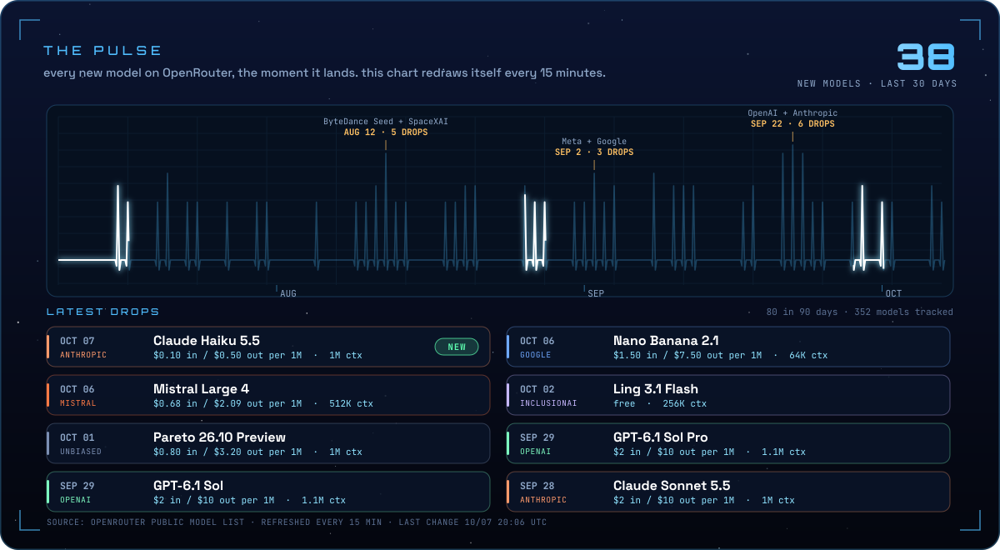


<!-- VOTE:START -->
<a href="https://github.com/SuperComboGamer/SuperComboGamer/issues/new?title=vote%3A%20anthropic%2Fclaude-haiku-5.5&body=**Just%20hit%20%60Submit%20new%20issue%60.**%20%F0%9F%97%B3%EF%B8%8F%0A%0AA%20bot%20counts%20your%20vote%20for%20**Claude%20Haiku%205.5**%20(usually%20within%20a%20minute)%2C%20updates%20the%20live%20tally%20on%20the%20profile%20and%20closes%20this%20issue%20for%20you.%0A%0A%3Csub%3EOne%20vote%20per%20account.%20Voting%20again%20moves%20your%20vote.%3C%2Fsub%3E">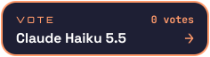</a>

<a href="https://github.com/SuperComboGamer/SuperComboGamer/issues/new?title=vote%3A%20qwen%2Fqwen3.8-max-prime&body=**Just%20hit%20%60Submit%20new%20issue%60.**%20%F0%9F%97%B3%EF%B8%8F%0A%0AA%20bot%20counts%20your%20vote%20for%20**Qwen3.8%20Max%20Prime**%20(usually%20within%20a%20minute)%2C%20updates%20the%20live%20tally%20on%20the%20profile%20and%20closes%20this%20issue%20for%20you.%0A%0A%3Csub%3EOne%20vote%20per%20account.%20Voting%20again%20moves%20your%20vote.%3C%2Fsub%3E">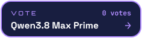</a>

<!-- VOTE:END -->

pick a model, hit submit, and a bot counts your vote in about a minute. the ballot is always the newest models from the big labs, so it changes as they ship.

  

<picture>
  <source media="(prefers-color-scheme: dark)" srcset="cosmos/h-03-dark.svg">
  <source media="(prefers-color-scheme: light)" srcset="cosmos/h-03-light.svg">
  
</picture>


best runs on X: <a href="https://x.com/aipulseda1ly/status/2064434795094966656">Fable 5 Max</a> · <a href="https://x.com/aipulseda1ly/status/2060075792957124861">Opus 4.8 vs GPT-5.5 Pro</a> · <a href="https://x.com/aipulseda1ly/status/2080771726254743571">Opus 5 just broke my NYC test</a>

  

<picture>
  <source media="(prefers-color-scheme: dark)" srcset="cosmos/h-04-dark.svg">
  <source media="(prefers-color-scheme: light)" srcset="cosmos/h-04-light.svg">
  
</picture>

<a href="https://x.com/aipulseda1ly/status/2089804529034481700"></a>
<a href="https://x.com/aipulseda1ly/status/2103352533657719230"></a>
<a href="https://x.com/aipulseda1ly/status/2105087699971395589"></a>
<a href="https://survivethenightgame.com"></a>

  

<picture>
  <source media="(prefers-color-scheme: dark)" srcset="cosmos/h-05-dark.svg">
  <source media="(prefers-color-scheme: light)" srcset="cosmos/h-05-light.svg">
  
</picture>


  

<picture>
  <source media="(prefers-color-scheme: dark)" srcset="cosmos/h-06-dark.svg">
  <source media="(prefers-color-scheme: light)" srcset="cosmos/h-06-light.svg">
  
</picture>


<a href="https://github.com/SuperComboGamer/SuperComboGamer/issues/new?title=%F0%9F%93%A1%20signal&body=%2A%2AJust%20hit%20%60Submit%20new%20issue%60.%2A%2A%20%F0%9F%9A%80%0A%0AA%20bot%20will%20plant%20your%20avatar%20as%20a%20star%20in%20my%20sky%20%28usually%20within%20a%20minute%29%20and%20close%20this%20issue%20for%20you.%0A%0A%3Csub%3ENothing%20else%20to%20do.%20Thanks%20for%20drifting%20by%2C%20traveler.%3C/sub%3E"></a>

<!-- SIGNALS:START -->
📡 no signals yet. the first star in this sky could be yours.
<!-- SIGNALS:END -->

 

<picture>
  <source media="(prefers-color-scheme: dark)" srcset="cosmos/h-07-dark.svg">
  <source media="(prefers-color-scheme: light)" srcset="cosmos/h-07-light.svg">
  
</picture>

the human behind the account. I'm <b>SuperComboGamer</b>: game dev, rust, python, 3D and AI agents. this is my last year on GitHub, one star per day.



 

<picture>
  <source media="(prefers-color-scheme: dark)" srcset="cosmos/h-08-dark.svg">
  <source media="(prefers-color-scheme: light)" srcset="cosmos/h-08-light.svg">
  
</picture>

the most famous cheat code in gaming history. enter it right and something wakes up. enter it wrong and… well. close it and try again.

<kbd>↑</kbd>

<blockquote>
⚡ HIT 1/10, keep going…

<kbd>↑</kbd>

<blockquote>
⚡ HIT 2/10, keep going…

<kbd>↑</kbd>
<blockquote>🫠 <b>WHIFFED.</b> the void laughs. try again.</blockquote>

<kbd>↓</kbd>

<blockquote>
⚡ HIT 3/10, keep going…

<kbd>↑</kbd>
<blockquote>⛔ <b>BLOCKED.</b> that is not the way.</blockquote>

<kbd>↓</kbd>

<blockquote>
⚡ HIT 4/10, keep going…

<kbd>↑</kbd>
<blockquote>💥 <b>COMBO DROPPED.</b> close it and try again.</blockquote>

<kbd>↓</kbd>
<blockquote>💀 <b>K.O.</b> wrong input. close it, regroup.</blockquote>

<kbd>←</kbd>

<blockquote>
⚡ HIT 5/10, keep going…

<kbd>↑</kbd>
<blockquote>💀 <b>K.O.</b> wrong input. close it, regroup.</blockquote>

<kbd>↓</kbd>
<blockquote>🫠 <b>WHIFFED.</b> the void laughs. try again.</blockquote>

<kbd>←</kbd>
<blockquote>⛔ <b>BLOCKED.</b> that is not the way.</blockquote>

<kbd>→</kbd>

<blockquote>
⚡ HIT 6/10, keep going…

<kbd>↑</kbd>
<blockquote>🫠 <b>WHIFFED.</b> the void laughs. try again.</blockquote>

<kbd>↓</kbd>
<blockquote>⛔ <b>BLOCKED.</b> that is not the way.</blockquote>

<kbd>←</kbd>

<blockquote>
⚡ HIT 7/10, keep going…

<kbd>↑</kbd>
<blockquote>⛔ <b>BLOCKED.</b> that is not the way.</blockquote>

<kbd>↓</kbd>
<blockquote>💥 <b>COMBO DROPPED.</b> close it and try again.</blockquote>

<kbd>←</kbd>
<blockquote>💀 <b>K.O.</b> wrong input. close it, regroup.</blockquote>

<kbd>→</kbd>

<blockquote>
⚡ HIT 8/10, keep going…

<kbd>↑</kbd>
<blockquote>💥 <b>COMBO DROPPED.</b> close it and try again.</blockquote>

<kbd>↓</kbd>
<blockquote>💀 <b>K.O.</b> wrong input. close it, regroup.</blockquote>

<kbd>←</kbd>
<blockquote>🫠 <b>WHIFFED.</b> the void laughs. try again.</blockquote>

<kbd>→</kbd>
<blockquote>⛔ <b>BLOCKED.</b> that is not the way.</blockquote>

<kbd>B</kbd>

<blockquote>
⚡ HIT 9/10, keep going…

<kbd>↑</kbd>
<blockquote>💀 <b>K.O.</b> wrong input. close it, regroup.</blockquote>

<kbd>↓</kbd>
<blockquote>🫠 <b>WHIFFED.</b> the void laughs. try again.</blockquote>

<kbd>←</kbd>
<blockquote>⛔ <b>BLOCKED.</b> that is not the way.</blockquote>

<kbd>→</kbd>
<blockquote>💥 <b>COMBO DROPPED.</b> close it and try again.</blockquote>

<kbd>B</kbd>
<blockquote>💀 <b>K.O.</b> wrong input. close it, regroup.</blockquote>

<kbd>A</kbd>

<blockquote>


<b>you know the code.</b> few travelers make it this far. claim your place in the sky as a <b>golden star</b> ↓

</blockquote>

</blockquote>

<kbd>A</kbd>
<blockquote>💀 <b>K.O.</b> wrong input. close it, regroup.</blockquote>

</blockquote>

<kbd>B</kbd>
<blockquote>⛔ <b>BLOCKED.</b> that is not the way.</blockquote>

<kbd>A</kbd>
<blockquote>💥 <b>COMBO DROPPED.</b> close it and try again.</blockquote>

</blockquote>

<kbd>→</kbd>
<blockquote>💀 <b>K.O.</b> wrong input. close it, regroup.</blockquote>

<kbd>B</kbd>
<blockquote>🫠 <b>WHIFFED.</b> the void laughs. try again.</blockquote>

<kbd>A</kbd>
<blockquote>⛔ <b>BLOCKED.</b> that is not the way.</blockquote>

</blockquote>

<kbd>B</kbd>
<blockquote>💀 <b>K.O.</b> wrong input. close it, regroup.</blockquote>

<kbd>A</kbd>
<blockquote>🫠 <b>WHIFFED.</b> the void laughs. try again.</blockquote>

</blockquote>

<kbd>→</kbd>
<blockquote>⛔ <b>BLOCKED.</b> that is not the way.</blockquote>

<kbd>B</kbd>
<blockquote>💥 <b>COMBO DROPPED.</b> close it and try again.</blockquote>

<kbd>A</kbd>
<blockquote>💀 <b>K.O.</b> wrong input. close it, regroup.</blockquote>

</blockquote>

<kbd>←</kbd>
<blockquote>💀 <b>K.O.</b> wrong input. close it, regroup.</blockquote>

<kbd>→</kbd>
<blockquote>🫠 <b>WHIFFED.</b> the void laughs. try again.</blockquote>

<kbd>B</kbd>
<blockquote>⛔ <b>BLOCKED.</b> that is not the way.</blockquote>

<kbd>A</kbd>
<blockquote>💥 <b>COMBO DROPPED.</b> close it and try again.</blockquote>

</blockquote>

<kbd>←</kbd>
<blockquote>💥 <b>COMBO DROPPED.</b> close it and try again.</blockquote>

<kbd>→</kbd>
<blockquote>💀 <b>K.O.</b> wrong input. close it, regroup.</blockquote>

<kbd>B</kbd>
<blockquote>🫠 <b>WHIFFED.</b> the void laughs. try again.</blockquote>

<kbd>A</kbd>
<blockquote>⛔ <b>BLOCKED.</b> that is not the way.</blockquote>

</blockquote>

<kbd>↓</kbd>
<blockquote>🫠 <b>WHIFFED.</b> the void laughs. try again.</blockquote>

<kbd>←</kbd>
<blockquote>⛔ <b>BLOCKED.</b> that is not the way.</blockquote>

<kbd>→</kbd>
<blockquote>💥 <b>COMBO DROPPED.</b> close it and try again.</blockquote>

<kbd>B</kbd>
<blockquote>💀 <b>K.O.</b> wrong input. close it, regroup.</blockquote>

<kbd>A</kbd>
<blockquote>🫠 <b>WHIFFED.</b> the void laughs. try again.</blockquote>

</blockquote>

<kbd>↓</kbd>
<blockquote>💀 <b>K.O.</b> wrong input. close it, regroup.</blockquote>

<kbd>←</kbd>
<blockquote>🫠 <b>WHIFFED.</b> the void laughs. try again.</blockquote>

<kbd>→</kbd>
<blockquote>⛔ <b>BLOCKED.</b> that is not the way.</blockquote>

<kbd>B</kbd>
<blockquote>💥 <b>COMBO DROPPED.</b> close it and try again.</blockquote>

<kbd>A</kbd>
<blockquote>💀 <b>K.O.</b> wrong input. close it, regroup.</blockquote>

 

<picture>
  <source media="(prefers-color-scheme: dark)" srcset="cosmos/footer-dark.svg">
  <source media="(prefers-color-scheme: light)" srcset="cosmos/footer-light.svg">
  
</picture>

<!-- SYNC:START -->
🛰️ live data last changed <b>10/09 21:51 UTC</b> · checked every 15 minutes by <a href="cosmos">/cosmos</a> · 0 votes on the ballot · <a href="#top">back to top ↑</a>
<!-- SYNC:END -->

